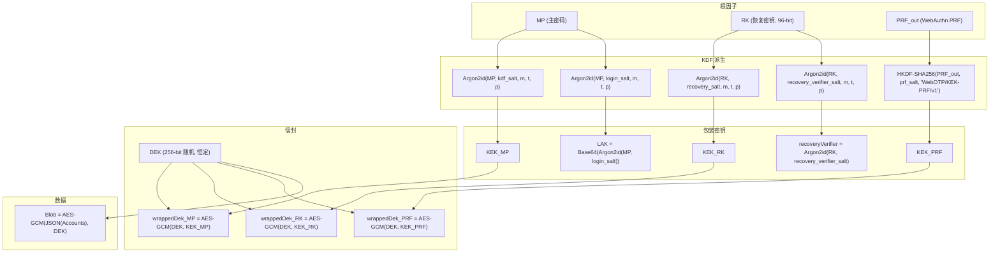
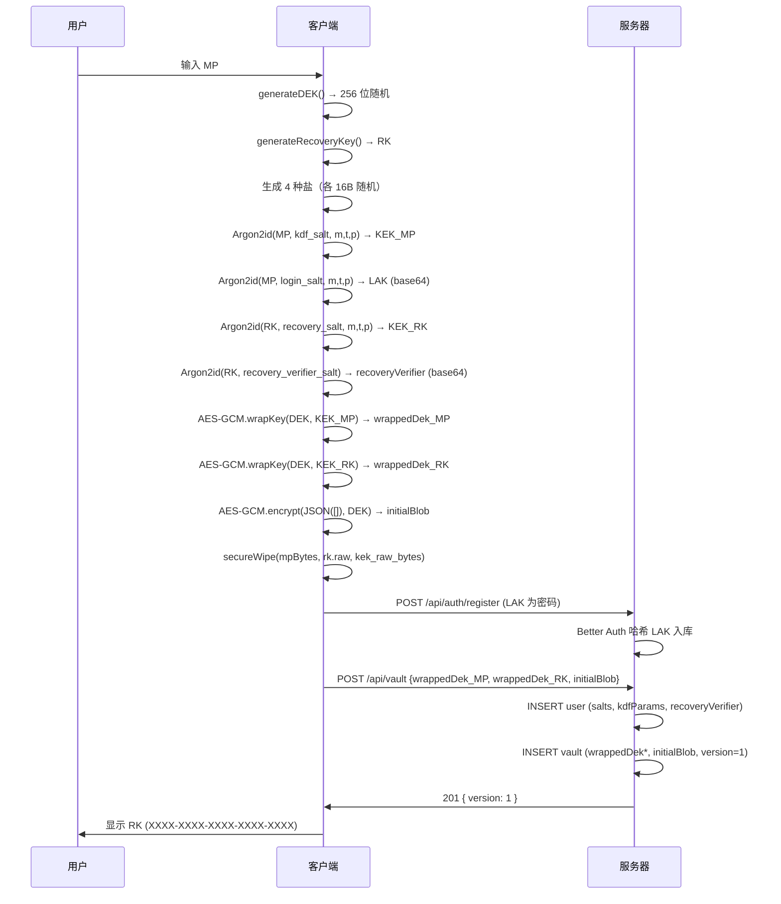

# 🔐 WebOTP 密码学实现规范 (CryptoSpec)

**文档版本**: 1.0  
**更新日期**: 2026 年 6 月 20 日  
**文档密级**: 公开 (Public)  
**核心标签**: `Envelope-Encryption`, `Argon2id`, `AES-GCM-256`, `HKDF-SHA256`, `TOTP`, `HOTP`, `base32`, `base64`  
**前置文档**: [Architecture.md](./Architecture.md)（本文档为 §3 密钥层级的精确实现规格）

---

## 0. 变更摘要 (Changelog)

| 版本 | 日期 | 说明 |
| :--- | :--- | :--- |
| 1.0 | 2026-06-20 | 初始版本，覆盖信封加密、Argon2id、AES-GCM、密文封装、HKDF、LAK、base32、TOTP/HOTP 全部实现规格。 |

---

## 1. 信封加密总览

本系统采用**信封加密**（见 docs/Architecture.md §3.1）。核心原则：

- **DEK（Data Encryption Key）**：注册时由 `crypto.getRandomValues()` 生成的 **256 位随机密钥**，**一旦生成永不更换**（恒定 DEK），仅用于 AES-GCM-256 加解密 Vault Blob。
- **KEK（Key Encryption Key）**：由各根因子（MP / RK / PRF）独立派生，**仅用于包装 DEK**，从不直接接触 Blob。

### 1.1 密钥层级关系图



### 1.2 关键不变量

以下不变量贯穿整个密码学子系统，实现时**必须**维护：

| 不变量 | 说明 |
| :--- | :--- |
| DEK 恒定 | 注册时生成，整个生命周期不更换。密码轮换、恢复、PRF 绑定均只重新包装同一 DEK。 |
| KEK 不接触 Blob | 各 KEK 仅用于 `wrapKey`/`unwrapKey` 操作 DEK；Blob 仅由 DEK 加解密。 |
| 各路径独立盐 | `kdf_salt`（KEK_MP）、`login_salt`（LAK）、`recovery_salt`（KEK_RK）、`recovery_verifier_salt`（recoveryVerifier）、`prf_salt`（KEK_PRF）——五种盐互不复用。 |
| IV 不可复用 | 每次 AES-GCM 加密操作必须生成新的 12 字节随机 IV（见 §3.1）。 |
| AEAD 失败即拒绝 | AES-GCM 解密时 tag 校验失败必须抛出错误，绝不返回部分解密结果（见 §3.4）。 |

---

## 2. Argon2id 密钥派生实现

### 2.1 库选型：hash-wasm

采用 [hash-wasm](https://github.com/nicedoc/hash-wasm) 纯 Wasm 实现，原因：

- 支持 argon2id 全参数（`memorySize`、`iterations`、`parallelism`、`hashLength`）
- 纯 Wasm，无 native 依赖，SvelteKit/Vite 静态资源友好（~30KB）
- CSP 兼容：仅需 `'wasm-unsafe-eval'`（见 Architecture.md §2）

### 2.2 调用签名

hash-wasm 的 `argon2id` 函数精确签名：

```typescript
import { argon2id } from 'hash-wasm';

/**
 * hash-wasm argon2id 调用签名（供参考，不直接调用此形式）。
 * 本系统封装为 deriveKEK / deriveLAK / deriveRecoveryVerifier。
 */
interface Argon2idOptions {
  password: string | Uint8Array;  // 口令（MP 明文或 RK 字节）
  salt: Uint8Array;               // 16 字节高熵随机盐
  parallelism: number;            // p，推荐 4
  memorySize: number;             // m，单位 KiB，推荐 65536
  iterations: number;             // t，推荐 3
  hashLength: number;             // 输出长度，固定 32
  outputType: 'binary';          // 返回 Uint8Array
}

// 调用示例（实际通过封装函数调用）：
// const rawKey = await argon2id({
//   password: mpBytes,
//   salt: kdfSaltBytes,
//   parallelism: 4,
//   memorySize: 65536,
//   iterations: 3,
//   hashLength: 32,
//   outputType: 'binary',
// });
```

### 2.3 KdfParams 类型

KDF 参数从 `user` 表读取（见 Architecture.md §4），支持日后调优与离线下发：

```typescript
/** KDF 参数，从 user 表读取或由 GET /api/auth-params 返回 */
interface KdfParams {
  algo: 'argon2id';
  memoryKiB: number;   // m，推荐 65536
  iterations: number;  // t，推荐 3
  parallelism: number; // p，推荐 4
}
```

### 2.4 deriveKEK 函数签名

```typescript
import { argon2id } from 'hash-wasm';

/**
 * 从根因子（MP 或 RK 字节）派生 32 字节 KEK 原始字节。
 * 用于 KEK_MP、KEK_RK 的派生。
 *
 * @param password - 根因子字节（MP 的 UTF-8 编码，或 RK 的原始 32 字节）
 * @param salt     - 16 字节盐（kdf_salt 或 recovery_salt，已 base64 解码）
 * @param params   - KDF 参数（从 user 表读取）
 * @returns        - 32 字节 Uint8Array（调用方应尽快覆写）
 * @throws         - salt 非 16 字节或 output 非 32 字节时抛出 RangeError
 */
async function deriveKEK(
  password: Uint8Array,
  salt: Uint8Array,
  params: KdfParams,
): Promise<Uint8Array> {
  if (salt.length !== 16) throw new RangeError('salt must be 16 bytes');

  const raw = await argon2id({
    password,
    salt,
    parallelism: params.parallelism,
    memorySize: params.memoryKiB,
    iterations: params.iterations,
    hashLength: 32,
    outputType: 'binary',
  });

  return raw; // 32 字节，调用方负责导入 CryptoKey 后覆写
}
```

### 2.5 错误处理

| 场景 | 处理 |
| :--- | :--- |
| salt 长度 ≠ 16 字节 | 抛出 `RangeError`，消息 `'salt must be 16 bytes'` |
| params.memoryKiB < 8192 或 iterations < 1 | 抛出 `RangeError`，拒绝弱参数 |
| hash-wasm Wasm 加载失败 | 抛出 `Error('argon2id wasm module failed to load')`，上层捕获后提示用户刷新 |
| 超时（移动端 m=65536 约 1-3 秒） | 不设超时（Argon2id 本身就是时间成本函数），但 UI 应显示进度指示 |

### 2.6 参数来源与存储

```
注册时:   客户端生成 KdfParams 默认值 → POST /api/vault 初始化写入 user 表
登录时:   GET /api/auth-params?email= → 返回 KdfParams + 各盐值
离线时:   从 IndexedDB 缓存读取 KdfParams（见 Architecture.md §7.2）
```

---

## 3. AES-GCM 包装 / 解包

### 3.1 IV 生成规则

```typescript
/**
 * 生成 AES-GCM 随机 IV（nonce）。
 * 每次加密操作必须调用此函数生成新 IV，绝不复用。
 *
 * @returns 12 字节随机 Uint8Array
 */
function generateIV(): Uint8Array {
  const iv = new Uint8Array(12); // 96 位
  crypto.getRandomValues(iv);
  return iv;
}
```

**关键约束**：
- IV 长度固定 **12 字节（96 位）**，符合 NIST SP 800-38D 推荐。
- 每次调用 `generateIV()` 必须产生密码学安全的随机值（`crypto.getRandomValues`）。
- **IV 不可复用**：同一 KEK 下，相同 IV + 相同密钥会导致 AES-GCM 安全性完全崩溃（可恢复认证密钥 H）。本系统每个 `wrapKey` / `encrypt` 操作均生成新 IV。

### 3.2 KEK 导入为 CryptoKey

```typescript
/**
 * 将 Argon2id 派生的 32 字节原始 KEK 导入为不可导出的 CryptoKey。
 *
 * @param rawKek - 32 字节 Argon2id 输出
 * @returns      - CryptoKey（AES-GCM-256, extractable: false, wrap/unwrap 用途）
 */
async function importKEK(rawKek: Uint8Array): Promise<CryptoKey> {
  return crypto.subtle.importKey(
    'raw',
    rawKek,
    { name: 'AES-GCM', length: 256 },
    false,                        // extractable: false——不可导出
    ['wrapKey', 'unwrapKey'],     // 仅用于包装/解包 DEK
  );
}
```

### 3.3 DEK 生成与导入

```typescript
/**
 * 注册时生成随机 DEK 并导入为不可导出的 CryptoKey。
 * DEK 一旦生成永不更换（见 Architecture.md §3.1）。
 *
 * @returns CryptoKey（AES-GCM-256, extractable: false, encrypt/decrypt 用途）
 */
async function generateDEK(): Promise<CryptoKey> {
  const rawDek = new Uint8Array(32); // 256 位
  crypto.getRandomValues(rawDek);

  const dek = await crypto.subtle.importKey(
    'raw',
    rawDek,
    { name: 'AES-GCM', length: 256 },
    false,                              // extractable: false
    ['encrypt', 'decrypt'],             // 用于加解密 Blob
  );

  // 立即覆写原始字节
  crypto.getRandomValues(rawDek);
  return dek;
}
```

### 3.4 wrapKey / unwrapKey vs 手动 encrypt/decrypt

**选择 `wrapKey`/`unwrapKey` 而非手动 `encrypt`/`decrypt`**，理由如下：

| 维度 | `wrapKey`/`unwrapKey` | 手动 `encrypt`/`decrypt` |
| :--- | :--- | :--- |
| **API 语义** | 专为密钥包装设计，输出为单一 ArrayBuffer（含 tag） | 需先 `exportKey` 再 `encrypt`，多一步暴露明文密钥 |
| **安全性** | DEK 的原始字节**永不经过 JS 内存**——`wrapKey` 直接在内部完成导出+加密 | 必须先 `exportKey('raw', dek)` 得到 `rawDek`（要求 `extractable: true`），引入不必要的密钥暴露窗口 |
| **extractable** | KEK 和 DEK 均可保持 `extractable: false` | DEK 必须设为 `extractable: true` 才能导出 |
| **AEAD 保证** | 同样产生 128 位 tag，与 AES-GCM-256 一致 | 同 |

**结论**：DEK 包装统一使用 `wrapKey`/`unwrapKey`，DEK 始终 `extractable: false`。

```typescript
/**
 * 用 KEK 包装 DEK，返回密文封装格式字符串。
 *
 * @param dek - 待包装的 DEK（CryptoKey, extractable: false）
 * @param kek - 用于包装的 KEK（CryptoKey, extractable: false）
 * @returns   - "v=1;iv=<base64>;ct=<base64>" 格式字符串
 */
async function wrapDek(dek: CryptoKey, kek: CryptoKey): Promise<string> {
  const iv = generateIV();
  const wrappedBytes = await crypto.subtle.wrapKey(
    'raw',                  // 导出格式
    dek,                    // 被包装的密钥
    kek,                    // 包装密钥
    { name: 'AES-GCM', iv, tagLength: 128 },
  );
  return serializeEncryptedPayload(new Uint8Array(wrappedBytes), iv);
}

/**
 * 用 KEK 解包包装后的 DEK。
 *
 * @param wrapped - "v=1;iv=<base64>;ct=<base64>" 格式字符串
 * @param kek     - 用于解包的 KEK（CryptoKey, extractable: false）
 * @returns       - 解包后的 DEK（CryptoKey, extractable: false）
 * @throws        - AEAD 校验失败时抛出 DecryptionError；格式错误抛出 FormatError
 */
async function unwrapDek(wrapped: string, kek: CryptoKey): Promise<CryptoKey> {
  const { version, iv, ciphertext } = parseEncryptedPayload(wrapped);
  if (version !== 1) throw new FormatError(`unsupported envelope version: ${version}`);

  try {
    return await crypto.subtle.unwrapKey(
      'raw',                  // 导入格式
      ciphertext,             // 包装后的密文字节（含 tag）
      kek,                    // 解包密钥
      { name: 'AES-GCM', iv, tagLength: 128 },
      { name: 'AES-GCM', length: 256 },  // 导入后的密钥算法
      false,                  // extractable: false
      ['encrypt', 'decrypt'], // 用途
    );
  } catch (e) {
    // unwrapKey 在 AEAD 校验失败时抛出 DOMException (name: 'OperationError')
    if (e instanceof DOMException && e.name === 'OperationError') {
      throw new DecryptionError('AEAD authentication failed: wrong KEK or corrupted ciphertext');
    }
    throw e;
  }
}
```

### 3.5 AEAD 校验失败处理

AES-GCM 是 AEAD（Authenticated Encryption with Associated Data）算法。解密时内置 128 位 tag 校验：

- **成功**：返回明文（或解包后的 CryptoKey）。
- **失败**：浏览器抛出 `DOMException`（`name: 'OperationError'`），本系统统一包装为 `DecryptionError`。

**处理规则（Architecture.md §4.1、§7.4）**：
1. **绝不静默降级**——AEAD 失败意味着密钥错误或密文被篡改，必须显式报错。
2. **KEK 解包失败**（`unwrapDek`）→ 提示用户"密码错误"（MP 路径）或"恢复密钥错误"（RK 路径）。
3. **Blob 解密失败**（`decryptBlob`）→ 提示"Vault 数据损坏"（见 §4）。
4. **恒定时间无要求**：AEAD 校验在 SubtleCrypto 内部完成，客户端无需额外恒定时间比较。

---

## 4. 密文封装格式

所有密文（`wrappedDek*`、`encryptedBlob`）均使用统一的封装格式（见 Architecture.md §4.1）：

```
v=1;iv=<base64>;ct=<base64>
```

- `v`：格式版本号（当前 `1`），独立于 OCC `version`。
- `iv`：base64 编码的 12 字节 IV（标准 base64，RFC 4648，有填充 `=`）。
- `ct`：base64 编码的密文 + 128 位 tag（标准 base64，有填充）。

### 4.1 base64 变体规范

| 场景 | 变体 | 标准 | 填充 | 字符集 |
| :--- | :--- | :--- | :--- | :--- |
| 盐值、wrappedDek、encryptedBlob、recoveryVerifier | 标准 base64 | RFC 4648 §4 | 有 (`=`) | `A-Za-z0-9+/` |
| WebAuthn credentialId | base64url | RFC 4648 §5 | 无 | `A-Za-z0-9-_` |

### 4.2 序列化函数

```typescript
/**
 * 将密文字节和 IV 序列化为封装格式字符串。
 *
 * @param ciphertext - AES-GCM 输出字节（含 128 位 tag）
 * @param iv         - 12 字节 IV
 * @returns          - "v=1;iv=<base64>;ct=<base64>"
 */
function serializeEncryptedPayload(ciphertext: Uint8Array, iv: Uint8Array): string {
  const ivB64 = uint8ArrayToBase64(iv);
  const ctB64 = uint8ArrayToBase64(ciphertext);
  return `v=1;iv=${ivB64};ct=${ctB64}`;
}

/** 标准 base64 编码（RFC 4648 §4，有填充） */
function uint8ArrayToBase64(bytes: Uint8Array): string {
  // 浏览器环境
  let binary = '';
  for (let i = 0; i < bytes.length; i++) {
    binary += String.fromCharCode(bytes[i]!);
  }
  return btoa(binary);
}

/** 标准 base64 解码（RFC 4648 §4，有填充） */
function base64ToUint8Array(b64: string): Uint8Array {
  const binary = atob(b64);
  const bytes = new Uint8Array(binary.length);
  for (let i = 0; i < binary.length; i++) {
    bytes[i] = binary.charCodeAt(i);
  }
  return bytes;
}
```

### 4.3 反序列化函数

```typescript
interface ParsedEncryptedPayload {
  version: number;
  iv: Uint8Array;        // 12 字节
  ciphertext: Uint8Array; // 密文 + tag
}

/**
 * 解析密文封装格式字符串。
 *
 * @param encoded - "v=1;iv=<base64>;ct=<base64>" 格式字符串
 * @returns       - 解析结果
 * @throws        - FormatError（格式错误、版本未知、IV 长度非 12 字节）
 */
function parseEncryptedPayload(encoded: string): ParsedEncryptedPayload {
  // 1. 格式校验：必须匹配 v=N;iv=...;ct=... 模式
  const parts = encoded.split(';');
  if (parts.length !== 3) {
    throw new FormatError('invalid envelope format: expected 3 semicolon-separated parts');
  }

  const [vPart, ivPart, ctPart] = parts;

  // 2. 版本号解析
  if (!vPart!.startsWith('v=')) {
    throw new FormatError('invalid envelope format: missing version prefix');
  }
  const version = parseInt(vPart!.slice(2), 10);
  if (isNaN(version) || version < 1) {
    throw new FormatError(`invalid envelope version: ${vPart!.slice(2)}`);
  }

  // 3. IV 解析
  if (!ivPart!.startsWith('iv=')) {
    throw new FormatError('invalid envelope format: missing iv prefix');
  }
  let iv: Uint8Array;
  try {
    iv = base64ToUint8Array(ivPart!.slice(3));
  } catch {
    throw new FormatError('invalid envelope format: iv is not valid base64');
  }
  if (iv.length !== 12) {
    throw new FormatError(`invalid IV length: expected 12 bytes, got ${iv.length}`);
  }

  // 4. 密文解析
  if (!ctPart!.startsWith('ct=')) {
    throw new FormatError('invalid envelope format: missing ct prefix');
  }
  let ciphertext: Uint8Array;
  try {
    ciphertext = base64ToUint8Array(ctPart!.slice(3));
  } catch {
    throw new FormatError('invalid envelope format: ct is not valid base64');
  }
  // AES-GCM 最小输出为 16 字节（空明文 + 128 位 tag）
  if (ciphertext.length < 16) {
    throw new FormatError(`ciphertext too short: expected >= 16 bytes, got ${ciphertext.length}`);
  }

  return { version, iv, ciphertext };
}
```

### 4.4 版本演进策略

| 版本 | 状态 | 说明 |
| :--- | :--- | :--- |
| `v=1` | 当前 | AES-GCM-256，12B IV，128B tag。本文档全部实现基于 v=1。 |
| `v=2+` | 预留 | 未来可能迁移至 XChaCha20-Poly1305 或其他算法。 |

**解析规则**：
- `v=1`：正常处理。
- `v` 未知（> 当前支持版本）：**拒绝**并抛出 `FormatError`，提示"Vault 格式不兼容，请更新应用"。
- 解析任何步骤失败（base64 无效、字段缺失、IV 长度错误）：**拒绝**并抛出 `FormatError`，绝不静默降级。

### 4.5 错误类型

```typescript
/** 密文格式错误（解析失败、版本未知） */
class FormatError extends Error {
  constructor(message: string) {
    super(message);
    this.name = 'FormatError';
  }
}

/** AEAD 解密/认证失败 */
class DecryptionError extends Error {
  constructor(message: string) {
    super(message);
    this.name = 'DecryptionError';
  }
}
```

### 4.6 Blob 加解密

```typescript
/**
 * 加密 Vault Blob。
 *
 * @param accounts - Account[] 明文
 * @param dek      - DEK（CryptoKey, extractable: false）
 * @returns        - "v=1;iv=<base64>;ct=<base64>" 格式字符串
 */
async function encryptBlob(accounts: Account[], dek: CryptoKey): Promise<string> {
  const plaintext = new TextEncoder().encode(JSON.stringify(accounts));
  const iv = generateIV();
  const ciphertext = await crypto.subtle.encrypt(
    { name: 'AES-GCM', iv, tagLength: 128 },
    dek,
    plaintext,
  );
  // 覆写明文字节
  crypto.getRandomValues(plaintext);
  return serializeEncryptedPayload(new Uint8Array(ciphertext), iv);
}

/**
 * 解密 Vault Blob。
 *
 * @param encoded - "v=1;iv=<base64>;ct=<base64>" 格式字符串
 * @param dek     - DEK（CryptoKey, extractable: false）
 * @returns       - Account[] 明文
 * @throws        - FormatError（格式错误）/ DecryptionError（AEAD 失败或 JSON 解析失败）
 */
async function decryptBlob(encoded: string, dek: CryptoKey): Promise<Account[]> {
  const { version, iv, ciphertext } = parseEncryptedPayload(encoded);
  if (version !== 1) throw new FormatError(`unsupported blob version: ${version}`);

  let plaintext: ArrayBuffer;
  try {
    plaintext = await crypto.subtle.decrypt(
      { name: 'AES-GCM', iv, tagLength: 128 },
      dek,
      ciphertext,
    );
  } catch (e) {
    if (e instanceof DOMException && e.name === 'OperationError') {
      throw new DecryptionError('AES-GCM authentication failed: wrong DEK or corrupted blob');
    }
    throw e;
  }

  const text = new TextDecoder().decode(plaintext);
  try {
    return JSON.parse(text) as Account[];
  } catch {
    throw new DecryptionError('decrypted blob is not valid JSON');
  }
}
```

---

## 5. HKDF-SHA256（PRF 路径）

### 5.1 设计背景

WebAuthn PRF 扩展输出的 $PRF_{out}$ 是硬件安全芯片产生的高熵伪随机字节串（≥32 字节）。与 MP/RK 不同，$PRF_{out}$ **不是低熵口令**，无需 Argon2id 的慢哈希抗暴力。因此 PRF 路径采用 **HKDF-SHA256**（RFC 5869）进行密钥派生，满足以下目标：

- **应用绑定**：通过 `info` 参数将派生绑定到本应用（`"WebOTP/KEK-PRF/v1"`），防止跨应用密钥复用。
- **Vault 绑定**：通过 `salt` 参数（`prf_salt`，用户级盐）将派生绑定到特定用户的 Vault 上下文。
- **信息熵保留**：HKDF 是 Extract-and-Expand KDF，不降低高熵输入的熵。

### 5.2 为何 MP/RK 用 Argon2id 而 PRF 用 HKDF

| 路径 | 输入熵 | 暴力威胁 | KDF 选择 | 理由 |
| :--- | :--- | :--- | :--- | :--- |
| MP | 低（用户选的口令） | 字典/暴力攻击 | Argon2id | 需要内存硬函数降低暴力速率 |
| RK | 高（96 位随机） | 无（但与 MP 同参数统一管理） | Argon2id | 统一参数模型，简化实现 |
| PRF_out | 高（硬件安全芯片输出） | 无 | HKDF-SHA256 | 无需慢哈希；HKDF 轻量、标准化、足够安全 |

### 5.3 实现

```typescript
/**
 * 从 PRF_out 派生 KEK_PRF（32 字节 CryptoKey）。
 * 使用 HKDF-SHA256，info 固定为 "WebOTP/KEK-PRF/v1"。
 *
 * @param prfOut   - WebAuthn PRF 扩展输出（Uint8Array，通常 32 字节）
 * @param prfSalt  - 用户级盐（16 字节，base64 解码后；存 user.prf_salt）
 * @returns        - CryptoKey（AES-GCM-256, extractable: false, wrapKey/unwrapKey）
 */
async function deriveKEKPrf(
  prfOut: Uint8Array,
  prfSalt: Uint8Array,
): Promise<CryptoKey> {
  // 1. HKDF-SHA256 派生 256 位原始密钥材料
  const rawKey = await crypto.subtle.deriveBits(
    {
      name: 'HKDF',
      hash: 'SHA-256',
      salt: prfSalt,                                  // 16 字节用户级盐
      info: new TextEncoder().encode('WebOTP/KEK-PRF/v1'), // 应用+用途+版本绑定
    },
    // HKDF 的 key 输入需要先导入为 CryptoKey
    await crypto.subtle.importKey(
      'raw',
      prfOut,
      'HKDF',
      false,
      ['deriveBits', 'deriveKey'],
    ),
    256, // 输出 256 位
  );

  // 2. 导入为 AES-GCM CryptoKey
  return crypto.subtle.importKey(
    'raw',
    rawKey,
    { name: 'AES-GCM', length: 256 },
    false,
    ['wrapKey', 'unwrapKey'],
  );
}
```

### 5.4 HKDF info 参数规范

| 字段 | 值 | 说明 |
| :--- | :--- | :--- |
| `info` | `"WebOTP/KEK-PRF/v1"` | 应用标识 + 用途 + 版本，硬编码字符串 |
| `salt` | `prfSalt`（16 字节） | 用户级盐，首次绑定 Passkey 时生成，所有 Passkey 共用 |
| `hash` | `SHA-256` | HKDF 的哈希函数 |
| 输出长度 | 256 位（32 字节） | AES-256 密钥 |

---

## 6. LAK 派生

### 6.1 定义

LAK（Login Authentication Key）是提交给 Better Auth 的"虚拟密码"（见 Architecture.md §3.4）。Better Auth 服务器对其再次哈希入库，因此 LAK 本身**不是**最终存储的哈希。

$$LAK = \text{Base64}(\text{Argon2id}(MP,\ login\_salt,\ m, t, p,\ \text{len}=32))$$

- 输出 32 字节 → base64 编码后约 44 字符，无 Bcrypt 72 字节截断之忧。
- `login_salt` 与 `kdf_salt` 互不复用，确保 LAK 与 KEK_MP 路径语义隔离。

### 6.2 实现

```typescript
/**
 * 派生 LAK（Login Authentication Key）。
 * Argon2id(MP, login_salt, m, t, p) → 32 字节 → base64 字符串。
 *
 * @param mpBytes    - 主密码的 UTF-8 编码字节
 * @param loginSalt  - 16 字节登录盐（base64 解码后）
 * @param params     - KDF 参数（从 user 表读取）
 * @returns          - base64 编码的 LAK 字符串（约 44 字符）
 * @throws           - salt 非 16 字节时抛出 RangeError
 */
async function deriveLAK(
  mpBytes: Uint8Array,
  loginSalt: Uint8Array,
  params: KdfParams,
): Promise<string> {
  const raw = await deriveKEK(mpBytes, loginSalt, params); // 复用同一 Argon2id 调用
  return uint8ArrayToBase64(raw);
}
```

### 6.3 与 Better Auth 的交互

```
注册:  deriveLAK(MP, loginSalt, params) → lakBase64 → Better Auth 注册（以 lakBase64 为密码）
登录:  deriveLAK(MP, loginSalt, params) → lakBase64 → Better Auth 登录
轮换:  deriveLAK(MP_new, loginSalt_new, params) → lakBase64_new → POST /api/vault/rotate-key
```

---

## 7. base32 解码（RFC 4648）

### 7.1 用途

OTP 种子（`Account.secret`）以 base32 编码存储（见 Architecture.md §5.2）。解码后传入 SubtleCrypto 的 HMAC 进行 TOTP/HOTP 计算。

### 7.2 规范化规则

解码前必须执行以下规范化（顺序固定）：

1. **移除空白/连字符**：`secret.replace(/[\s-]/g, '')`
2. **转大写**：`toUpperCase()`
3. **移除填充**：去除尾部 `=` 字符（RFC 4648 base32 填充）

### 7.3 实现

```typescript
const BASE32_ALPHABET = 'ABCDEFGHIJKLMNOPQRSTUVWXYZ234567';

/**
 * RFC 4648 base32 解码。
 * 规范化：去空白/连字符、转大写、去填充。
 *
 * @param input - base32 编码字符串
 * @returns     - 解码后的字节数组
 * @throws      - 遇到非法字符时抛出 Error
 */
function base32Decode(input: string): Uint8Array {
  // 1. 规范化
  const cleaned = input.replace(/[\s-]/g, '').toUpperCase().replace(/=+$/, '');

  if (cleaned.length === 0) return new Uint8Array(0);

  // 2. 验证字符集
  for (let i = 0; i < cleaned.length; i++) {
    if (!BASE32_ALPHABET.includes(cleaned[i]!)) {
      throw new Error(`invalid base32 character at position ${i}: '${cleaned[i]}'`);
    }
  }

  // 3. 解码
  const outputLength = Math.floor((cleaned.length * 5) / 8);
  const output = new Uint8Array(outputLength);
  let bits = 0;
  let value = 0;
  let outputIndex = 0;

  for (let i = 0; i < cleaned.length; i++) {
    const idx = BASE32_ALPHABET.indexOf(cleaned[i]!);
    value = (value << 5) | idx;
    bits += 5;

    if (bits >= 8) {
      bits -= 8;
      output[outputIndex++] = (value >>> bits) & 0xff;
    }
  }

  return output;
}

/**
 * base32 编码（用于 RK 生成展示，4-4-4-4-4 分组）。
 *
 * @param bytes - 原始字节
 * @returns     - base32 编码字符串（大写，无填充）
 */
function base32Encode(bytes: Uint8Array): string {
  let result = '';
  let bits = 0;
  let value = 0;

  for (let i = 0; i < bytes.length; i++) {
    value = (value << 8) | bytes[i]!;
    bits += 8;
    while (bits >= 5) {
      bits -= 5;
      result += BASE32_ALPHABET[(value >>> bits) & 0x1f];
    }
  }

  if (bits > 0) {
    result += BASE32_ALPHABET[(value << (5 - bits)) & 0x1f];
  }

  return result;
}

/**
 * 生成 Recovery Key（RK）并格式化为 20 字符 4-4-4-4-4 分组展示。
 *
 * RK 为 96 位（12 字节）随机 → base32 编码恰好 20 字符（RFC 4648 去填充）→ 4-4-4-4-4 分组。
 * 12 字节 = 2×5 字节(16 字符) + 2 字节(4 字符) = 20 字符，整字节对齐、无信息损失。
 * 96 位熵配合 Argon2id 派生 + recover/init 限流 + recoveryVerifier 校验，离线暴力不可行。
 *
 * @returns - { raw: Uint8Array(12), display: string }
 *           display 格式："XXXX-XXXX-XXXX-XXXX-XXXX"
 */
function generateRecoveryKey(): { raw: Uint8Array; display: string } {
  const raw = new Uint8Array(12); // 96 位
  crypto.getRandomValues(raw);

  // base32 编码 12 字节 → 恰好 20 字符（RFC 4648 去填充，无 "="）
  const fullB32 = base32Encode(raw); // 20 字符

  // 按 4-4-4-4-4 分组用于用户抄写展示
  const display = fullB32.match(/.{4}/g)!.join('-');

  return { raw, display };
}

/**
 * 将用户输入的 RK 展示格式还原为原始字节。
 * 用户输入格式："XXXX-XXXX-XXXX-XXXX-XXXX"（或变体：有无分隔符、大小写）。
 * 20 字符 base32（去填充）→ 解码为 12 字节（96 位）原始 RK。
 * 解码后用 KEK_RK = Argon2id(RK, recovery_salt) 解包 wrappedDekByRecovery 得 DEK。
 * 非法字符/长度错误 → 抛 EncodingError，不静默降级。
 *
 * @param input - 用户输入的 RK（可含分隔符、小写）
 * @returns     - 解码后的字节
 * @throws      - 非法字符或长度错误
 */
function parseRecoveryKey(input: string): Uint8Array {
  return base32Decode(input);
}
```

### 7.4 base32 解码失败处理

- 遇到非法字符（非 `A-Z2-7`、非空白/连字符/填充）→ 抛出 `Error`，消息包含非法字符位置。
- 空字符串 → 返回空 `Uint8Array`（调用方应额外校验长度）。
- **绝不返回空种子**：解码失败必须显式报错，否则 HMAC 使用空密钥会导致所有 TOTP 码相同（见 Architecture.md §5.2）。

---

## 8. SubtleCrypto 与 Wasm 边界

### 8.1 职责划分

| 操作 | 引擎 | API |
| :--- | :--- | :--- |
| **Argon2id 口令派生** | Wasm（hash-wasm） | `argon2id({password, salt, memorySize, iterations, parallelism, hashLength, outputType})` |
| **AES-GCM-256 加解密** | SubtleCrypto | `crypto.subtle.encrypt/decrypt({name:'AES-GCM', iv, tagLength:128}, key, data)` |
| **AES-GCM-256 包装/解包** | SubtleCrypto | `crypto.subtle.wrapKey/unwrapKey(...)` |
| **HKDF-SHA256 密钥派生** | SubtleCrypto | `crypto.subtle.deriveBits({name:'HKDF', hash:'SHA-256', salt, info}, key, length)` |
| **HMAC-SHA1/256/512** | SubtleCrypto | `crypto.subtle.sign('HMAC', key, data)` |
| **密钥导入/导出** | SubtleCrypto | `crypto.subtle.importKey/exportKey(...)` |
| **密码学安全随机数** | SubtleCrypto | `crypto.getRandomValues(array)` |

### 8.2 选型理由

- **SubtleCrypto** 优先：浏览器原生，硬件加速（AES-NI、ARM Crypto），不出 JS 沙箱，`extractable: false` 保障密钥不可导出。
- **hash-wasm（Wasm）** 仅用于 Argon2id：SubtleCrypto 不支持 Argon2id（仅支持 PBKDF2），而 Argon2id 的内存硬特性是抗 GPU/ASIC 暴力的刚需。
- **禁止自行实现**：所有密码学原语均使用上述两个引擎，禁止自行实现 AES、HMAC、SHA 等。

### 8.3 CSP 兼容

```
Content-Security-Policy: script-src 'self' 'wasm-unsafe-eval'; ...
```

- `'wasm-unsafe-eval'`：允许加载 hash-wasm 的静态 `.wasm` 模块。
- 仍**禁止** `'unsafe-inline'` 与脚本侧 `'unsafe-eval'`。
- Wasm 模块以 Vite 静态资源形式加载，不接受任意字符串编译。

---

## 9. 内存擦除

### 9.1 Uint8Array 覆写规范

所有敏感 `Uint8Array` 中间产物在使用完毕后**必须**调用 `crypto.getRandomValues()` 原地覆写（见 Architecture.md §6.2）：

```typescript
/**
 * 安全擦除 Uint8Array 内容。
 * 用密码学安全随机字节覆写全部内容。
 *
 * @param buffer - 待擦除的字节数组
 */
function secureWipe(buffer: Uint8Array): void {
  crypto.getRandomValues(buffer);
  // 可选：二次零填充（随机 → 零，防止随机数与原内容区分）
  buffer.fill(0);
}
```

### 9.2 需要擦除的敏感对象

| 对象 | 类型 | 何时擦除 |
| :--- | :--- | :--- |
| MP 明文字节（UTF-8 编码） | `Uint8Array` | KEK_MP 派生完成后立即 |
| RK 原始字节 | `Uint8Array` | KEK_RK 派生 + recoveryVerifier 派生完成后立即 |
| PRF_out 输出 | `Uint8Array` | KEK_PRF 派生完成后立即 |
| 各 KEK 派生字节（Argon2id/HKDF 输出） | `Uint8Array` | 导入为 CryptoKey 后立即 |
| base32 解码后的 OTP 种子 | `Uint8Array` | HMAC 计算完成后立即 |
| LAK base64 字符串引用 | JS string（尽力而为） | 提交 Better Auth 后置空引用 |

### 9.3 CryptoKey 生命周期

- **不可导出**：所有 CryptoKey 均设 `extractable: false`，原始密钥字节不可通过 `exportKey` 提取。
- **浏览器托管**：CryptoKey 内部状态由浏览器管理，生命周期受 GC 影响。
- **锁定时置空**：`crypto.svelte.ts` 在锁定时将 `$state` 中的 DEK 引用置空，允许 GC 回收 CryptoKey。
- **能力边界**：此机制**无法**保证 CryptoKey 内部状态被立即清除（浏览器实现依赖 GC），也**无法**清除 JS 不可变字符串（MP 作为 string 输入时的 UTF-16 副本）。这是尽力而为 (best-effort) 的纵深防御。

### 9.4 锁定触发条件

以下事件触发内存擦除（见 Architecture.md §6.2）：

1. 用户主动锁定。
2. 5 分钟无操作。
3. 页面切后台（`visibilitychange` → `hidden`）。
4. Better Auth 会话被吊销（`401 Unauthorized`，见 Architecture.md §8.3）。

---

## 10. TOTP / HOTP 计算

### 10.1 算法概述

遵循 RFC 6238（TOTP）与 RFC 4226（HOTP），核心为 HMAC-based 截断（见 Architecture.md §5.2）。

### 10.2 HMAC 算法映射

| Account.algorithm | SubtleCrypto 算法名 | HMAC 输出长度 |
| :--- | :--- | :--- |
| `"SHA1"` | `'SHA-1'` | 20 字节 |
| `"SHA256"` | `'SHA-256'` | 32 字节 |
| `"SHA512"` | `'SHA-512'` | 64 字节 |

### 10.3 动态截断算法（RFC 4226 §5.3）

```
DT(hmacResult: Uint8Array): number {
  offset = hmacResult[hmacResult.length - 1] & 0x0f
  binary =
    ((hmacResult[offset]     & 0x7f) << 24) |
    ((hmacResult[offset + 1] & 0xff) << 16) |
    ((hmacResult[offset + 2] & 0xff) <<  8) |
    ((hmacResult[offset + 3] & 0xff))
  return binary
}
```

### 10.4 TOTP 实现

```typescript
/**
 * 计算 TOTP 验证码。
 *
 * @param secret    - base32 编码的共享密钥
 * @param algorithm - HMAC 算法（"SHA1" | "SHA256" | "SHA512"）
 * @param digits    - 验证码位数（6 或 8）
 * @param period    - TOTP 步长（秒），默认 30
 * @param time      - 当前时间（epoch 秒），默认 Date.now() / 1000
 * @returns         - 零填充的数字验证码字符串（如 "012345"）
 * @throws          - base32 解码失败
 */
async function generateTOTP(
  secret: string,
  algorithm: 'SHA1' | 'SHA256' | 'SHA512',
  digits: 6 | 8,
  period: number = 30,
  time: number = Date.now() / 1000,
): Promise<string> {
  // 1. 计算动态因子 T
  const T = Math.floor(time / period);

  // 2. 调用通用 HOTP
  return await generateHOTP(secret, algorithm, digits, BigInt(T));
}

/**
 * 计算 HOTP 验证码。
 *
 * @param secret    - base32 编码的共享密钥
 * @param algorithm - HMAC 算法（"SHA1" | "SHA256" | "SHA512"）
 * @param digits    - 验证码位数（6 或 8）
 * @param counter   - HOTP 计数器（bigint）
 * @returns         - 零填充的数字验证码字符串
 * @throws          - base32 解码失败
 */
async function generateHOTP(
  secret: string,
  algorithm: 'SHA1' | 'SHA256' | 'SHA512',
  digits: 6 | 8,
  counter: bigint,
): Promise<string> {
  // 1. base32 解码种子
  const keyBytes = base32Decode(secret);

  // 2. 导入为 HMAC CryptoKey
  const subtleAlgo = algorithm === 'SHA1' ? 'SHA-1' : algorithm === 'SHA256' ? 'SHA-256' : 'SHA-512';
  const key = await crypto.subtle.importKey(
    'raw',
    keyBytes,
    { name: 'HMAC', hash: { name: subtleAlgo } },
    false,
    ['sign'],
  );

  // 3. 将计数器编码为 8 字节大端序
  const counterBytes = new Uint8Array(8);
  let c = counter;
  for (let i = 7; i >= 0; i--) {
    counterBytes[i] = Number(c & 0xffn);
    c >>= 8n;
  }

  // 4. 计算 HMAC
  const hmacResult = new Uint8Array(
    await crypto.subtle.sign('HMAC', key, counterBytes),
  );

  // 5. 覆写种子字节
  secureWipe(keyBytes);

  // 6. 动态截断（RFC 4226 §5.3）
  const offset = hmacResult[hmacResult.length - 1]! & 0x0f;
  const binary =
    ((hmacResult[offset]! & 0x7f) << 24) |
    ((hmacResult[offset + 1]! & 0xff) << 16) |
    ((hmacResult[offset + 2]! & 0xff) << 8) |
    (hmacResult[offset + 3]! & 0xff);

  // 7. 取模得到 digits 位验证码
  const modulus = 10 ** digits;
  const otp = binary % modulus;

  return otp.toString().padStart(digits, '0');
}
```

### 10.5 TOTP 验证（含窗口容忍）

```typescript
/**
 * 验证 TOTP 验证码（含前后窗口容忍）。
 *
 * @param token     - 用户输入的验证码
 * @param secret    - base32 编码的共享密钥
 * @param algorithm - HMAC 算法
 * @param digits    - 验证码位数
 * @param period    - TOTP 步长
 * @param window    - 容忍窗口（前后各 N 个周期），默认 1
 * @param time      - 当前时间（epoch 秒）
 * @returns         - 验证是否通过
 */
async function verifyTOTP(
  token: string,
  secret: string,
  algorithm: 'SHA1' | 'SHA256' | 'SHA512',
  digits: 6 | 8,
  period: number = 30,
  window: number = 1,
  time: number = Date.now() / 1000,
): Promise<boolean> {
  const T = Math.floor(time / period);
  for (let i = -window; i <= window; i++) {
    const expected = await generateHOTP(secret, algorithm, digits, BigInt(T + i));
    if (token === expected) return true;
  }
  return false;
}
```

### 10.6 HOTP 计数器管理

- 存储为 JSON string（`Account.counter`），避免 `number` 精度丢失（见 Architecture.md §5.1）。
- 新建初值 `"0"`，每次使用后客户端递增（`BigInt(counter) + 1n` → `toString()`）。
- 合并时取两侧较大值，防回放（见 Architecture.md §5.3）。

---

## 附录 A：端到端注册派生链代码示例

以下为完整注册流程的密码学操作序列，展示 MP→KEK_MP→wrap DEK、RK→KEK_RK→wrap DEK、recoveryVerifier 的完整派生链：

```typescript
import { argon2id } from 'hash-wasm';

/**
 * 注册时的完整密码学派生链。
 * 展示 MP→KEK_MP→wrap DEK、RK→KEK_RK→wrap DEK、recoveryVerifier 的完整流程。
 *
 * 输入：
 *   mp - 用户输入的主密码（string → UTF-8 Uint8Array）
 *
 * 输出：
 *   wrappedDekByMaster    - "v=1;iv=...;ct=..."（存 vault 表）
 *   wrappedDekByRecovery  - "v=1;iv=...;ct=..."（存 vault 表）
 *   lakBase64             - 约 44 字符（提交 Better Auth）
 *   recoveryVerifier      - base64（存 user 表）
 *   salts / kdfParams     - 存 user 表
 *
 * 对应架构：§3.4、§7.1
 */
async function registrationCryptoChain(mp: string): Promise<{
  wrappedDekByMaster: string;
  wrappedDekByRecovery: string;
  lakBase64: string;
  recoveryVerifier: string;
  salts: {
    loginSalt: string;
    kdfSalt: string;
    recoverySalt: string;
    recoveryVerifierSalt: string;
  };
  kdfParams: KdfParams;
}> {
  // ── 0. 参数 ──────────────────────────────────────────────
  const kdfParams: KdfParams = {
    algo: 'argon2id',
    memoryKiB: 65536,
    iterations: 3,
    parallelism: 4,
  };

  // ── 1. 生成盐值（各 16 字节，独立随机）───────────────────
  const loginSalt = new Uint8Array(16);
  const kdfSalt = new Uint8Array(16);
  const recoverySalt = new Uint8Array(16);
  const recoveryVerifierSalt = new Uint8Array(16);
  crypto.getRandomValues(loginSalt);
  crypto.getRandomValues(kdfSalt);
  crypto.getRandomValues(recoverySalt);
  crypto.getRandomValues(recoveryVerifierSalt);

  // ── 2. 生成 DEK（256 位随机，恒定）──────────────────────
  const dek = await generateDEK();

  // ── 3. 生成 RK（96 位随机）──────────────────────────────
  const rk = generateRecoveryKey(); // { raw: Uint8Array(12), display: 'XXXX-XXXX-...' }

  // ── 4. MP 编码为字节 ────────────────────────────────────
  const mpBytes = new TextEncoder().encode(mp);

  // ── 5. 派生 KEK_MP ─────────────────────────────────────
  const rawKekMp = await deriveKEK(mpBytes, kdfSalt, kdfParams);
  const kekMp = await importKEK(rawKekMp);
  secureWipe(rawKekMp);

  // ── 6. 派生 LAK ────────────────────────────────────────
  const lakBase64 = await deriveLAK(mpBytes, loginSalt, kdfParams);

  // ── 7. 派生 KEK_RK ────────────────────────────────────
  const rawKekRk = await deriveKEK(rk.raw, recoverySalt, kdfParams);
  const kekRk = await importKEK(rawKekRk);
  secureWipe(rawKekRk);

  // ── 8. 派生 recoveryVerifier ───────────────────────────
  const rawVerifier = await deriveKEK(rk.raw, recoveryVerifierSalt, kdfParams);
  const recoveryVerifier = uint8ArrayToBase64(rawVerifier);
  secureWipe(rawVerifier);

  // ── 9. 包装 DEK ───────────────────────────────────────
  const wrappedDekByMaster = await wrapDek(dek, kekMp);
  const wrappedDekByRecovery = await wrapDek(dek, kekRk);

  // ── 10. 擦除敏感中间产物 ──────────────────────────────
  secureWipe(mpBytes);
  secureWipe(rk.raw);

  // ── 11. 返回 ──────────────────────────────────────────
  return {
    wrappedDekByMaster,
    wrappedDekByRecovery,
    lakBase64,
    recoveryVerifier,
    salts: {
      loginSalt: uint8ArrayToBase64(loginSalt),
      kdfSalt: uint8ArrayToBase64(kdfSalt),
      recoverySalt: uint8ArrayToBase64(recoverySalt),
      recoveryVerifierSalt: uint8ArrayToBase64(recoveryVerifierSalt),
    },
    kdfParams,
  };
}
```

### 派生链时序图



---

## 附录 B：类型定义汇总

```typescript
/** KDF 参数（Architecture.md §4 user 表） */
interface KdfParams {
  algo: 'argon2id';
  memoryKiB: number;
  iterations: number;
  parallelism: number;
}

/** OTP 账户（Architecture.md §5.1） */
interface Account {
  id: string;
  type: 'totp' | 'hotp';
  issuer: string | null;
  label: string;
  secret: string;            // base32 编码
  algorithm: 'SHA1' | 'SHA256' | 'SHA512';
  digits: 6 | 8;
  period: number;
  counter: string | null;    // bigint as string
  icon: string | null;
  createdAt: number;         // epoch ms
  updatedAt: number;         // epoch ms
  deletedAt: number | null;  // epoch ms, tombstone
}

/** 解析后的密文封装 */
interface ParsedEncryptedPayload {
  version: number;
  iv: Uint8Array;        // 12 字节
  ciphertext: Uint8Array; // 密文 + 128 位 tag
}

/** 密文格式错误 */
class FormatError extends Error {
  name = 'FormatError';
}

/** AEAD 解密失败 */
class DecryptionError extends Error {
  name = 'DecryptionError';
}
```

---

## 附录 C：算法参数速查表

| 参数 | 值 | 来源 |
| :--- | :--- | :--- |
| Argon2id `memorySize` | 65,536 KiB (64 MiB) | `user.kdf_memory_kib` |
| Argon2id `iterations` | 3 | `user.kdf_iterations` |
| Argon2id `parallelism` | 4 | `user.kdf_parallelism` |
| Argon2id `hashLength` | 32 字节 | 固定 |
| Salt 长度 | 16 字节 | 固定 |
| AES-GCM key | 256 位 | 固定 |
| AES-GCM IV | 12 字节 (96 位) | 每次随机 |
| AES-GCM tag | 128 位 | 固定 |
| HKDF hash | SHA-256 | 固定 |
| HKDF info | `"WebOTP/KEK-PRF/v1"` | 固定 |
| HKDF output | 256 位 | 固定 |
| base64 变体 | 标准（RFC 4648 §4，有填充） | 盐值/密文 |
| base64url 变体 | RFC 4648 §5（无填充） | 仅 credentialId |
| RK 位数 | 96 位（12 字节） | 固定 |
| RK 展示格式 | 20 字符 base32，4-4-4-4-4 分组 | 固定 |
| TOTP 默认 period | 30 秒 | Account 默认值 |
| HOTP counter 初值 | `"0"` | 字符串存储 |
| OTP 验证窗口 | ±1 周期（TOTP） | 前后容忍 |
