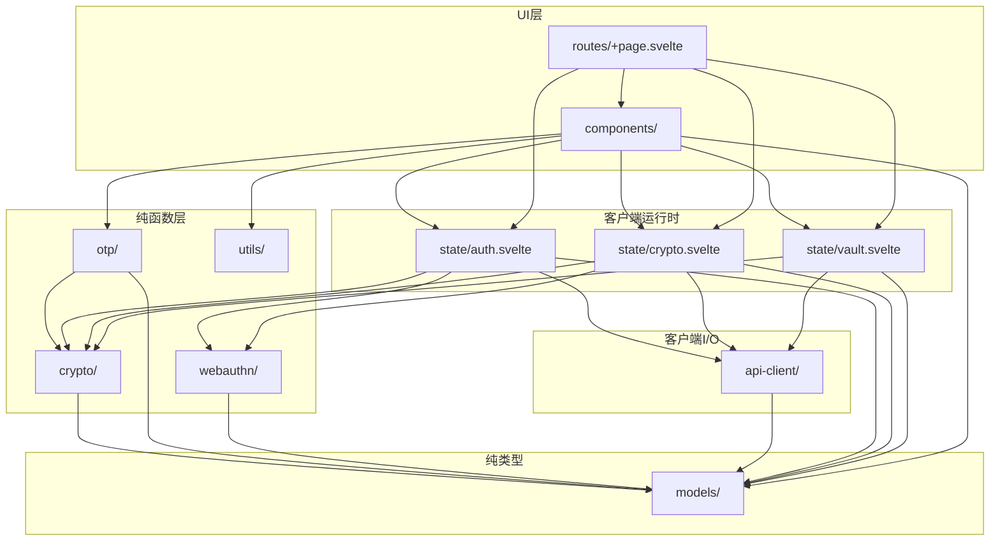

# 🧱 WebOTP 模块化设计文档 (Design)

**文档版本**: 1.0  
**更新日期**: 2026 年 6 月 20 日  
**文档密级**: 公开 (Public)  
**核心标签**: `Modular-Design`, `Module-Boundary`, `API-Contract`, `Dependency-Graph`, `Independence`

> 本文档是 [Architecture.md](./Architecture.md) v1.1 的模块化分解，把架构分解为**尽量独立**的模块，并定义每个模块的**职责 / 公共 API 契约 / 依赖关系 / 内部文件结构 / 错误契约**。

---

## 0. 文档定位与阅读约定

### 0.1 本文档的边界

本文档只定义**模块边界与契约**，不重复已有规格的完整实现：

| 关注点 | 权威文档 | 本文档角色 |
| :--- | :--- | :--- |
| 密码学实现（Argon2id/AES-GCM/HKDF/base32/封装格式/TOTP-HOTP 算法） | [CryptoSpec.md](./CryptoSpec.md) | 仅列模块公共 API 契约（函数名 + 参数/返回类型概要） |
| 工程化（TS 配置、命名、Drizzle 约定、错误类签名、目录组织） | [Engineering.md](./Engineering.md) | 遵循其约定，不重复签名实现 |
| 状态机、HTTP 错误码 UI 映射、重试退避、i18n 键 | [StateMachines.md](./StateMachines.md) | 引用其状态机，不重复转换图 |
| 路由树、页面、组件清单、交互规格 | [UIInventory.md](./UIInventory.md) | 引用其组件清单，仅补 `components/` 模块契约 |
| 测试向量与分层 | [Testing.md](./Testing.md) | 引用其测试分层，标注各模块可测性 |
| 数据模型/密钥层级/API 契约/工作流 | [Architecture.md](./Architecture.md) | 本文分解对象，每模块标注"关联架构 §X" |

### 0.2 模块独立性原则

1. **单向依赖**：依赖图必须无环（Engineering §9.2）。CI 以 `madge --circular src/lib/` 静态校验。
2. **纯函数层零状态/零 I/O**：`crypto/`、`otp/`、`models/`、`webauthn/`、`utils/`、`api-client/` 不得 import `state/` 或 `server/`（Engineering §9.1）。
3. **服务端隔离**：`server/` 入口 `import '$server-only'`，客户端禁止导入（Engineering §5.2）。
4. **跨模块副作用走注册而非导入**：需回调的耦合（如 401 触发锁定）以 handler 注册模式解耦，避免反向依赖（见 §8.4）。
5. **共享存储按 store 隔离**：多模块共用同一 IndexedDB 库但各占独立 object store，杜绝跨 state 模块互导（见 §8.3）。

### 0.3 决策记录（本次设计依据）

| 决策 | 选定 | 影响 |
| :--- | :--- | :--- |
| 文档深度 | **边界与契约层** | 仅契约概要，实现细节引用现有 specs |
| 同步引擎分解 | **单体 `vault.svelte.ts`** | 同步/3-way 合并/防抖/重试/离线缓存逻辑全部内置；`mergeAccounts` 作为该模块导出的纯函数 |
| 覆盖范围 | **全栈模块** | 客户端 lib + 服务端 lib + API 路由处理器 + Better Auth 配置全部纳入 |

> 因"单体 vault.svelte.ts"决策，`mergeAccounts` 纯函数内置于 `state/vault.svelte.ts`。Testing.md §1.1/§1.2/§5、StateMachines.md §3.2/§4.3/§8.2、Engineering.md §9.1 中相关路径/依赖图已同步更新（见 §10.2 传播记录）。

---

## 1. 模块总览

### 1.1 模块清单

| # | 模块 | 路径 | 类别 | 职责（一句话） | 纯净度 | 主要依赖 |
| :--- | :--- | :--- | :--- | :--- | :--- | :--- |
| 1 | `models/` | `src/lib/models/` | 纯类型 | 全部领域类型与错误基类，零运行时代码 | 纯类型 | 无 |
| 2 | `crypto/` | `src/lib/crypto/` | 纯函数 | 信封加密/包装/派生/编解码/内存擦除密码学原语 | 纯函数 | `models/`, hash-wasm, Web Crypto |
| 3 | `otp/` | `src/lib/otp/` | 纯函数 | TOTP/HOTP 计算与 otpauth URI 解析 | 纯函数 | `crypto/`(encoding), `models/` |
| 4 | `webauthn/` | `src/lib/webauthn/` | 浏览器 I/O | WebAuthn PRF 仪式封装（create/get + PRF 扩展） | 准纯函数 | `models/`, navigator.credentials |
| 5 | `utils/` | `src/lib/utils/` | 纯函数 | 时钟漂移检测、剪贴板定时清除等 UI 杂项 | 纯函数 | 浏览器 API |
| 6 | `api-client/` | `src/lib/api-client/` | 客户端 I/O | 全局 fetch 拦截器 + 类型化端点封装 + 401 吊销回调注册 | 客户端 I/O | `models/`, fetch |
| 7 | `state/auth.svelte.ts` | `src/lib/state/` | Runes 状态 | Better Auth 会话/设备/吊销 + auth-params 离线缓存 | 有状态 | `api-client/`, `webauthn/`, `crypto/`, `models/`, idb |
| 8 | `state/crypto.svelte.ts` | `src/lib/state/` | Runes 状态 | KEK/DEK 派生解包、解锁状态机、内存擦除、锁定触发 | 有状态 | `crypto/`, `webauthn/`, `api-client/`, `models/`, idb |
| 9 | `state/vault.svelte.ts` | `src/lib/state/` | Runes 状态 | 同步状态机 + 防抖 + 重试 + 3-way 合并 + Blob/快照离线缓存（单体） | 有状态 | `crypto/`, `api-client/`, `models/`, idb |
| 10 | `server/db/` | `src/lib/server/db/` | 服务端 | Drizzle schema + 查询（CAS/事务/CRUD） | 服务端 | drizzle-orm, `models/`, `server/auth` |
| 11 | `server/auth.ts` | `src/lib/server/auth.ts` | 服务端 | Better Auth 实例 + passkey 插件 + 会话吊销 API | 服务端 | better-auth, `server/db/schema` |
| 12 | `server/anti-enumeration.ts` | `src/lib/server/` | 服务端 | 不存在邮箱的确定性伪参数/伪恢复材料派生 | 服务端 | `models/`, `$env/static/private` |
| 13 | `server/rate-limit.ts` | `src/lib/server/` | 服务端 | IP+email 维度指数冷却限流（recover 端点） | 服务端 | 限流存储接口 |
| 14 | `server/constant-time.ts` | `src/lib/server/` | 服务端 | recoveryVerifier 常量时间比较 | 服务端 | node:crypto |
| 15 | `routes/api/*` | `src/routes/api/` | API 路由 | 9 个端点的 +server.ts 处理器 | 服务端 | `server/*`, `models/` |
| 16 | `components/` | `src/lib/components/` | UI | Svelte 组件（清单见 UIInventory） | UI | `state/`, `otp/`, `models/`, `utils/` |
| 17 | `paraglide/` | `src/paraglide/` | i18n | paraglide-sveltekit 生成的无运行时国际化 | 生成代码 | @paraglide-js |

### 1.2 模块分类与层次

```
┌─────────────────────────────────────────────────────────────┐
│ UI 层        components/  →  routes/+page.svelte            │
├─────────────────────────────────────────────────────────────┤
│ 客户端运行时  state/auth · state/crypto · state/vault       │
├─────────────────────────────────────────────────────────────┤
│ 客户端 I/O    api-client/                                   │
├─────────────────────────────────────────────────────────────┤
│ 纯函数层      models/  crypto/  otp/  webauthn/  utils/     │
└─────────────────────────────────────────────────────────────┘

┌─────────────────────────────────────────────────────────────┐
│ API 路由层    routes/api/*/+server.ts                       │
├─────────────────────────────────────────────────────────────┤
│ 服务端层      server/db · server/auth · server/anti-        │
│               enumeration · server/rate-limit ·             │
│               server/constant-time                          │
└─────────────────────────────────────────────────────────────┘

横切：paraglide/ (i18n)
```

---

## 2. 模块依赖图

### 2.1 客户端依赖图



### 2.2 服务端依赖图

```mermaid
graph TD
    subgraph schema
        SCH["server/db/schema"]
    end
    subgraph 服务端层
        DB["server/db (queries)"]
        AU["server/auth.ts"]
        AE["server/anti-enumeration"]
        RL["server/rate-limit"]
        CT["server/constant-time"]
    end
    subgraph API路由层
        R["routes/api/*/+server.ts"]
    end
    subgraph 纯类型
        M["models/"]
    end

    SCH --> M
    AU --> SCH
    DB --> SCH
    DB --> M
    DB --> AU
    AE --> M
    R --> DB
    R --> AU
    R --> AE
    R --> RL
    R --> CT
    R --> M
```



### 2.3 依赖方向规则

| 允许的边 | 禁止的边 | 依据 |
| :--- | :--- | :--- |
| `components/ → state/`、`state/ → 纯函数层`、`otp/ → crypto/`、`crypto/ → models/`、`server/* → models/` | `crypto/ → state/`、`crypto/ → server/`、`models/ → 任何`、`components/ → server/`、`state/ → state/`（同层互导） | Engineering §9.1 |
| `api-client/ → models/`（仅类型与错误） | `api-client/ → state/`（反向） | §8.4 以 handler 注册解耦 |
| `server/db → server/auth`（调用 BA 会话 API） | `server/auth → server/db(queries)` | 防环；auth 仅依赖 schema |
| `routes/api/* → server/*` | `server/* → routes/*` | 路由是消费方 |

> **新增依赖边说明**：因错误类拆分（Engineering §6.1 注释：`CryptoError` 细化子类置于 `crypto/errors.ts`），`crypto/errors.ts` 需 import `CryptoError` 基类自 `models/errors.ts`，故在 Engineering §9.1 原图基础上**新增** `crypto/ → models/` 一条边（仅用于错误基类，最小且单向）。

---

## 3. 纯函数层模块

### 3.1 `models/` — 领域类型与错误基类

| 项 | 内容 |
| :--- | :--- |
| 职责 | 全部领域模型接口、API 请求/响应类型、UI Props 类型、错误类基类。**零运行时代码、零依赖**。 |
| 内部文件 | `account.ts`（`Account`、`AccountDraft`、`OtpauthParsed`）、`vault.ts`（`VaultResponse`/`VaultPut*`/`VaultCreate*`/`VaultConflictResponse`）、`api.ts`（`AuthParamsResponse`/`RotateKeyRequest`/`PasskeyWrap*`/`Recover*`/`KdfParams`）、`ui.ts`（UIInventory 附录 A 全部 Props）、`errors.ts`（`WebOtpError` 基类 + 非 crypto 子类） |
| 公共 API 契约 | `Account`（Architecture §5.1）、`KdfParams`（CryptoSpec §2.3）、`AuthParamsResponse`/`VaultResponse`/`VaultPutRequest`/`VaultPutResponse`/`VaultConflictResponse`/`VaultCreateRequest`/`VaultCreateResponse`/`RotateKeyRequest`/`PasskeyWrapCreateRequest`/`PasskeyWrapRow`/`RecoverInitRequest`/`RecoverInitResponse`/`RecoverResetRequest`（Architecture §9.1，字段以该文档为准）；错误类：`WebOtpError`(abstract)、`CryptoError`(base)、`OccConflictError`、`NetworkError`、`SessionRevokedError`、`ApiError`、`RateLimitError`、`ForbiddenError`、`NotFoundError`、`ConflictError`、`ServerError`（Engineering §6.1 签名） |
| 依赖 | 无（`isolatedModules` 下纯类型导出） |
| 错误契约 | 仅定义类型；`errors.ts` 提供可实例化类（构造签名见 Engineering §6.1） |
| 可测性 | 不需测试（纯类型）；错误类可由各模块测试覆盖 |
| 关联架构 | §4 数据模型、§5.1 Account、§9.1 API Schema、Engineering §6.1 |

### 3.2 `crypto/` — 密码学原语（纯函数）

| 项 | 内容 |
| :--- | :--- |
| 职责 | 信封加密全部密码学操作：Argon2id 派生、AES-GCM 加解密/包装解包、HKDF-SHA256、base32/base64 编解码、密文封装格式、RK 生成解析、内存擦除。**无状态、无副作用、可独立单测**。 |
| 内部文件 | `argon2.ts`、`aes-gcm.ts`、`envelope.ts`、`hkdf.ts`、`encoding.ts`、`recovery-key.ts`、`secure-wipe.ts`、`errors.ts` |
| 公共 API 契约（概要） | `argon2.ts`：`deriveKEK(password, salt, params) → Promise<Uint8Array(32)>`、`deriveLAK(mpBytes, loginSalt, params) → Promise<string>`、`deriveRecoveryVerifier(rkBytes, verifierSalt, params) → Promise<string>`<br>`aes-gcm.ts`：`generateIV() → Uint8Array(12)`、`encryptAesGcm(plaintext, key, iv) → Promise<Uint8Array>`、`decryptAesGcm(ct, key, iv) → Promise<Uint8Array>`（纯核心，IV 显式传入；便利函数 `encryptAesGcmRandomIv` 委托核心）<br>`envelope.ts`：`importKEK(rawKek) → Promise<CryptoKey>`、`generateDEK() → Promise<CryptoKey>`、`wrapDek(dek, kek) → Promise<string>`、`unwrapDek(wrapped, kek) → Promise<CryptoKey>`、`encryptBlob(accounts, dek) → Promise<string>`、`decryptBlob(encoded, dek) → Promise<Account[]>`<br>`hkdf.ts`：`deriveKEKPrf(prfOut, prfSalt) → Promise<CryptoKey>`（info 固定 `"WebOTP/KEK-PRF/v1"`）<br>`encoding.ts`：`uint8ArrayToBase64`/`base64ToUint8Array`、`base32Decode`/`base32Encode`、`serializeEncryptedPayload(ct, iv) → string`、`parseEncryptedPayload(encoded) → ParsedEncryptedPayload`<br>`recovery-key.ts`：`generateRecoveryKey() → { raw: Uint8Array(12), display: string }`、`parseRecoveryKey(input) → Uint8Array`<br>`secure-wipe.ts`：`secureWipe(buffer) → void`<br>`errors.ts`：`DecryptionError`、`KdfError`、`EncodingError`、`FormatError`（均继承 `models/errors.ts` 的 `CryptoError`） |
| 依赖 | `models/`（错误基类 + `Account`/`KdfParams` 类型）、`hash-wasm`、Web Crypto API |
| 错误契约 | 抛 `CryptoError` 子类：AEAD 失败→`DecryptionError`；Argon2id 参数非法/Wasm 加载失败→`KdfError`；base32/base64/封装格式非法→`EncodingError`/`FormatError`。**绝不静默降级、绝不返回默认值**（CryptoSpec §3.5、§4.4、§7.4） |
| 不变量 | DEK 恒定、KEK 不接触 Blob、各路径独立盐、IV 不可复用、AEAD 失败即拒绝（CryptoSpec §1.2） |
| 可测性 | 100% 可独立单测；测试向量见 Testing.md §3、§4，降速参数见 Testing.md §2.2 |
| 关联架构 | §3 密钥层级、CryptoSpec 全文 |

### 3.3 `otp/` — OTP 计算引擎（纯函数）

| 项 | 内容 |
| :--- | :--- |
| 职责 | TOTP/HOTP 验证码计算、otpauth URI 解析为账户草稿。纯函数，依赖 `crypto/encoding.ts` 的 base32 解码。 |
| 内部文件 | `totp.ts`、`hotp.ts`、`otpauth-uri.ts` |
| 公共 API 契约（概要） | `hotp.ts`：`generateHOTP({ secret, algorithm, digits, counter }) → Promise<string>`（RFC 4226 动态截断）<br>`totp.ts`：`generateTOTP({ secret, algorithm, digits, period, time }) → Promise<string>`、`verifyTOTP({ token, secret, algorithm, digits, period, window, time }) → Promise<boolean>`（默认 window=±1）<br>`otpauth-uri.ts`：`parseOtpauthUri(uri) → OtpauthParsed`（解析 `otpauth://totp/...?secret=...&algorithm=...&digits=...&period=...`，返回 `AccountDraft` 待调用方补 `id`/`createdAt`/`updatedAt`）；`buildOtpauthUri(account) → string`（导出用） |
| 依赖 | `crypto/`（`base32Decode`）、`models/`（`Account`、`OtpauthParsed`） |
| 错误契约 | base32 解码失败抛 `EncodingError`；URI 格式非法抛 `EncodingError`；非 `totp`/`hotp` 协议抛 `EncodingError` |
| 取舍 | Engineering §6.3 建议 OTP 计算 UI 入口返回 `Result<T, CryptoError>` 避免 try/catch 开销；CryptoSpec §10 实现为 `Promise<string>` 并抛错。**本文档约定**：`otp/` 内部函数保持 CryptoSpec 的抛错语义；UI/调用侧如需 `Result` 由调用方包装。该差异在 §10 文档对齐中标注 |
| 可测性 | 100% 可独立单测；RFC 6238/4226 标准向量见 Testing.md §3 |
| 关联架构 | §5.2 TOTP/HOTP 规范、CryptoSpec §10 |

### 3.4 `webauthn/` — WebAuthn PRF 仪式封装

| 项 | 内容 |
| :--- | :--- |
| 职责 | 封装 `navigator.credentials.create/get` 的 PRF 扩展细节：注入 `prf.eval` 到创建选项、从 `clientExtensionResults` 读取 `$PRF_{out}$`、能力探测。与 Better Auth passkey 插件协作：Better Auth 生成基础 WebAuthn 选项，本模块叠加 PRF 扩展并提取 PRF 输出。 |
| 内部文件 | `prf.ts`、`support.ts` |
| 公共 API 契约（概要） | `support.ts`：`isPrfSupported() → boolean`（特性检测，用于解锁页按钮显隐与降级）<br>`prf.ts`：`createPasskeyWithPrf({ prfSalt, betterAuthOptions }) → Promise<{ credentialId: string; prfOut: Uint8Array }>`、`getAssertionWithPrf({ prfSalt, email }) → Promise<{ credentialId: string; assertion: PublicKeyCredential; prfOut: Uint8Array }>` |
| 依赖 | `models/`（类型）、`navigator.credentials`、Better Auth passkey 选项（由 `state/auth` 透传） |
| 错误契约 | 浏览器不支持 PRF → 返回 `null`/抛 `PrfUnsupportedError`（调用方走 §7.5 降级）；用户取消 → 抛 `WebAuthnUserCancelledError`（调用方回退 MP）；PRF 输出缺失 → 抛 `PrfOutputMissingError`。以上错误类置于 `webauthn/errors.ts`，继承 `WebOtpError` |
| 不变量 | `$PRF_{out}$` 以 `Uint8Array` 短暂持有，派生 `KEK_PRF` 后由调用方立即 `secureWipe`（CryptoSpec §9.2） |
| 可测性 | 浏览器 API 需 E2E（Playwright + 虚拟 WebAuthn）；能力探测可单测 mock |
| 关联架构 | §7.5 PRF 免密解锁、§3.4 PRF 路径 |

### 3.5 `utils/` — 客户端杂项工具

| 项 | 内容 |
| :--- | :--- |
| 职责 | 与业务无关的浏览器杂项：时钟漂移检测、剪贴板定时清除。 |
| 内部文件 | `clock-drift.ts`、`clipboard.ts` |
| 公共 API 契约（概要） | `clock-drift.ts`：`detectClockDrift() → Promise<number>`（比对 HTTP `Date` 响应头与 `Date.now()`，返回偏差秒）<br>`clipboard.ts`：`copyAndClearAfter(text, clearMs = 30_000) → Promise<void>`（写入剪贴板，`clearMs` 后条件清除） |
| 依赖 | 浏览器 API（fetch `Date` 头、`navigator.clipboard`） |
| 错误契约 | 剪贴板 API 被拒绝 → 静默忽略（UIInventory §7.3）；时钟漂移检测失败 → 返回 0 |
| 关联架构 | §11.1 时钟漂移、UIInventory §7.3 |

### 3.6 `api-client/` — 客户端 HTTP 层

| 项 | 内容 |
| :--- | :--- |
| 职责 | 全局 fetch 拦截器（StateMachines §3.2）：把 HTTP 状态码映射为类型化错误；提供 9 个端点的类型化封装；通过 **handler 注册**接收 401 吊销回调（不反向 import `state/`）。 |
| 内部文件 | `api-client.ts`（拦截器 + `apiFetch`）、`endpoints.ts`（类型化端点函数）、`session-revoked-hook.ts`（handler 注册槽） |
| 公共 API 契约（概要） | `apiFetch(input, init?) → Promise<Response>`（拦截器，见 StateMachines §3.2 伪码）<br>`session-revoked-hook.ts`：`setSessionRevokedHandler(fn: () => void) → void`、`triggerSessionRevoked() → void`<br>`endpoints.ts`（均返回类型化响应或抛 `WebOtpError` 子类）：`getAuthParams(email) → Promise<AuthParamsResponse>`、`getVault() → Promise<VaultResponse>`、`initVault(req) → Promise<VaultCreateResponse>`、`putVault(expectedVersion, encryptedBlob) → Promise<VaultPutResponse>`、`rotateKey(req) → Promise<void>`、`listPasskeyWraps() → Promise<PasskeyWrapRow[]>`、`createPasskeyWrap(req) → Promise<PasskeyWrapRow>`、`deletePasskeyWrap(credentialId) → Promise<void>`、`recoverInit(email) → Promise<RecoverInitResponse>`、`recoverReset(req) → Promise<void>`、`revokeSession(id) → Promise<void>` |
| 依赖 | `models/`（错误类 + API 类型）、fetch |
| 错误契约 | 401（非 `auth/*`）→ `SessionRevokedError` + 触发已注册 handler；412 → `OccConflictError`（携 `serverVersion`/`serverEncryptedBlob`/`serverWrappedDekByMaster`，从响应体 `{serverVersion, encryptedBlob, wrappedDekByMaster}` 解析）；429 → `RateLimitError`（携 `retryAfter`，读 `Retry-After` 头，默认 60）；403→`ForbiddenError`；404→`NotFoundError`；409→`ConflictError`；5xx→`ServerError`；fetch TypeError/超时→`NetworkError`（携 `cause`） |
| 解耦要点 | 拦截器不 import `state/`；`state/crypto.svelte` 在初始化时调用 `setSessionRevokedHandler(() => lock())` 注册回调，保持 `api-client → state` 无边 |
| 可测性 | 拦截器与端点可用 fetch mock（MSW）单测；handler 注册纯逻辑可单测 |
| 关联架构 | §9 API 契约、StateMachines §3 错误映射、§8.3 会话校验 |
| 文档对齐 | StateMachines §3.2 标注路径为 `src/lib/server/api-client.ts`，但该拦截器运行于**客户端**（触发锁定、用 `$state`）。本文档修正为 `src/lib/api-client/`（见 §10） |

---

## 4. 客户端运行时层（`state/`）

> 三大状态模块为**同级 sibling**，**禁止互相 import**（Engineering §9.1）。跨模块协作通过：① `api-client/` handler 注册；② 共享 IndexedDB 库按 store 隔离（§8.3）；③ 路由层 `+page.svelte` 编排三者。

### 4.1 `state/auth.svelte.ts` — 身份与设备控制

| 项 | 内容 |
| :--- | :--- |
| 职责 | 封装 Better Auth 客户端，管理 `isAuthenticated`、会话列表、当前设备标识；提供注册/登录/登出/吊销；登录成功后把 auth-params 沉淀到 IndexedDB 供离线解锁。 |
| 模块级 `$state` | `isAuthenticated: boolean`、`sessions: SessionRow[]`、`currentDeviceId: string | null`、`authStatus: 'idle' | 'authenticating' | 'error'` |
| 公共 API 契约（概要） | `registerWithLak({ email, lak, vaultInitReq }) → Promise<void>`、`loginWithLak({ email, lak }) → Promise<void>`、`loginWithPasskey(assertion) → Promise<void>`、`logout() → Promise<void>`、`listSessions() → Promise<SessionRow[]>`、`revokeSession(id) → Promise<void>`（经 `api-client.revokeSession`）、`sedimentAuthParams(params: AuthParamsResponse) → Promise<void>`（写 `auth-params` store）、`getCachedAuthParams() → Promise<AuthParamsResponse | null>`（离线读，供 `crypto.svelte` 解锁） |
| 依赖 | `api-client/`、`webauthn/`（Passkey 登录断言）、`crypto/`（仅类型，不派生——派生归 `crypto.svelte`）、`models/`、Better Auth 客户端、idb（`auth-params` store） |
| 错误契约 | 登录凭据错误（`POST /api/auth/*` 401）→ 不触发吊销 handler，向上抛由登录页显示 `auth.login.error.wrongPassword`；429→`RateLimitError`；其余 401→`SessionRevokedError` |
| IndexedDB store | 库 `webotp`，store `auth-params`（键 `email`，值 `{ kdfSalt, prfSalt, kdfParams, email }`；**不缓存** `loginSalt`/`recoverySalt`，离线无需——Architecture §7.2） |
| 关联架构 | §6.1、§7.1 注册、§7.2 登录、§8.3 会话校验 |

### 4.2 `state/crypto.svelte.ts` — 内存安全与加解锁

| 项 | 内容 |
| :--- | :--- |
| 职责 | 持有不可导出 `DEK`（`extractable: false` 的 `CryptoKey`）与 `isUnlocked`；管理解锁状态机（StateMachines §2）；MP/Passkey/RK 三条解包路径；锁定时擦除敏感内存；注册 401 吊销 handler；密码轮换的客户端侧重新派生+重新包装。 |
| 模块级 `$state` | `isUnlocked: boolean`、`unlockStatus: 'locked' | 'unlocking' | 'unlocked' | 'locking'`、`dekRef: CryptoKey | null`（**不**放入会被 proxy 包装的 `$state`——Engineering §4.1，用模块级非响应式引用 + `isUnlocked` 响应式标志） |
| 公共 API 契约（概要） | `unlockWithMp({ mp, authParams, wrappedDekByMaster }) → Promise<void>`、`unlockWithPasskey() → Promise<void>`（经 `webauthn.getAssertionWithPrf` + `api-client.listPasskeyWraps` + `crypto.unwrapDek`）、`unlockWithRecoveryKey({ rk, recoverInitResp }) → Promise<{ dek, blob }>`、`lock() → Promise<void>`（擦除 + 重置计时器 + 取消在途 fetch）、`rotateMasterPassword({ oldMp, newMp }) → Promise<void>`（旧 KEK 解包 DEK → 新 KEK/LAK/盐重新包装 → `api-client.rotateKey`）、`registerSessionRevokedHandler() → void`（向 `api-client` 注册 `lock` 回调，应用启动时调用） |
| 锁定触发 | 主动锁定 / 5 分钟无操作 / `visibilitychange→hidden`（StateMachines §2.4）/ 任意 401（经 handler） |
| 依赖 | `crypto/`、`webauthn/`、`api-client/`、`models/`、idb（读 `auth-params` 离线派生 KEK_MP） |
| 错误契约 | 解包失败（AEAD）→ `DecryptionError` → 状态 `unlocking → locked` + UI `auth.unlock.error.wrongPassword`（不区分密码错/数据损坏）；KdfError→阻断式错误页 |
| 内存擦除 | `lock()` 对所有敏感 `Uint8Array`（MP/RK/PRF/KEK 派生字节/种子）调 `crypto.secureWipe`；`dekRef=null`；诚实定界见 CryptoSpec §9.3 |
| 关联架构 | §6.2、§3.4–3.6、StateMachines §2 |

### 4.3 `state/vault.svelte.ts` — 同步引擎（单体）

| 项 | 内容 |
| :--- | :--- |
| 职责 | 维护 `accounts`/`baseSnapshot`/`syncStatus`/`lastVersion`；同步状态机（StateMachines §1）；防抖（500ms 窗口 / 3000ms 最大等待，StateMachines §8）；指数退避重试队列（StateMachines §4）；**3-way 合并纯函数 `mergeAccounts`**；Blob/快照/Passkey 行的 IndexedDB 离线缓存；加密上传与 412 合并循环。 |
| 模块级 `$state` | `accounts: Account[]`、`baseSnapshot: Account[]`、`syncStatus: 'idle' | 'dirty' | 'syncing' | 'conflict'`、`lastVersion: number`（Architecture §6.3） |
| 公共 API 契约（概要） | **纯函数导出**：`mergeAccounts(base, local, remote) → Account[]`（§5.3 全部裁决规则 + base 丢失两方降级；**纯函数，可单测**——见 §10 测试路径对齐）<br>**状态/编排**：`initEmptyBlob(dek) → Promise<string>`、`loadVault(dek, remote) → Promise<Account[]>`、`addAccount(draft) → void`、`updateAccount(account) → void`、`deleteAccount(id) → void`（软删除置 `deletedAt`）、`triggerSync(dek) → Promise<void>`（防抖入口）、`encryptAndUpload(dek) → Promise<void>`（经 `crypto.encryptBlob` + `api-client.putVault`）、`handleOccConflict(err, dek) → Promise<void>`（解密 Remote → `mergeAccounts` → 重 PUT，循环至 200）、`persistToIndexedDB() → Promise<void>`、`loadFromIndexedDB(dek) → Promise<Account[] | null>`、`getCachedPasskeyWraps() → Promise<PasskeyWrapRow[]>`（解锁页探测已绑定 Passkey） |
| 内部子机制（同模块内，不外拆） | 防抖计时器、重试队列（`calculateBackoff` 见 StateMachines §4.3）、IndexedDB 读写 |
| 依赖 | `crypto/`（`encryptBlob`/`decryptBlob`）、`api-client/`（`getVault`/`putVault`/`listPasskeyWraps` 等）、`models/`、idb |
| 错误契约 | 412→`OccConflictError` 捕获→`syncing → conflict → syncing`（合并不计重试次数）；网络/5xx→`syncing → dirty`（进退避队列）；401→不进合并→经 handler 强制锁定（StateMachines §1.3、§2.5） |
| IndexedDB stores | 库 `webotp`，stores：`vault-cache`（`{ encryptedBlob, wrappedDekByMaster, version, updatedAt }`）、`base-snapshot`（`Account[]`）、`passkey-wraps`（`PasskeyWrapRow[]`） |
| 可测性 | `mergeAccounts` 纯函数可单测（导入模块会初始化响应式 state，函数本身纯）；合并规则矩阵见 Testing.md §5；防抖/重试/状态机需集成/E2E |
| 关联架构 | §6.3、§7.3 三方合并、§5.3 合并语义、StateMachines §1、§4、§8 |

---

## 5. 服务端层（`server/`）

> 全部模块入口 `import '$server-only'`；客户端禁止导入（Engineering §5.2）。

### 5.1 `server/db/` — Drizzle ORM 层

| 项 | 内容 |
| :--- | :--- |
| 职责 | schema 定义（纯表结构 + 类型，**不含查询**——Engineering §8.1）+ 查询函数（CAS/事务/CRUD）。 |
| 内部文件 | `index.ts`（drizzle 实例 + 连接，`import '$server-only'`）、`migrate.ts`、`schema/index.ts`、`schema/user.ts`、`schema/vault.ts`、`schema/passkey-wrap.ts`、查询文件 `user.ts`、`vault.ts`、`passkey-wrap.ts`、`recover.ts`、`session.ts` |
| schema 契约 | `user`/`vault`/`passkeyWrap` 三表，字段与列名映射严格遵循 Architecture §4 + Engineering §3.2（camelCase 字段 ↔ snake_case 列） |
| 查询公共 API 契约（概要） | `vault.ts`：`initVault(userId, req: VaultCreateRequest) → Promise<{version:1}>`、`getVault(userId) → Promise<VaultResponse>`、`updateVaultBlob(userId, expectedVersion, encryptedBlob) → Promise<number>`（**CAS**：`UPDATE ... SET version=version+1 WHERE version=expectedVersion`；影响 0 行→查当前行抛 `OccConflictError` 携 `serverVersion`/`serverEncryptedBlob`/`serverWrappedDekByMaster`）、`rotateWrappedDekByMaster(userId, newWrapped) → Promise<void>`<br>`user.ts`：`getAuthParamsByEmail(userId) → AuthParamsResponse`、`updateUserSaltsAndKdf(userId, {loginSalt, kdfSalt}) → Promise<void>`、`updateRecoveryMaterial(userId, fields) → Promise<void>`<br>`passkey-wrap.ts`：`listPasskeyWraps(userId)`、`createPasskeyWrap(userId, req)`（`credentialId` 唯一冲突→`ConflictError`）、`deletePasskeyWrap(userId, credentialId)`（不存在→`NotFoundError`）<br>`recover.ts`：`getRecoveryMaterial(email) → RecoverInitResponse | null`、`resetRecovery(email, req: RecoverResetRequest) → Promise<void>`（**单事务**：常量时间校验 `recoveryVerifier` → 更新 BA 密码哈希 + `login_salt`/`kdf_salt`/`wrapped_dek_by_master`/`wrapped_dek_by_recovery`/`recovery_salt`/`recovery_verifier_salt`/`recovery_verifier` → 调 `server/auth.revokeAllSessions`）<br>`session.ts`：薄封装，吊销委托 `server/auth` |
| 事务规则 | `PUT /api/vault`（Blob）单条 CAS UPDATE 原子，不用显式事务；`rotate-key`/`recover/reset` **必须** `db.transaction()`（Engineering §8.3）；`passkey-wraps` 单行 CRUD 不需事务 |
| 依赖 | drizzle-orm、`schema/`、`models/`（`OccConflictError`/`ConflictError`/`NotFoundError`/API 类型）、`server/auth`（rotate/reset 内调 BA 会话吊销 API） |
| 错误契约 | OCC 冲突抛 `OccConflictError`；`credentialId` 重复抛 `ConflictError`；行不存在抛 `NotFoundError` |
| 关联架构 | §4 数据模型、§8.2 原子轮换、§8.5 恢复授权、Engineering §8 |

### 5.2 `server/auth.ts` — Better Auth 配置

| 项 | 内容 |
| :--- | :--- |
| 职责 | Better Auth 实例 + Drizzle adapter + `@better-auth/passkey` 插件；user 表扩展字段（盐值/KDF 参数/`recoveryVerifier`）映射；会话/设备管理 API；密码哈希更新 hook。 |
| 公共 API 契约（概要） | `betterAuth`（实例，供 `routes/api/auth/[...path]` 委托）、`revokeOtherSessions(userId, exceptSessionId) → Promise<void>`（密码轮换后用，Architecture §8.2）、`revokeAllSessions(userId) → Promise<void>`（恢复重置后用，§8.5）、`updatePasswordHash(userId, newLak) → Promise<void>`（在 rotate/reset 事务内调用，覆盖 BA 密码哈希）、`passkeyPluginConfig`（PRF 扩展注入点，配合 `webauthn/` 客户端） |
| 依赖 | better-auth、@better-auth/passkey、`server/db`（schema + `db/index` 连接实例，配置 Drizzle adapter；**不 import 查询文件**，防环）、`$env/static/private`（`BETTER_AUTH_SECRET`） |
| 集成要点 | Better Auth 的 passkey 创建/断言选项需叠加 PRF `extensions.prf.eval`——客户端 `webauthn/createPasskeyWithPrf` 接收 BA 基础选项后注入；断言后 `clientExtensionResults.prf.results.first(prfSalt)` 取 `$PRF_{out}$` |
| 关联架构 | §2 技术栈、§7.1/§7.2/§7.5、§8.2/§8.3/§8.5 |

### 5.3 `server/anti-enumeration.ts` — 反枚举伪参数

| 项 | 内容 |
| :--- | :--- |
| 职责 | 对不存在邮箱确定性派生**形状/耗时一致**的伪 `AuthParamsResponse` 与伪 `RecoverInitResponse`，延续 §8.1 反枚举。 |
| 公共 API 契约（概要） | `derivePseudoAuthParams(email) → AuthParamsResponse`、`derivePseudoRecoveryMaterial(email) → RecoverInitResponse`（均经 `HMAC(email, ServerSecret)` 确定性派生固定伪盐/伪 KDF 参数/伪密文，类型与形状与真实响应完全一致） |
| 依赖 | `$env/static/private`（`ServerSecret`）、`models/`（响应类型）、node:crypto（HMAC） |
| 不变量 | 伪参数须与真实参数在字段、base64 长度、类型上完全一致，仅数值为确定性伪随机；必要时加恒定延迟对齐耗时（§8.1） |
| 关联架构 | §8.1 反枚举、§8.5 recover/init 伪材料 |

### 5.4 `server/rate-limit.ts` — 限流

| 项 | 内容 |
| :--- | :--- |
| 职责 | recover/init、recover/reset 端点的 IP + email 双维度指数冷却限流；返回 `Retry-After`。 |
| 公共 API 契约（概要） | `checkAndConsume(key: { ip, email, action }) → Promise<{ allowed: boolean; retryAfter: number }>`、`LimitStore` 接口（`get`/`set` 带过期）供注入：默认内存实现（标注 serverless 多实例下应换 DB/Redis 实现） |
| 依赖 | 限流存储接口（默认内存 `Map` + TTL） |
| 错误契约 | 超限→由路由层返回 429 + `Retry-After` 头 |
| 关联架构 | §8.5 限流、StateMachines §3.1（429 映射） |

### 5.5 `server/constant-time.ts` — 常量时间比较

| 项 | 内容 |
| :--- | :--- |
| 职责 | `recoveryVerifier` 提交值与存储值的常量时间比较，防时序侧信道。 |
| 公共 API 契约 | `safeEqualVerifier(submitted: string, stored: string) → boolean`（基于 `node:crypto.timingSafeEqual`，先比较长度再比较缓冲，长度不等时以恒定方式返回 false） |
| 依赖 | node:crypto |
| 关联架构 | §8.5 重置授权 |

---

## 6. API 路由层（`routes/api/*/+server.ts`）

每个处理器 = 鉴权 + 参数校验 + 调 `server/*` + 返回 Architecture §9.1 schema + 按 StateMachines §3.1 矩阵返回错误码。错误码覆盖校验见 StateMachines 附录 A。

### 6.1 端点处理器清单

| 处理器文件 | 方法 | 鉴权 | 依赖服务模块 | 成功 | 错误码 |
| :--- | :--- | :--- | :--- | :--- | :--- |
| `routes/api/auth-params/+server.ts` | GET | 公开 | `server/anti-enumeration` | 200 `AuthParamsResponse` | 网络降级（无 4xx） |
| `routes/api/auth/[...path]/+server.ts` | POST/GET/DELETE | 公开（BA 自管） | `server/auth`（委托） | 200 | 401/429 |
| `routes/api/vault/+server.ts` | GET | BA 会话 | `server/db/vault` | 200 `VaultResponse` | 401 |
| `routes/api/vault/+server.ts` | POST | BA 会话 | `server/db/vault` | 201 `{version:1}` | 401/409 |
| `routes/api/vault/+server.ts` | PUT | BA 会话 | `server/db/vault`（CAS） | 200 `{version}` | 401/412 |
| `routes/api/vault/rotate-key/+server.ts` | POST | BA 会话 | `server/db/vault`（事务）+ `server/auth.revokeOtherSessions` | 200 | 401 |
| `routes/api/passkey-wraps/+server.ts` | GET | BA 会话 | `server/db/passkey-wrap` | 200 `PasskeyWrapRow[]` | 401 |
| `routes/api/passkey-wraps/+server.ts` | POST | BA 会话 | `server/db/passkey-wrap` | 201 `PasskeyWrapRow` | 401/409 |
| `routes/api/passkey-wraps/[credentialId]/+server.ts` | DELETE | BA 会话 | `server/db/passkey-wrap` + `server/auth`（吊销 BA 凭证） | 200 | 401/404 |
| `routes/api/vault/recover/init/+server.ts` | POST | 无会话+限流 | `server/rate-limit` + `server/anti-enumeration`（不存在邮箱）+ `server/db/recover` | 200 `RecoverInitResponse` | 429 |
| `routes/api/vault/recover/reset/+server.ts` | POST | 无会话+限流 | `server/rate-limit` + `server/constant-time` + `server/db/recover`（事务）+ `server/auth.revokeAllSessions` | 200 | 403/429 |
| `routes/api/session/[id]/+server.ts` | DELETE | BA 会话 | `server/auth` | 200 | 401/404 |

### 6.2 三个复杂处理器的额外约定

- **`PUT /api/vault`（CAS）**：`expectedVersion` 来自请求体；`updateVaultBlob` 返回新 `version`；0 行影响由 `server/db/vault` 抛 `OccConflictError`，路由层捕获并响应 412 + `VaultConflictResponse`（`{serverVersion, encryptedBlob, wrappedDekByMaster}`，**不含** `wrappedDekByRecovery`/passkey 行——Architecture §9.1）。
- **`POST /api/vault/rotate-key`**：路由层调 `rotateMasterPassword` 事务（更新 BA 密码哈希 + `login_salt`/`kdf_salt` + `wrappedDekByMaster`），**事务提交后**调 `server/auth.revokeOtherSessions(userId, currentSessionId)`（非事务内）。Blob/version/`wrappedDekByRecovery`/passkey 行不动（§8.2）。
- **`POST /api/vault/recover/reset`**：路由层先 `rate-limit.checkAndConsume`，再 `server/constant-time.safeEqualVerifier(提交 recoveryVerifier, 存储)`，失败→403；通过→`resetRecovery` 单事务更新全部 MP/RK 字段 + `revokeAllSessions`。$DEK$ 与 Blob 不变。

---

## 7. UI 层与 i18n

### 7.1 `components/` — Svelte 组件模块

| 项 | 内容 |
| :--- | :--- |
| 职责 | 全部 UI 组件，按 `auth/`/`otp/`/`sync/`/`settings/`/`layout/`/`ui/`(shadcn 生成) 分组。**完整清单、Props、交互规格见 [UIInventory.md](./UIInventory.md) §3、§6–§9、附录 A**，本文档不重复。 |
| 模块契约 | ① 只 import `state/`（读 `$state`/调用编排函数）、`otp/`、`models/`、`utils/`；② **禁止** import `server/`（Engineering §5.3）；③ **禁止**经 `$props` 传递 `CryptoKey`/`Uint8Array` 密钥材料（Engineering §4.2）；④ 敏感输入用 `SensitiveInput`（单向 `onSubmit` 回调，不 `bind:value`，UIInventory §8.5）；⑤ 禁止 `{@html}`（Engineering §2.3，防解密后 XSS） |
| 依赖 | `state/`、`otp/`、`models/`、`utils/`、shadcn-svelte/bits-ui |
| 关联架构 | §6、UIInventory 全文 |

### 7.2 `paraglide/` — i18n

| 项 | 内容 |
| :--- | :--- |
| 职责 | paraglide-sveltekit 生成的无运行时、类型安全国际化。键命名遵循 StateMachines §7（`{domain}.{context}.{element}[.{qualifier}]`），初始键清单见 StateMachines §7.2。 |
| 位置 | `src/paraglide/`（paraglide 生成目录）+ `project.inlang/` 配置；消息文件 `messages/{locale}.json` |
| 依赖 | @paraglide-js/paraglide-sveltekit |
| 关联架构 | §11.3 多语言、StateMachines §7 |

---

## 8. 跨模块契约

### 8.1 错误契约（谁抛 / 谁捕）

错误类层级与 UI 映射权威定义见 StateMachines §6、Engineering §6.1。各模块角色：

| 模块 | 抛出 | 捕获/处理 |
| :--- | :--- | :--- |
| `crypto/` | `DecryptionError`/`KdfError`/`EncodingError`/`FormatError` | 不捕（向上抛） |
| `otp/` | `EncodingError` | 不捕 |
| `api-client/` | `SessionRevokedError`/`OccConflictError`/`RateLimitError`/`ForbiddenError`/`NotFoundError`/`ConflictError`/`ServerError`/`NetworkError` | 401 触发已注册 handler |
| `state/crypto.svelte` | `DecryptionError`（解包失败） | 捕 → `unlocking → locked` + UI 错误文案 |
| `state/vault.svelte` | — | 捕 `OccConflictError` → 合并循环；捕 `NetworkError`/`ServerError` → 退避队列；`SessionRevokedError` → 经 handler 锁定 |
| `state/auth.svelte` | — | 登录 401（凭据错）不触发 handler，向上抛供登录页显示 |
| `server/db` | `OccConflictError`/`ConflictError`/`NotFoundError` | 不捕（路由层转 HTTP 码） |
| `routes/api/*` | — | 捕模块错误 → 映射 HTTP 状态码 + 响应体（StateMachines §3.1） |

### 8.2 内存擦除契约（谁持有 / 谁擦）

权威见 CryptoSpec §9。各模块持有的敏感材料与擦除责任：

| 模块 | 持有的敏感 `Uint8Array` | 擦除责任 |
| :--- | :--- | :--- |
| `crypto/` | KEK 派生字节、base32 解码种子、`encryptBlob` 明文 | 各函数内部 `secureWipe`（CryptoSpec §9.2） |
| `webauthn/` | `$PRF_{out}$` | 派生 `KEK_PRF` 后交调用方 `secureWipe` |
| `state/crypto.svelte` | MP/RK 明文字节、PRF 输出、KEK 派生字节 | `lock()` 统一 `secureWipe` + `dekRef=null` |
| `components` | 经 `SensitiveInput` 的 MP/RK string | 解锁/提交后输入框 `.value=''`；string 副本诚实定界（不可擦） |

### 8.3 离线缓存契约（IndexedDB store 隔离）

单一库 `webotp`，各 state 模块**独占** object store，互不读写对方 store，杜绝跨 state 模块互导：

| store | 写入方 | 读取方 | 内容 | 架构依据 |
| :--- | :--- | :--- | :--- | :--- |
| `auth-params` | `state/auth`（登录后沉淀） | `state/crypto`（离线派生 KEK_MP） | `{ kdfSalt, prfSalt, kdfParams, email }` | §7.2（不缓存 `loginSalt`/`recoverySalt`） |
| `vault-cache` | `state/vault`（每次成功同步） | `state/vault`（离线冷启动） | `{ encryptedBlob, wrappedDekByMaster, version, updatedAt }` | §7.2 |
| `base-snapshot` | `state/vault`（成功同步后） | `state/vault`（3-way 合并基准） | `Account[]` | §5.3、§7.3 |
| `passkey-wraps` | `state/vault`（绑定/同步后） | `state/vault`/解锁页（探测已绑定 Passkey） | `PasskeyWrapRow[]` | §7.2、§7.5 |

> `state/crypto` 读 `auth-params` store 经 idb 直接访问，**不** import `state/auth`——保持 state 同层无互导。

### 8.4 会话吊销契约（handler 注册解耦）

```
应用启动:
  state/crypto.svelte → api-client.setSessionRevokedHandler(() => lock())
任意请求 401（非 auth/*）:
  api-client 拦截器 → triggerSessionRevoked() → lock()
    → state/crypto: 擦除 DEK + unlockStatus=locked
    → 路由/布局层 $effect: goto('/login')
```

- `api-client/` **不** import `state/`（依赖方向 `state → api-client` 单向）。
- `state/auth` 登录 401 不触发 handler（凭据错误 vs 会话吊销区分，StateMachines §3.1）。

---

## 9. 模块独立性矩阵

| 模块 | 可独立单测 | 可独立替换 | 依赖方向 | 副作用边界 |
| :--- | :--- | :--- | :--- | :--- |
| `models/` | —（纯类型） | ✅ 类型替换 | 无依赖 | 无 |
| `crypto/` | ✅ 100% | ✅（只要保契约） | → models/ | 仅 Web Crypto/hash-wasm 调用 |
| `otp/` | ✅ 100% | ✅ | → crypto/, models/ | 仅 SubtleCrypto HMAC |
| `webauthn/` | ⚠️ 需 E2E/虚拟 authenticator | ✅ | → models/ | navigator.credentials |
| `utils/` | ✅ | ✅ | 无 | 浏览器 API |
| `api-client/` | ✅（MSW mock） | ✅ | → models/ | fetch |
| `state/auth` | ⚠️ 需集成 | ⚠️（绑 BA 客户端） | → api-client/webauthn/crypto/models | Better Auth + idb |
| `state/crypto` | ⚠️ 需集成 | ⚠️ | → crypto/webauthn/api-client/models | idb + 计时器 + visibilitychange |
| `state/vault` | `mergeAccounts` ✅；其余需集成 | ⚠️ | → crypto/api-client/models | idb + 计时器 + fetch |
| `server/db` | ✅（testcontainers/pg-mem） | ✅ | → schema/models/server-auth | PostgreSQL |
| `server/auth` | ⚠️ 需集成 | ⚠️（绑 BA） | → schema | BA + DB |
| `server/anti-enumeration` | ✅ | ✅ | → models/$env | HMAC |
| `server/rate-limit` | ✅ | ✅（store 可换） | store 接口 | 内存/DB |
| `server/constant-time` | ✅ | ✅ | node:crypto | 无 |
| `routes/api/*` | ✅（集成测试） | ⚠️ | → server/*, models | HTTP |
| `components/` | ⚠️（Playwright） | ✅ | → state/otp/models/utils | DOM |
| `paraglide/` | —（生成代码） | — | @paraglide-js | 无 |

---

## 10. 文档对齐与决策记录

### 10.1 本次设计决策（用户确认）

见 §0.3。核心三条：边界与契约层深度 / 单体 `vault.svelte.ts` / 全栈覆盖。

### 10.2 因本设计已同步更新的既有文档（传播完成）

| 既有文档 | 原状 | 已更新为 | 原因 |
| :--- | :--- | :--- | :--- |
| Testing.md §1.1 职责描述 | `src/lib/models/merge.ts`（三方合并） | 从 `$lib/state/vault.svelte` 导出 `mergeAccounts` | 单体决策：合并纯函数内置 `vault.svelte.ts`；`models/` 保持纯类型（Engineering §9.1） |
| Testing.md §1.2 coverage include | `src/lib/models/merge.ts` | `["src/lib/crypto/**", "src/lib/otp/**"]`（`mergeAccounts` 由 `tests/unit/merge/three-way.test.ts` 单测覆盖，宿主模块的响应式编排不纳入文件级 95% 阈值） | 同上 |
| Testing.md §5 三方合并测试 | `import { mergeAccounts } from "$lib/models/merge"` | `import { mergeAccounts } from "$lib/state/vault.svelte"` | 同上 |
| StateMachines.md §3.2 拦截器路径 | `src/lib/server/api-client.ts` | `src/lib/api-client/api-client.ts`（客户端） | 拦截器运行于客户端（触发锁定、用响应式状态），非 `server/` |
| StateMachines.md §4.3 重试队列路径 | `src/lib/state/retry-queue.ts` | `src/lib/state/vault.svelte.ts`（内置于单体） | 单体决策 |
| StateMachines.md §8.2 防抖路径 | `src/lib/state/sync-debounce.ts` | `src/lib/state/vault.svelte.ts`（内置于单体） | 单体决策 |
| Engineering.md §9.1 依赖图 | 未含 `crypto/ → models/` | 新增 `crypto/ → models/`（仅错误基类）+ 说明 | 错误类拆分：`crypto/errors.ts` 继承 `models/errors.ts` 的 `CryptoError` |

### 10.3 既有文档间的规格差异（已反向传播，与 CryptoSpec/Engineering 显式一致）

| 差异 | 原状 | 本设计立场 | 反向传播落地 |
| :--- | :--- | :--- | :--- |
| OTP 返回类型 | Engineering §6.3 建议 `Result<T, CryptoError>`；CryptoSpec §10 实现 `Promise<string>` 抛错 | `otp/` 内部遵循 CryptoSpec 抛错语义；`Result` 作为调用侧可选包装工具，不强制 | Engineering §6.3 表格行 + 代码示例已改为抛错语义为模块契约、`Result` 为调用侧可选；CryptoSpec §10.4 已加"模块契约（权威）"说明指向 Engineering §6.3 |
| 错误类物理位置 | Engineering §6.1 文件头标 `models/errors.ts`、注释指 `crypto/errors.ts`，未显式声明约定 | 基类与 HTTP/OCC/Network/Session 错误在 `models/errors.ts`；`CryptoError` 子类（`DecryptionError`/`KdfError`/`EncodingError`/`FormatError`）在 `crypto/errors.ts` | Engineering §6.1 已加"错误类物理位置约定（权威）"说明块，显式列出两文件归属与依赖边 |
| 错误类基类继承 | CryptoSpec §4.5 与附录 B 中 `FormatError`/`DecryptionError` 定义为 `extends Error`；Engineering §6.1 权威定义为 `extends CryptoError`；且 Engineering §6.1 缺 `FormatError` 类定义，§6.2 继承图缺 `FormatError` | `FormatError`/`DecryptionError`/`KdfError`/`EncodingError` 均继承 `CryptoError`（基类在 `models/errors.ts`），`FormatError` 与 `EncodingError` 同用 `operation: 'decode'` | CryptoSpec §4.5 与附录 B 已改为 `extends CryptoError` + import 说明；Engineering §6.1 已补 `FormatError` 类定义、§6.2 继承图已加 `FormatError`；StateMachines §6.1 继承图、§6.2 映射表、§6.3 构造约定均已同步 `FormatError` |

---

## 附录 A：模块文件清单总览

```
src/
├── lib/
│   ├── models/                  # 纯类型（零运行时）
│   │   ├── account.ts
│   │   ├── vault.ts
│   │   ├── api.ts
│   │   ├── ui.ts
│   │   └── errors.ts            # WebOtpError 基类 + 非 crypto 子类
│   ├── crypto/                  # 纯密码学函数
│   │   ├── argon2.ts            # deriveKEK / deriveLAK / deriveRecoveryVerifier
│   │   ├── aes-gcm.ts           # generateIV / encrypt/decryptAesGcm
│   │   ├── envelope.ts          # importKEK / generateDEK / wrap/unwrapDek / encrypt/decryptBlob
│   │   ├── hkdf.ts              # deriveKEKPrf
│   │   ├── encoding.ts          # base32/base64 / 序列化封装
│   │   ├── recovery-key.ts      # generate/parseRecoveryKey
│   │   ├── secure-wipe.ts       # secureWipe
│   │   └── errors.ts            # CryptoError 子类 + FormatError
│   ├── otp/                     # OTP 计算引擎
│   │   ├── totp.ts
│   │   ├── hotp.ts
│   │   └── otpauth-uri.ts       # parse/buildOtpauthUri
│   ├── webauthn/                # WebAuthn PRF 仪式
│   │   ├── prf.ts
│   │   ├── support.ts           # isPrfSupported
│   │   └── errors.ts            # Prf* 错误类
│   ├── utils/
│   │   ├── clock-drift.ts
│   │   └── clipboard.ts
│   ├── api-client/              # 客户端 HTTP 层
│   │   ├── api-client.ts        # apiFetch 拦截器
│   │   ├── endpoints.ts         # 9 端点类型化封装
│   │   └── session-revoked-hook.ts
│   ├── state/                   # Svelte 5 Runes 状态（同级，禁互导）
│   │   ├── auth.svelte.ts
│   │   ├── crypto.svelte.ts
│   │   └── vault.svelte.ts      # 单体同步引擎 + 导出 mergeAccounts 纯函数
│   ├── server/                  # import '$server-only'
│   │   ├── db/
│   │   │   ├── index.ts
│   │   │   ├── migrate.ts
│   │   │   ├── schema/
│   │   │   │   ├── index.ts
│   │   │   │   ├── user.ts
│   │   │   │   ├── vault.ts
│   │   │   │   └── passkey-wrap.ts
│   │   │   ├── user.ts          # 查询
│   │   │   ├── vault.ts         # 查询（CAS/rotate/init）
│   │   │   ├── passkey-wrap.ts  # 查询
│   │   │   ├── recover.ts       # 查询（init/reset 事务）
│   │   │   └── session.ts       # 委托 auth
│   │   ├── auth.ts              # Better Auth 配置
│   │   ├── anti-enumeration.ts
│   │   ├── rate-limit.ts
│   │   └── constant-time.ts
│   └── components/              # 见 UIInventory.md
│       ├── auth/
│       ├── otp/
│       ├── sync/
│       ├── settings/
│       ├── layout/
│       └── ui/                  # shadcn-svelte 生成
├── routes/
│   ├── +page.svelte             # 重定向
│   ├── +layout.svelte           # 路由守卫
│   ├── +error.svelte
│   ├── register/ login/ unlock/ recover/ recover/reset/
│   ├── app/ (+layout.svelte 守卫, settings/*)
│   └── api/
│       ├── auth-params/+server.ts
│       ├── auth/[...path]/+server.ts
│       ├── vault/+server.ts
│       ├── vault/rotate-key/+server.ts
│       ├── vault/recover/init/+server.ts
│       ├── vault/recover/reset/+server.ts
│       ├── passkey-wraps/+server.ts
│       ├── passkey-wraps/[credentialId]/+server.ts
│       └── session/[id]/+server.ts
└── paraglide/                   # paraglide-sveltekit 生成 i18n
```

---

## 附录 B：模块 → 架构章节映射

| 模块 | 主要架构依据 |
| :--- | :--- |
| `models/` | Architecture §4、§5.1、§9.1 |
| `crypto/` | Architecture §3、CryptoSpec 全文 |
| `otp/` | Architecture §5.2、CryptoSpec §10 |
| `webauthn/` | Architecture §7.5、§3.4 PRF 路径 |
| `utils/` | Architecture §11.1、UIInventory §7.3 |
| `api-client/` | Architecture §9、StateMachines §3、§8.3 |
| `state/auth` | Architecture §6.1、§7.1、§7.2、§8.3 |
| `state/crypto` | Architecture §6.2、§3.4–3.6、StateMachines §2 |
| `state/vault` | Architecture §6.3、§7.3、§5.3、StateMachines §1/§4/§8 |
| `server/db` | Architecture §4、§8.2、§8.5、Engineering §8 |
| `server/auth` | Architecture §2、§7.5、§8.2/§8.3/§8.5 |
| `server/anti-enumeration` | Architecture §8.1、§8.5 |
| `server/rate-limit` | Architecture §8.5 |
| `server/constant-time` | Architecture §8.5 |
| `routes/api/*` | Architecture §9、StateMachines §3.1、附录 A |
| `components/` | Architecture §6、UIInventory 全文 |
| `paraglide/` | Architecture §11.3、StateMachines §7 |
