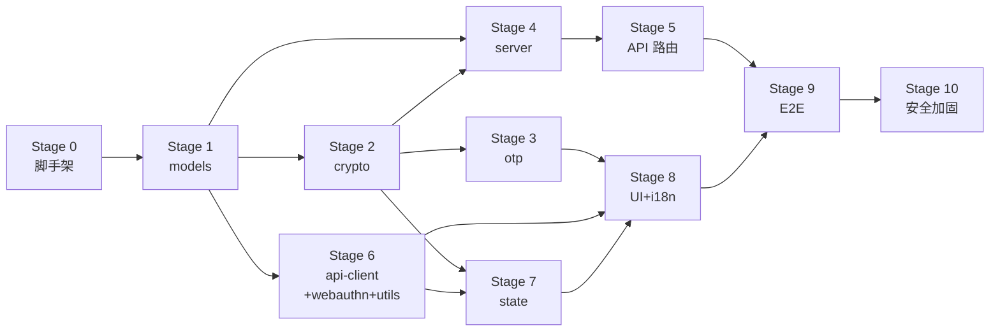

# WebOTP 开发进度总览 (Progress)

**文档版本**: 1.0
**更新日期**: 2026-06-21
**阶段策略**: 分层完整推进（自底向上，按 [Design.md](./Design.md) §2 模块依赖图）+ Stage 0 脚手架 + 末尾单列安全加固验收阶段
**阶段文件**: `./docs/stages/StageXX-*.md`

---

## 阶段总览

WebOTP 按 Design.md 模块依赖图自底向上划分为 11 个阶段（Stage 0–10）。每个阶段对应一个或多个完整模块（含其全部测试），阶段间依赖单向、无环；集成风险由 Stage 9 E2E 统一兜底，安全收尾由 Stage 10 集中验收。依赖链：

---

## 各阶段完成情况

### Stage 0 — 项目脚手架与开发环境

从零搭建 SvelteKit 工程基座：依赖、tsconfig/Prettier/ESLint/CSP/Drizzle/vitest/playwright 配置、目录骨架、CI 工作流。本阶段不写业务逻辑，确保 `pnpm dev` 可启动、`check/lint/test` 已接通、PostgreSQL 可连接。

- [x] 0.1 `pnpm create svelte@latest` → 实际用 `sv create`（Svelte CLI 替代 create-svelte），SvelteKit minimal + TS strict ✓
- [x] 0.2 安装运行时依赖（DevSetup §2.2 / §3.1）✓ — 注：`@paraglide-js/paraglide-sveltekit` 为文档笔误（404），改用 `@inlang/paraglide-js@2.20.0`（v2 无需独立 sveltekit adapter）
- [x] 0.3 安装开发依赖 + `playwright install chromium`（DevSetup §2.3 / §3.2）✓
- [x] 0.4 `shadcn-svelte init`（New York / Zinc / CSS variables）✓ — 注：CLI 在非 TTY 环境无法交互选择 preset，改用[手动安装](https://shadcn-svelte.com/docs/installation/manual)：`components.json` + `src/lib/utils.ts`（`cn`）+ `src/app.css`（zinc 主题 CSS 变量）+ `clsx`/`tailwind-merge`/`tailwind-variants`/`tw-animate-css`/`@lucide/svelte`
- [x] 0.5 配置 `tsconfig.json`（Engineering §1.2：strict + noUncheckedIndexedAccess + verbatimModuleSyntax）✓ — 注：路径别名由 SvelteKit `kit.alias` 提供（svelte.config.js），不在 tsconfig 声明 `paths`（避免与生成的 tsconfig 冲突）
- [x] 0.6 配置 `.prettierrc` + `eslint.config.js` flat config（Engineering §2.1 / §2.2）✓ — 注：`recommendedTypeChecked` 需 `projectService` + `ts.config()` wrapper；type-checked 规则限定 `**/*.ts`，`.svelte`/`.js`/`.d.ts`/`*.config.ts` 用 `disableTypeChecked`
- [x] 0.7 配置 `svelte.config.js`：adapter-node + CSP（DevSetup §4.2）✓ — 注：`vite.config.ts` 中 `sveltekit()` 不传参以确保 `svelte.config.js` 生效；runes 编译选项移至 `compilerOptions`
- [x] 0.8 创建 `.env` / `.env.example`（DevSetup §5.1）✓ — `DATABASE_URL` 用 `127.0.0.1` 避免 IPv6 `ECONNREFUSED`
- [x] 0.9 配置 `drizzle.config.ts` ✓ — `createdb`/DB 连通性验证延后（环境无 PostgreSQL，开发者自备后运行 `pnpm db:push`）
- [x] 0.10 配置 `vitest.config.ts`（Testing §1.2）✓ — 注：Vitest 4 移除 `workspace`，改用 `projects` API；加 `passWithNoTests: true` 满足"无测试时退出 0"
- [x] 0.11 配置 `playwright.config.ts`（Testing §1.3）✓
- [x] 0.12 创建目录骨架（Design 附录 A / DevSetup §8）✓
- [x] 0.13 配置 `package.json` scripts（DevSetup §9）✓ — 含 `typecheck`/`madge`/`db:*` 等
- [x] 0.14 CI 工作流 `.github/workflows/ci.yml`（含 `madge --circular`）✓ — 含 PostgreSQL 16 service container
- [x] 0.15 安装 `madge` devDependency ✓
- [x] 0.16 空应用冒烟：`pnpm dev` 启动（HTTP 200）+ `check/lint/format:check` 零错误 ✓

**验收**: `pnpm dev` 返回 200 ✓；`check/lint/format:check` 零错误 ✓；`test` 退出 0 ✓；`madge --circular` 无环 ✓；`drizzle-kit push` 连通 PG — **延后**（环境无 PostgreSQL，开发者自备后运行 `pnpm db:push`）。详见 [Stage00](./stages/Stage00-项目脚手架与开发环境.md)

---

### Stage 1 — 领域模型与错误基类 (models/)

纯类型 + 错误类层，零运行时业务代码、零依赖。定义 Account、API 请求/响应契约、UI Props、`WebOtpError` 基类与非 crypto 子类。

- [x] 1.1 `account.ts`：`Account`/`AccountDraft`/`OtpauthParsed`（Architecture §5.1）✓ — `AccountDraft`/`OtpauthParsed` 均为 `Omit<Account,'id'|'createdAt'|'updatedAt'|'deletedAt'>`（生命周期字段由调用方补齐；新建 `deletedAt` 恒 null 故不纳入草稿；`OtpauthParsed` 为 `AccountDraft` 别名，形状一致）
- [x] 1.2 `vault.ts`：Vault API 类型（§9.1，412 响应体裁剪）✓ — `VaultConflictResponse` 仅 `{serverVersion, encryptedBlob, wrappedDekByMaster}` 三字段
- [x] 1.3 `api.ts`：`AuthParamsResponse`/`RotateKeyRequest`/`PasskeyWrap*`/`Recover*`/`KdfParams` ✓ — `KdfParams`（CryptoSpec §2.3 短名 `algo/memoryKiB/...`）与 `AuthParamsResponse`/`RecoverInitResponse`（§9.1 `kdf` 前缀名 `kdfAlgo/kdfMemoryKiB/...`）按各自文档分别定义，未合并
- [x] 1.4 `ui.ts`：UIInventory 附录 A 全部 Props ✓ — 8 个 Props interface，跨文件仅 `import type { Account } from './account'`
- [x] 1.5 `errors.ts`：`WebOtpError`/`CryptoError`/`OccConflictError`/`NetworkError`/`SessionRevokedError`/`ApiError`+子类（Engineering §6.1 签名逐字）✓ — 注：§6.1 原文 `ApiError` 的 `readonly code = 'API_ERROR'` 推断为字面量类型，致子类以各自字面量覆写时 TS2416；已加 `: string` 显式标注（运行时值不变），属文档偏差，待 Stage 10 反向传播至 Engineering §6.1
- [x] 1.6 验证 `models/` 零运行时依赖（全 type-only import）✓ — grep 确认 `models/` 仅 `ui.ts` 一处 `import type './account'`，无 `$lib`/跨模块 import；另修复 Stage 0 遗留：`madge` 脚本缺 `--extensions ts` 致扫描 0 文件，已补（CI `pnpm madge` 现实际校验 TS，19 文件无环）
- [x] 1.7 错误类单测 `tests/unit/models/errors.test.ts` ✓ — 15 用例覆盖全子类（code/operation/三字段/默认消息/response+status/instanceof）；另修复 Stage 0 遗留：Vitest 4 `projects` 不继承根级 Vite plugins，`$lib` 别名在 unit 项目无法解析，已将 `sveltekit()` 移入各 project 声明

**验收**: `pnpm check` 通过（0 错误 0 警告）✓；`models/` 不 import 其他 `src/lib`（madge + grep 双重验证）✓；错误类签名与 Engineering §6.1 一致（`ApiError.code` 加 `: string` 标注方可编译，详见 1.5 注）✓；`pnpm test:unit` 15/15 通过 ✓；`Account` 字段集与 Architecture §5.1 一一对应（含 `counter: string | null`）✓。详见 [Stage01](./stages/Stage01-领域模型与错误基类.md)

---

### Stage 2 — 密码学原语 (crypto/)

信封加密全部密码学原语：Argon2id、AES-GCM-256、HKDF-SHA256、base32/base64、Blob 封装、RK 生成、内存擦除。纯函数、无状态、100% 单测。AEAD 失败绝不静默降级。

- [x] 2.1 `errors.ts`：`DecryptionError`/`KdfError`/`EncodingError`/`FormatError`（extends CryptoError）✓ — 注：`CryptoError.code` 同 Stage 1 `ApiError` 的 TS2416 问题（基类 `readonly code = 'CRYPTO_ERROR'` 推断字面量致子类覆写报错），已在 `models/errors.ts` 加 `: string` 显式标注（运行时值不变），属 Engineering §6.1 偏差，待 Stage 10 反向传播
- [x] 2.2 `encoding.ts`：base32/base64 + `serializeBlob`/`parseBlob`（v=1;iv=;ct= 封装）✓ — 注：`parseBlob` 按 Stage02 2.2 在解析层即拒绝 `v≠1`（CryptoSpec §4.3 原 `parseEncryptedPayload` 接受 v≥1 再由调用方校验，此处从严）；空串抛 `EncodingError`（CryptoSpec §7.3 原返回空数组，Stage02 2.2 覆盖为抛错）
- [x] 2.3 `argon2.ts`：`deriveKEK`/`deriveLAK`/`deriveRecoveryVerifier`（hash-wasm）✓ — 注：参数校验仅 salt=16、各参数≥1（结构合法性）；CryptoSpec §2.5 的生产阈值 `memoryKiB≥8192` 不在原语层强制（否则测试降速参数 m=4096 被拒），生产阈值由注册层（Stage 4）策略强制
- [x] 2.4 `aes-gcm.ts`：`generateIV`/`encryptAesGcm`/`decryptAesGcm` + `encryptAesGcmRandomIv` ✓ — `encryptAesGcmRandomIv` 返回 `{iv, ciphertext}` 供调用方序列化
- [x] 2.5 `envelope.ts`：`importKEK`/`generateDEK`/`wrapDek`/`unwrapDek`/`encryptBlob`/`decryptBlob` ✓ — ⚠️ 关键偏差（CryptoSpec §3.3/§3.4）：实测 `wrapKey('raw', dek, kek)` 无法包装 `extractable:false` 密钥（SubtleCrypto 内部调用 exportKey，抛 InvalidAccessError），而『DEK 恒定 + 可被新 KEK 重新包装』（rotate-key/PRF 绑定）依赖 wrapKey。经确认：DEK `extractable:true`（`generateDEK` 与 `unwrapDek` 均如此），raw 字节不暴露给 JS（wrapKey 原子完成导出+加密，代码从不显式 exportKey）；KEK 仍 `extractable:false`。待 Stage 10 反向传播至 CryptoSpec §3.3/§3.4
- [x] 2.6 `hkdf.ts`：`deriveKEKPrf`（info=`WebOTP/KEK-PRF/v1`）✓ — info 硬编码常量，调用方不可控；HKDF 合法输入永不失败，故不包 try/catch（编程错误以原生 DOMException 传播，与 `importKEK` 一致）
- [x] 2.7 `recovery-key.ts`：`generateRecoveryKey`/`parseRecoveryKey`（96 位/20 字符 4-4-4-4-4）✓ — `generateRecoveryKey()→string`（展示串），调用方经 `parseRecoveryKey` 取 12 字节用于派生
- [x] 2.8 `secure-wipe.ts`：`secureWipe` ✓ — 随机覆写 + `fill(0)`（CryptoSpec §9.1）
- [x] 2.9 测试 fixtures（Testing §2.1/§2.2/§2.3）✓ — 注：`ARGON2ID_TEST_PARAMS` 采用 `KdfParams` 形状（algo/memoryKiB/iterations/parallelism），非 Testing §2.2 原混用 hash-wasm 字段名+嵌入 salt/hashLength，以直接匹配 `deriveKEK` 参数类型
- [x] 2.10 单测 `tests/unit/crypto/`：argon2id/aes-gcm/hkdf/base32/lak/blob-format ✓ — 注：Testing §4 样例代码的 API 名/签名（`deriveArgon2id`/`wrapDek({dek,kek,iv})`/`deriveKekPrf({prfOutput,salt,info})`/`decodeBase32`/`lak.ts`/`blob-format.ts` 等）为早期草案，与 Stage02 规格 + CryptoSpec 不一致；以 Stage02（权威任务定义）+ CryptoSpec（权威密码学规格）的文件布局与签名为准，Testing §4 的测试*场景*（往返/篡改/IV 不复用/容错/拒绝）已适配到权威 API。另增 `crypto-errors.test.ts`/`envelope.test.ts` 以达覆盖率。另：Testing §4.3 样例 `validBlob` 的 `iv=AAAAAAAAAAAAAAAAAAAAAA==` 实为 16 字节（非 12），已修正为 12 字节 IV
- [x] 2.11 补充 `recovery-key.test.ts` ✓
- [x] 2.12 补充 `secure-wipe.test.ts` ✓

**验收**: `pnpm test:unit` 通过（122/122）✓；`crypto/**` 覆盖率 lines 100% / branches 100%（≥95%/90%）✓；AES-GCM 篡改（密文/IV/tag）均抛 `DecryptionError`、两次包装同 DEK 密文不同（IV 不复用）✓；base32 容错（大小写/空格/连字符/填充）全通过、非法字符与空串抛 `EncodingError` ✓；Blob parse/serialize 往返一致、全部拒绝用例抛 `FormatError` ✓；HKDF `info='WebOTP/KEK-PRF/v1'` 常量校验 + 确定性 + 不同 PRF/info 产生不同 KEK ✓；RK generate→parse 往返 12 字节、20 字符 4-4-4-4-4 ✓；`crypto/` 不 import `state/`/`server/`（madge + grep 双重验证，仅 `crypto/→models/` 单向边）✓；`pnpm check` 0 错误 0 警告 ✓；`pnpm lint` 0 错误（19 个 `no-non-null-assertion` 警告，均是有界循环索引 `!`，符合 CryptoSpec 代码风格与 eslint 'warn' 配置）✓；`pnpm format:check` 通过 ✓；`pnpm madge --circular` 无环（27 文件）✓。另修复 Stage 0 遗留：`coverage/` 生成目录未加入 `.gitignore`/`.prettierignore`（vitest 覆盖率产物），已补。TS 6.0 `Uint8Array<ArrayBufferLike>` 与 SubtleCrypto `BufferSource` 不兼容，已在 subtle crypto 调用点加 `as BufferSource`/`as Uint8Array<ArrayBuffer>` 类型转换（仅类型层，无运行时影响）。详见 [Stage02](./stages/Stage02-密码学原语.md)

---

### Stage 3 — OTP 计算引擎 (otp/)

TOTP/HOTP 计算 + otpauth URI 解析。纯函数，依赖 `crypto/encoding`。内部抛错语义（CryptoSpec §10），`Result` 为调用侧可选。

- [ ] 3.1 `hotp.ts`：`generateHOTP`（RFC 4226 动态截断，bigint counter）
- [ ] 3.2 `totp.ts`：`generateTOTP`/`verifyTOTP`（RFC 6238，window=±1）
- [ ] 3.3 `otpauth-uri.ts`：`parseOtpauthUri`/`buildOtpauthUri`
- [ ] 3.4 HMAC 经 SubtleCrypto（SHA1/256/512），base32 复用 crypto/encoding
- [ ] 3.5 单测 `tests/unit/otp/`：totp（RFC 6238 全 18 向量）/hotp（RFC 4226 counter 0-9）/otpauth-uri

**验收**: `otp/**` lines ≥95% / branches ≥90%；RFC 6238 全 18 向量精确匹配；RFC 4226 counter 0-9 精确匹配；otpauth 往返一致。详见 [Stage03](./stages/Stage03-OTP计算引擎.md)

---

### Stage 4 — 服务端数据层与认证网关 (server/)

Drizzle schema + 查询（CAS/事务/CRUD）、Better Auth + passkey 插件 + 会话吊销、反枚举、限流、常量时间比较。全部 `import '$server-only'`。rotate-key/recover-reset 单事务原子。

- [ ] 4.1 `db/schema/{user,vault,passkey-wrap}.ts`（Architecture §4，camelCase↔snake_case）
- [ ] 4.2 `db/schema/index.ts` + `db/index.ts`（`$server-only`）
- [ ] 4.3 `db/migrate.ts` + `drizzle-kit generate --name init_schema` + `push` 验证
- [ ] 4.4 `db/vault.ts`：`initVault`/`getVault`/`updateVaultBlob`（CAS）/`rotateWrappedDekByMaster`
- [ ] 4.5 `db/vault.ts` `rotateMasterPassword` 事务（事务内更新+事务后 revokeOtherSessions）
- [ ] 4.6 `db/user.ts`：`getAuthParamsByEmail`/`updateUserSaltsAndKdf`/`updateRecoveryMaterial`
- [ ] 4.7 `db/passkey-wrap.ts`：list/create（冲突→ConflictError）/delete（不存在→NotFoundError）
- [ ] 4.8 `db/recover.ts`：`getRecoverMaterial`/`resetRecovery` 事务（+ revokeAllSessions）
- [ ] 4.9 `db/session.ts`：委托 auth 吊销
- [ ] 4.10 `auth.ts`：Better Auth + Drizzle adapter + passkey 插件 + revoke/updatePasswordHash
- [ ] 4.11 `anti-enumeration.ts`：`derivePseudoAuthParams`/`derivePseudoRecoveryMaterial`（HMAC 确定性）
- [ ] 4.12 `rate-limit.ts`：`checkAndConsume` + `LimitStore` 接口
- [ ] 4.13 `constant-time.ts`：`safeEqualVerifier`（timingSafeEqual）
- [ ] 4.14 集成测试 setup `tests/integration/setup.ts`（testcontainers/pg-mem）
- [ ] 4.15 集成测试 `tests/integration/db/`：vault-cas/rotate-key/passkey-wrap/recover/anti-enum

**验收**: `pnpm test:integration` 通过；CAS 冲突抛 OccConflictError 携三字段；rotate/recover 事务原子；anti-enum 伪响应形状一致；`server/` 全 `$server-only`；auth 不 import 查询文件（防环）。详见 [Stage04](./stages/Stage04-服务端数据层与认证网关.md)

---

### Stage 5 — API 路由层 (routes/api/*)

9 个端点 `+server.ts` 处理器：鉴权 + 参数校验 + 调 server/* + 返回 §9.1 schema + 按 StateMachines §3.1 矩阵返回错误码。处理器薄，业务在 server/db。

- [ ] 5.1 `auth-params/+server.ts`（GET 公开，反枚举）
- [ ] 5.2 `auth/[...path]/+server.ts`（委托 BA）
- [ ] 5.3 `vault/+server.ts` GET
- [ ] 5.4 `vault/+server.ts` POST（201/409）
- [ ] 5.5 `vault/+server.ts` PUT（CAS，412 裁剪响应体）
- [ ] 5.6 `vault/rotate-key/+server.ts`（事务+revokeOtherSessions）
- [ ] 5.7 `passkey-wraps/+server.ts` GET/POST（201/409）
- [ ] 5.8 `passkey-wraps/[credentialId]/+server.ts` DELETE（200/404）
- [ ] 5.9 `vault/recover/init/+server.ts`（无会话+限流+伪材料）
- [ ] 5.10 `vault/recover/reset/+server.ts`（限流+verifier 校验+事务+revokeAllSessions）
- [ ] 5.11 `session/[id]/+server.ts` DELETE（200/404）
- [ ] 5.12 错误码映射统一（StateMachines §3.1 矩阵）
- [ ] 5.13 集成测试 `tests/integration/api/`：auth-params/vault/rotate-key/passkey-wraps/recover

**验收**: 9 端点成功路径 100%、错误码矩阵全覆盖；412 响应体严格三字段；recover 限流 429+Retry-After；verifier 失败 403；`auth/*` 401 不触发吊销。详见 [Stage05](./stages/Stage05-API路由层.md)

---

### Stage 6 — 客户端 I/O 与浏览器能力层 (api-client/ + webauthn/ + utils/)

全局 fetch 拦截器 + 9 端点封装 + 401 吊销 handler 注册（不反向 import state/）；WebAuthn PRF 仪式封装；时钟漂移 + 剪贴板清除。可与 Stage 4/5 并行。

- [ ] 6.1 `api-client/api-client.ts`：`apiFetch` 拦截器（HTTP→类型化错误，StateMachines §3.2）
- [ ] 6.2 `api-client/session-revoked-hook.ts`：`setSessionRevokedHandler`/`triggerSessionRevoked`
- [ ] 6.3 `api-client/endpoints.ts`：9 端点类型化封装
- [ ] 6.4 `webauthn/errors.ts`：`PrfUnsupportedError`/`WebAuthnUserCancelledError`/`PrfOutputMissingError`
- [ ] 6.5 `webauthn/support.ts`：`isPrfSupported`
- [ ] 6.6 `webauthn/prf.ts`：`createPasskeyWithPrf`/`getAssertionWithPrf`
- [ ] 6.7 `utils/clock-drift.ts`：`detectClockDrift`
- [ ] 6.8 `utils/clipboard.ts`：`copyAndClearAfter`
- [ ] 6.9 单测 `tests/unit/api-client/`（MSW）：interceptor/endpoints/session-revoked-hook
- [ ] 6.10 单测 `tests/unit/webauthn/support.test.ts`
- [ ] 6.11 单测 `tests/unit/utils/`：clock-drift/clipboard
- [ ] 6.12 `webauthn/prf.ts` 标注需 E2E（Stage 9）

**验收**: 拦截器全部状态码映射断言通过；412 解析三字段；429 读 Retry-After（无头默认 60）；`api-client/` 不 import `state/`；`isPrfSupported` mock 正确。详见 [Stage06](./stages/Stage06-客户端IO与浏览器能力层.md)

---

### Stage 7 — 客户端状态层 (state/)

Svelte 5 Runes 三大同级状态模块（禁互导）：auth（会话/设备/离线缓存）、crypto（KEK/DEK 解包、解锁状态机、内存擦除、锁定）、vault（单体同步引擎 + `mergeAccounts` 纯函数 + 防抖 + 重试 + 离线缓存）。

- [ ] 7.1 `vault.svelte.ts` 导出纯函数 `mergeAccounts`（Architecture §5.3 全规则 + base 丢失降级）
- [ ] 7.2 `vault.svelte.ts` 模块级 `$state`：accounts/baseSnapshot/syncStatus/lastVersion
- [ ] 7.3 `vault.svelte.ts` 同步编排：init/loadVault/add/update/delete/triggerSync/encryptAndUpload/handleOccConflict/persist/loadFromIDB/getCachedPasskeyWraps
- [ ] 7.4 `vault.svelte.ts` 重试队列：`calculateBackoff`（StateMachines §4.2）+ `syncWithRetry`
- [ ] 7.5 `vault.svelte.ts` 防抖：500ms/3000ms（StateMachines §8）
- [ ] 7.6 `vault.svelte.ts` IndexedDB stores：vault-cache/base-snapshot/passkey-wraps
- [ ] 7.7 `crypto.svelte.ts` 状态：isUnlocked/unlockStatus/dekRef（不入 `$state`）
- [ ] 7.8 `crypto.svelte.ts`：unlockWithMp/unlockWithPasskey/unlockWithRecoveryKey/lock/rotateMasterPassword/registerSessionRevokedHandler
- [ ] 7.9 `crypto.svelte.ts` 锁定触发：主动/5min/visibilitychange/401（StateMachines §2.4/§2.5）
- [ ] 7.10 `crypto.svelte.ts` 内存擦除 + 解包失败 DecryptionError→locked
- [ ] 7.11 `auth.svelte.ts` 状态：isAuthenticated/sessions/currentDeviceId/authStatus
- [ ] 7.12 `auth.svelte.ts`：registerWithLak/loginWithLak/loginWithPasskey/logout/listSessions/revokeSession/sedimentAuthParams/getCachedAuthParams
- [ ] 7.13 `auth.svelte.ts` 登录 401 不触发吊销
- [ ] 7.14 三大 state 禁互导（madge 校验）
- [ ] 7.15 单测 `tests/unit/merge/three-way.test.ts`（Testing §5 全矩阵）
- [ ] 7.16 集成测试 `tests/integration/state/`：sync/unlock 状态机

**验收**: `mergeAccounts` 全矩阵通过；状态转换符合 StateMachines §1/§2；三 state 无互导；`dekRef` 不入 `$state`；退避公式一致；IndexedDB 三 store 隔离。详见 [Stage07](./stages/Stage07-客户端状态层.md)

---

### Stage 8 — UI 层与国际化 (components/ + routes + paraglide/)

全部 Svelte 5 组件、页面路由、布局守卫、paraglide i18n。组件禁 import server/、禁传密钥 props、禁 `{@html}`；i18n 全走 paraglide 消息函数。

- [ ] 8.1 paraglide 初始化 + `messages/{zh,en}.json`（StateMachines §7.1/§7.2 键清单）
- [ ] 8.2 `layout/SensitiveInput.svelte`（单向 onSubmit，不 bind:value）
- [ ] 8.3 `layout/{AppSidebar,AppHeader}.svelte`
- [ ] 8.4 `auth/{LoginForm,RegisterForm,UnlockForm,RecoverForm}.svelte`
- [ ] 8.5 `otp/{OtpCodeDisplay,AccountItem,AccountList,AccountEditDialog,AddAccountDialog,ClockDriftWarning}.svelte`
- [ ] 8.6 `sync/{SyncStatusBadge,LockButton}.svelte`
- [ ] 8.7 `settings/{PasskeyManager,RecoveryKeyDisplay,ExportDialog,ChangePasswordForm}.svelte`
- [ ] 8.8 shadcn 组件子集引入（UIInventory §4）
- [ ] 8.9 路由：`+page`/`+layout`/`+error`
- [ ] 8.10 路由：register/login/unlock（UIInventory §6 交互）
- [ ] 8.11 路由：app/+layout（守卫+布局）/app/+page（OTP 列表）
- [ ] 8.12 路由：app/settings/{+page,passkeys,change-password,export}
- [ ] 8.13 路由：recover/recover/reset
- [ ] 8.14 组件契约：禁 server/、禁密钥 props、禁 `{@html}`
- [ ] 8.15 OTP 列表交互（UIInventory §7：搜索/分组/倒计时/HOTP 递增/复制清除）
- [ ] 8.16 i18n 全走 paraglide，无硬编码文案
- [ ] 8.17 禁 Svelte 4 Store（全 Runes）

**验收**: `check`/`lint` 通过；各页面可渲染；路由守卫三态正确；i18n 键覆盖 §7.2；组件不 import server/、不传密钥、无 `{@html}`；`madge` 无环。详见 [Stage08](./stages/Stage08-UI层与国际化.md)

---

### Stage 9 — 端到端集成与关键用户流 (E2E)

Playwright（chromium + 虚拟 WebAuthn）覆盖全部关键用户流，分层推进策略的集成风险兜底。

- [ ] 9.1 `registration-flow.spec.ts`：注册→解锁→加账户→同步
- [ ] 9.2 `conflict-merge.spec.ts`：多设备并发合并 + 墓碑 + 字段冲突 + HOTP counter max + base 丢失降级
- [ ] 9.3 `prf-unlock.spec.ts`：PRF 绑定+免密解锁+撤销+降级
- [ ] 9.4 `disaster-recovery.spec.ts`：recover/init→reset→旧 RK 失效→旧会话失效→DEK/Blob 不变
- [ ] 9.5 密码轮换 E2E：设备 A 轮换→设备 B 401→新 MP 登录→合并（阻断式 UI §5.2）
- [ ] 9.6 离线场景：断网编辑→恢复在线合并上传
- [ ] 9.7 时钟漂移警告（>15s 显示）
- [ ] 9.8 复制 30s 清除验证

**验收**: `pnpm test:e2e` 通过（chromium）；关键用户流 100% 覆盖；合并收敛；PRF 全路径；恢复后旧 RK 失效；轮换后新 MP 登录合并。详见 [Stage09](./stages/Stage09-端到端集成与关键用户流.md)

---

### Stage 10 — 安全加固与验收

集中的安全收尾：Architecture §10 威胁矩阵逐项复核、CSP 渗透、侧信道审计、依赖审计、零知识边界复核、覆盖率与规范验收。不新增功能，只验证与修补安全缺口。

- [ ] 10.1 威胁模型复核（Architecture §10 全部向量）
- [ ] 10.2 CSP 渗透（生产构建，注入被拦）
- [ ] 10.3 内存擦除审计（诚实定界文档化）
- [ ] 10.4 反枚举审计（形状/耗时一致）
- [ ] 10.5 常量时间比较审计（无早退）
- [ ] 10.6 限流审计（双维度+Retry-After+多实例抽象）
- [ ] 10.7 依赖审计（`pnpm audit` 零高危+版本一致）
- [ ] 10.8 密钥隔离审计（5 盐互不复用+KEK 不接触 Blob+DEK 恒定+IV 不复用）
- [ ] 10.9 覆盖率验收（crypto/otp 95/90，集成关键 100，E2E 关键 100）
- [ ] 10.10 规范验收（check/lint/format:check/madge 全绿）
- [ ] 10.11 零知识边界复核（Architecture §8.4 表逐项）
- [ ] 10.12 文档同步（偏差反向传播）
- [ ] 10.13 RK 强制轮换验证（旧 RK reset→403）
- [ ] 10.14 OCC 范围复核（仅 PUT vault 自增 version）

**验收**: 威胁矩阵每项有防御代码+测试；生产 CSP 注入被拦；`pnpm audit` 零高危；覆盖率达标；规范全绿；零知识边界无越界；旧 RK 失效；OCC 范围正确；已知残留记录在案。详见 [Stage10](./stages/Stage10-安全加固与验收.md)

---

## 总体进度统计

| 阶段 | 状态 | 任务数 | 完成 |
| :--- | :--- | :--- | :--- |
| Stage 0 — 项目脚手架与开发环境 | ✅ 完成 | 16 | 16 |
| Stage 1 — 领域模型与错误基类 | ✅ 完成 | 7 | 7 |
| Stage 2 — 密码学原语 | ✅ 完成 | 12 | 12 |
| Stage 3 — OTP 计算引擎 | ⬜ 未开始 | 5 | 0 |
| Stage 4 — 服务端数据层与认证网关 | ⬜ 未开始 | 15 | 0 |
| Stage 5 — API 路由层 | ⬜ 未开始 | 13 | 0 |
| Stage 6 — 客户端 I/O 与浏览器能力层 | ⬜ 未开始 | 12 | 0 |
| Stage 7 — 客户端状态层 | ⬜ 未开始 | 16 | 0 |
| Stage 8 — UI 层与国际化 | ⬜ 未开始 | 17 | 0 |
| Stage 9 — 端到端集成与关键用户流 | ⬜ 未开始 | 8 | 0 |
| Stage 10 — 安全加固与验收 | ⬜ 未开始 | 14 | 0 |
| **合计** | — | **135** | **35** |

> 状态标记：⬜ 未开始 / 🟨 进行中 / ✅ 完成。每完成一个阶段将其任务勾选并把状态改为 ✅，同步更新本表"完成"列。

---

## 阶段间并行机会

虽为分层推进，部分阶段可并行以缩短关键路径：

- **Stage 4 与 Stage 2/3 可部分并行**：Stage 4 服务端依赖 Stage 1 models 与 Stage 2 错误类，但 schema 定义（4.1–4.3）可在 Stage 2 完成前先行；查询层（4.4+）需错误类就绪。
- **Stage 6 与 Stage 4/5 可并行**：Stage 6 客户端 I/O 仅依赖 Stage 1 models（契约类型），不依赖服务端实现，可与 Stage 4/5 同时推进。
- **Stage 8 UI 组件可在 Stage 7 state 接口稳定后并行**：组件依赖 state 的公共 API 契约，契约一旦冻结即可并行开发，不必等 state 全部实现完成。

串行硬依赖：Stage 0→1→2→3（纯函数链）；Stage 7→8→9→10（集成与验收链）。
