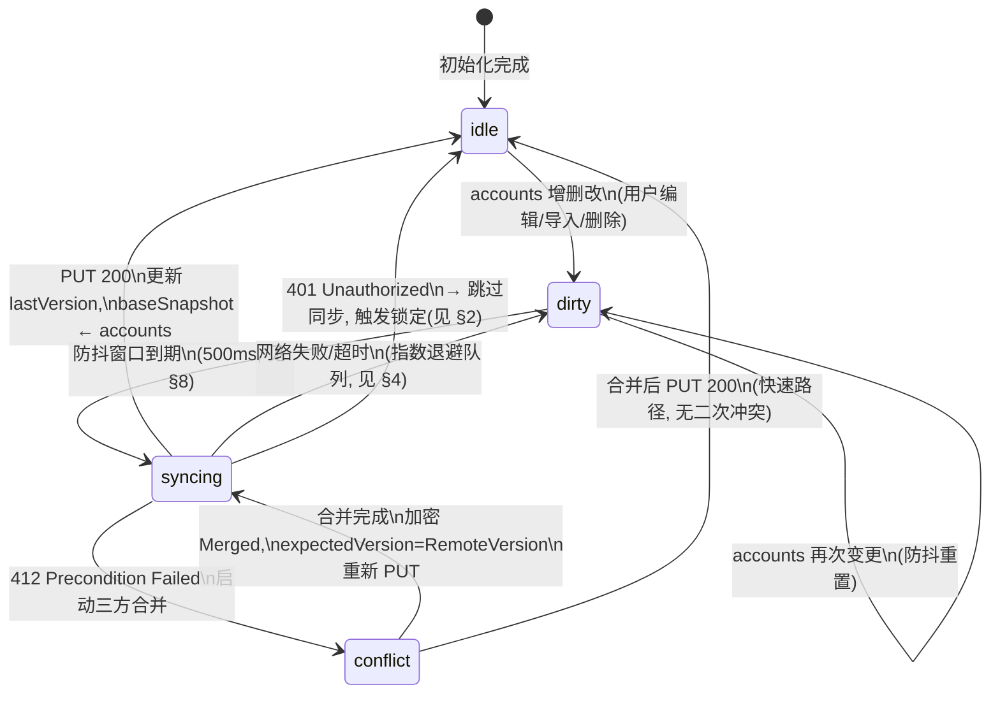
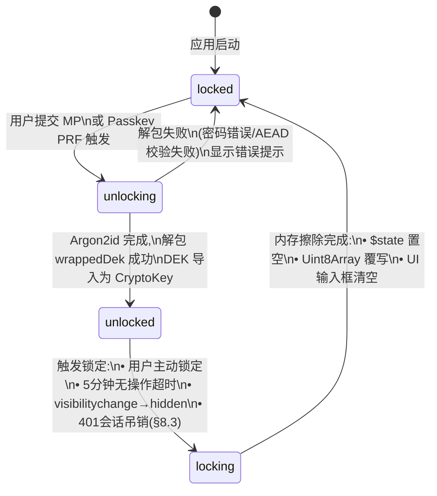

# ⚙️ 状态机与错误处理规格

**文档版本**: 1.0  
**更新日期**: 2026 年 6 月 20 日  
**文档密级**: 公开 (Public)  
**核心标签**: `State-Machine`, `Error-Handling`, `Retry`, `i18n`, `OCC`, `Offline-First`

> 本文档是 [Architecture.md](./Architecture.md) 的补充规格，定义前端状态机完整转换图、HTTP 错误码 UI 映射、重试退避策略、冲突解决 UI 流程、错误类层级与 i18n 键命名规范。所有交叉引用以 "见 §X" 指代 Architecture.md 章节。

---

## 目录

1. [syncStatus 状态机](#1-syncstatus-状态机)
2. [解锁状态机 (isUnlocked)](#2-解锁状态机-isunlocked)
3. [HTTP 错误码 → UI 行为映射](#3-http-错误码--ui-行为映射)
4. [重试与退避策略](#4-重试与退避策略)
5. [冲突解决 UI 流程](#5-冲突解决-ui-流程)
6. [错误类层级](#6-错误类层级)
7. [i18n 键命名规范](#7-i18n-键命名规范)
8. [并发编辑防抖](#8-并发编辑防抖)

---

## 1. syncStatus 状态机

`vaultState.syncStatus`（见 §6.3）管理 Vault 同步的四态生命周期。

### 1.1 状态定义

| 状态 | 含义 | UI 指示器 |
| :--- | :--- | :--- |
| `idle` | 本地与服务端一致，无待同步变更 | 无指示器 / 绿色"已同步" |
| `dirty` | 本地有未同步变更，等待防抖窗口关闭 | 橙色"待同步" |
| `syncing` | 正在加密并上传 Blob | 蓝色 spinner"同步中…" |
| `conflict` | 收到 412，正在执行三方合并（见 §5.3、§7.3） | 橙色"正在合并…" |

### 1.2 状态转换图



### 1.3 转换详情

| 转换 | 触发条件 | 副作用 |
| :--- | :--- | :--- |
| `idle → dirty` | `vaultState.accounts` 的任何 `$state` 深层变更（新增/修改/删除 Account，含软删除） | 重置防抖计时器；本地立即持久化变更到 IndexedDB（离线安全） |
| `dirty → dirty` | 防抖窗口内再次发生 `accounts` 变更 | 重置防抖计时器（500ms 从头计时），合并所有变更一次性上传 |
| `dirty → syncing` | 防抖窗口（500ms）到期且 `syncStatus === "dirty"` | 用 $DEK$ 加密 `accounts` → 新 Blob；`PUT /api/vault { expectedVersion: lastVersion, encryptedBlob }` |
| `syncing → idle` | `PUT` 返回 200 | `lastVersion` ← 响应 `version`；`baseSnapshot` ← 深拷贝当前 `accounts`；写入 IndexedDB |
| `syncing → dirty` | 网络错误（`TypeError: Failed to fetch`）或超时 | 当前 `accounts` 保留；加入重试队列（指数退避，见 §4）；`syncStatus` 回到 `dirty` 等待重试 |
| `syncing → conflict` | `PUT` 返回 412 | 进入三方合并流程（见 §5） |
| `conflict → syncing` | 三方合并完成 | `Merged` 经 $DEK$ 加密为新 Blob；`PUT` 携带 `expectedVersion = RemoteVersion`；合并期间 UI 显示"正在合并…"，**不阻断用户继续编辑**（编辑会叠加到下次合并的 Local 侧） |
| `syncing → idle` (401) | `PUT` 返回 401 | 不进入合并；触发解锁状态机的 **强制锁定**（见 §2）；跳转登录页 |

### 1.4 离线场景行为

- **完全离线**：`syncing → dirty` 转换立即发生（`fetch` 抛出 `TypeError`），退避重试在后台静默排队。`accounts` 编辑不受影响，IndexedDB 保证持久化。
- **恢复在线**：后台 `navigator.onLine` 事件或退避重试成功触发 `dirty → syncing`。
- **离线期间的多次编辑**：全部折叠为一次 `dirty` 状态（防抖合并），上线后一次性上传最终结果。

---

## 2. 解锁状态机 (isUnlocked)

`cryptoState.isUnlocked`（见 §6.2）管理 DEK 内存生命周期。

### 2.1 状态定义

| 状态 | 含义 | DEK 内存状态 | UI |
| :--- | :--- | :--- | :--- |
| `locked` | 未认证或已锁定，DEK 不在内存 | 无 | 显示解锁表单 |
| `unlocking` | 正在派生 KEK 并解包 DEK（Argon2id 耗时约 1–3s） | 派生中 | spinner + 进度文案 |
| `unlocked` | DEK 已加载为 `CryptoKey`（`extractable: false`） | 存在 | 正常应用界面 |
| `locking` | 正在擦除敏感内存（覆写 `Uint8Array`、清空 `$state`） | 覆写中 | 闪屏/过渡动画 |

### 2.2 状态转换图



### 2.3 转换详情

| 转换 | 触发条件 | 副作用 |
| :--- | :--- | :--- |
| `locked → unlocking` | 用户在解锁表单提交 MP 或 Passkey PRF 断言返回 | 开始 Argon2id KDF 派生；UI 显示 spinner，禁用提交按钮；启动超时计时器（30s） |
| `unlocking → unlocked` | `AES-GCM` 解包 `wrappedDekByMaster`（或 `wrappedDekByPrf`）成功 | DEK 导入为 `CryptoKey`（`extractable: false`）；解密本地 Blob 渲染 `accounts`；启动 5 分钟无操作计时器与 `visibilitychange` 监听器 |
| `unlocking → locked` | 解包失败（AEAD `OperationError`） | 清除输入；显示 `auth.unlock.error.wrongPassword`；不泄露失败原因细节 |
| `unlocked → locking` | **任一**条件满足：(a) 用户点击"锁定"按钮；(b) 5 分钟无操作（`mousemove`/`keydown`/`touchstart`/`scroll` 重置计时器）；(c) `document.visibilityState === "hidden"`（见 §6.2）；(d) 任意 HTTP 请求返回 401（见 §8.3） | 取消所有进行中的 sync 请求；停止无操作计时器 |
| `locking → locked` | 内存擦除完成 | `$state` 中 `dek`、`accounts`、`baseSnapshot` 置空；所有敏感 `Uint8Array`（MP/RK 明文、PRF 输出、KEK 派生字节、base32 解码种子）调用 `crypto.getRandomValues()` 原地覆写；UI 输入框 `.value = ""`；重定向至 `/login`（401 场景）或 `/unlock`（主动锁定/超时/切后台） |

### 2.4 visibilitychange 特殊处理

| 场景 | 行为 |
| :--- | :--- |
| `hidden` 持续 < 30 秒且 `syncStatus !== "syncing"` | 立即锁定（安全优先，见 §6.2） |
| `hidden` 持续 < 30 秒且 `syncStatus === "syncing"` | 等待当前 `syncing` 完成后立即锁定（避免中断加密上传导致需要重新加密） |
| `visible` 时处于 `locked` | 显示解锁表单，不清除 IndexedDB 缓存 |

### 2.5 401 强制锁定特殊路径

当 **任意** API 请求返回 401（§8.3）：
1. 取消所有进行中的 `fetch`（`AbortController.abort()`）。
2. `syncStatus` 置为 `idle`（丢弃未同步变更——会话已失效，需重新登录后才能同步）。
3. 触发 `unlocked → locking → locked` 转换。
4. 重定向至 `/login`，显示 `auth.session.revoked` 提示。

---

## 3. HTTP 错误码 → UI 行为映射

### 3.1 完整映射表

| HTTP 状态码 | 端点 | 触发条件 | UI 反馈 | 状态转移 | i18n 键 |
| :--- | :--- | :--- | :--- | :--- | :--- |
| **401** | `GET /api/vault`, `PUT /api/vault`, `POST /api/vault`, `POST /api/vault/rotate-key`, `GET /api/passkey-wraps`, `POST /api/passkey-wraps`, `DELETE /api/passkey-wraps/:id`, `DELETE /api/session/:id` | 会话被远程吊销（§8.3）或过期 | Toast 错误 → 强制锁屏 → 跳转 `/login`，显示"会话已失效，请重新登录" | `unlocked → locking → locked`；`syncStatus → idle` | `auth.session.revoked` |
| **401** | `POST /api/auth/*` | 登录凭据错误（LAK 不匹配） | 解锁表单显示"密码错误" | 保持 `locked` | `auth.unlock.error.wrongPassword` |
| **403** | `POST /api/vault/recover/reset` | `recoveryVerifier` 校验失败（旧 RK 错误或已轮换） | 恢复页面显示"恢复密钥无效，请确认后重试" | 保持当前页面，RK 输入框清空并高亮 | `auth.recovery.error.invalidKey` |
| **403** | `POST /api/vault/recover/init` | Rate limit 但响应表明凭据错误 | 同 429 行为（限流） | — | `auth.recovery.error.rateLimited` |
| **404** | `DELETE /api/passkey-wraps/:credentialId` | 指定 Passkey 不存在（已被其他设备删除或 ID 错误） | 刷新 Passkey 列表，Toast "该 Passkey 已不存在" | 重新 `GET /api/passkey-wraps` 刷新列表 | `auth.passkey.error.notFound` |
| **404** | `DELETE /api/session/:id` | 会话不存在（已过期或被其他设备吊销） | 重新拉取会话列表，静默忽略 | 重新拉取会话列表 | `auth.session.error.notFound` |
| **409** | `POST /api/vault` | Vault 已存在（重复注册） | 注册页提示"该账户已存在，请登录" | 跳转登录页 | `auth.register.error.vaultExists` |
| **409** | `POST /api/passkey-wraps` | `credentialId` 已绑定（Passkey 重复注册） | Toast 错误 "该 Passkey 已绑定到当前账户" | 不影响当前状态 | `auth.passkey.error.alreadyBound` |
| **412** | `PUT /api/vault` | OCC 版本冲突（远端 Blob 版本 > `expectedVersion`） | 进入自动合并流程，UI 显示"正在合并…"（§5） | `syncing → conflict → syncing` | `sync.conflict.merging` |
| **429** | `POST /api/vault/recover/init`, `POST /api/vault/recover/reset` | 服务端限流 | 显示"操作过于频繁，请 {retryAfter} 秒后重试"（读取 `Retry-After` 响应头） | 禁用提交按钮，倒计时后重新启用 | `auth.recovery.error.rateLimited` |
| **429** | Better Auth 登录/注册 | Better Auth 内置限流 | 同上 | 禁用登录按钮 | `auth.login.error.rateLimited` |
| **网络错误** | 所有端点 | `TypeError: Failed to fetch` / 超时 | 离线指示器（顶部 Banner）"当前离线，变更将在恢复连接后同步" | `syncing → dirty`（加入重试队列，§4）；离线模式下所有编辑正常写入 IndexedDB | `sync.offline.banner` |
| **5xx** | 所有端点 | 服务端内部错误 | Toast 错误 "服务暂时不可用，请稍后重试" | `syncing → dirty`（加入重试队列，§4） | `error.server.internal` |

### 3.2 错误处理拦截器架构

```typescript
// src/lib/server/api-client.ts — 全局 HTTP 拦截器伪码
async function apiFetch(input: RequestInfo, init?: RequestInit): Promise<Response> {
  const response = await fetch(input, init);

  if (response.ok) return response;

  switch (response.status) {
    case 401:
      // 会话级 401：触发强制锁定（非登录请求时）
      if (!isAuthEndpoint(input)) {
        triggerSessionRevoked(); // → §2.5 路径
      }
      throw new SessionRevokedError();

    case 403:
      throw new ForbiddenError(response);

    case 404:
      throw new NotFoundError(response);

    case 409:
      throw new ConflictError(response);

    case 412: {
      const body: VaultConflictResponse = await response.json();
      throw new OccConflictError('OCC conflict', body.serverVersion, body.encryptedBlob, body.wrappedDekByMaster); // 见 §6
    }

    case 429: {
      const retryAfter = parseInt(response.headers.get("Retry-After") ?? "60", 10);
      throw new RateLimitError(response, retryAfter);
    }

    default:
      if (response.status >= 500) {
        throw new ServerError(response);
      }
      throw new ApiError(response);
  }
}
```

---

## 4. 重试与退避策略

### 4.1 策略总览

| 错误类型 | 重试？ | 策略 | 最大重试次数 | 备注 |
| :--- | :--- | :--- | :--- | :--- |
| 网络错误 / 超时 | ✅ 是 | 指数退避 + 抖动 | 5 次 | 退避后 `syncStatus → dirty`，等待下次触发 |
| 5xx 服务端错误 | ✅ 是 | 指数退避 + 抖动 | 5 次 | 同网络错误 |
| 412 OCC 冲突 | ❌ 不重试 | 执行三方合并后重新 PUT | 无上限（合并→PUT 循环） | 每次合并以最新 Remote 为基准，见 §5 |
| 429 限流 | ✅ 是 | 按 `Retry-After` 头等待 | 3 次 | 无头时默认 60s |
| 401 会话失效 | ❌ 不重试 | 强制锁定 + 跳登录 | — | 见 §2.5 |
| 403/404/409 | ❌ 不重试 | 显示错误给用户 | — | 用户手动修正后重试 |

### 4.2 指数退避公式

$$
\text{delay}_n = \min\left(2^n \times 1000 + \text{random}(0, 1000),\ 30000\right) \quad \text{ms}
$$

其中 $n$ 为重试次数（从 0 开始），`random(0, 1000)` 为均匀分布抖动（防止多设备同时重试的"惊群效应"）。

| 重试次数 $n$ | 基础延迟 | 抖动范围 | 实际延迟范围 | 累计最长等待 |
| :--- | :--- | :--- | :--- | :--- |
| 0 | 1,000 ms | 0–1,000 ms | 1–2 s | 2 s |
| 1 | 2,000 ms | 0–1,000 ms | 2–3 s | 5 s |
| 2 | 4,000 ms | 0–1,000 ms | 4–5 s | 10 s |
| 3 | 8,000 ms | 0–1,000 ms | 8–9 s | 19 s |
| 4 | 16,000 ms | 0–1,000 ms | 16–17 s | 36 s |
| 5（上限） | 30,000 ms | — | 30 s（封顶） | 66 s |

### 4.3 重试实现

```typescript
// src/lib/state/retry-queue.ts
const MAX_RETRIES = 5;
const BASE_DELAY_MS = 1_000;
const MAX_DELAY_MS = 30_000;
const JITTER_MS = 1_000;

function calculateBackoff(attempt: number): number {
  const exponential = Math.pow(2, attempt) * BASE_DELAY_MS;
  const jitter = Math.random() * JITTER_MS;
  return Math.min(exponential + jitter, MAX_DELAY_MS);
}

async function syncWithRetry(encryptAndUpload: () => Promise<void>): Promise<void> {
  let attempt = 0;

  while (attempt <= MAX_RETRIES) {
    try {
      await encryptAndUpload();
      return; // 成功 → 退出
    } catch (err) {
      if (err instanceof OccConflictError) {
        // 412：不计入重试次数，执行合并后重试
        await threeWayMerge(err.serverVersion, err.serverEncryptedBlob, err.serverWrappedDekByMaster);
        attempt = 0; // 合并后重置重试计数
        continue;
      }

      if (err instanceof SessionRevokedError) {
        triggerSessionRevoked(); // → 强制锁定，不重试
        return;
      }

      if (err instanceof RateLimitError) {
        const waitMs = err.retryAfter * 1_000;
        await delay(waitMs);
        attempt++;
        continue;
      }

      if (err instanceof NetworkError || err instanceof ServerError) {
        if (attempt >= MAX_RETRIES) {
          vaultState.syncStatus = "dirty"; // 放弃重试，等待下次触发
          return;
        }
        const waitMs = calculateBackoff(attempt);
        await delay(waitMs);
        attempt++;
        continue;
      }

      // 其他错误（403/404/409）：不重试，向上抛出
      throw err;
    }
  }

  // 超过最大重试次数
  vaultState.syncStatus = "dirty";
}
```

### 4.4 429 限流处理

- 服务端返回 `Retry-After: N`（秒），客户端严格遵守等待 $N$ 秒后重试。
- 若无 `Retry-After` 头，默认等待 60 秒。
- 最多重试 3 次 429 错误；超过后显示 `error.rateLimited.persistent` 并放弃自动重试。

---

## 5. 冲突解决 UI 流程

### 5.1 自动三方合并（§7.3 默认路径）

大多数 412 冲突**无需用户介入**，三方合并引擎自动完成：

```
用户编辑 → dirty → syncing → 412 → [自动合并] → syncing → 200 → idle
                                        ↓
                              合并期间 UI：
                              "正在合并其他设备的变更…"
                              （非阻塞式 Toast，不阻断用户操作）
```

**自动合并期间的 UI 规则**：
- 显示非阻塞式 Toast/指示器："正在合并其他设备的变更…"
- 用户**可以继续编辑** `accounts`（变更会在下一轮合并的 Local 侧生效）
- 合并完成后 Toast 自动消失

### 5.2 阻断式合并 UI（§7.4 轮换后锁定态）

**唯一需要用户介入的场景**（见 §7.4）：

设备 B 会话被吊销（401）且处于锁定状态（内存无 DEK）。用户须以新 MP 重新登录后才能完成合并。

```
设备 A 轮换密码 → 吊销所有其他会话
                    ↓
设备 B 上线 → PUT 401 → 强制锁定 → 跳转 /login
                                        ↓
                              显示阻断式对话框：
                              ┌──────────────────────────────────────┐
                              │  ⚠️ 会话已失效                        │
                                      │                                      │
                                      │  另一台设备更改了密码，您需要使用      │
                                      │  新密码重新登录以同步离线期间的数据。    │
                                      │                                      │
                                      │  [使用新密码登录]  [使用恢复密钥]      │
                                      └──────────────────────────────────────┘
```

**阻断式 UI 文案**（i18n 键：`sync.conflict.sessionRevoked`）：

> 标题：`会话已失效`  
> 描述：`另一台设备更改了主密码，您的会话已被吊销。请使用新密码重新登录以同步离线期间的变更。如不知新密码，可使用恢复密钥重置。`  
> 主按钮：`使用新密码登录` → `/login`  
> 次按钮：`使用恢复密钥` → `/recover`

### 5.3 Base 丢失降级合并 UI（§5.3）

当 `baseSnapshot` 因 IndexedDB 被清空而丢失，三方合并退化为两方合并：

- **静默降级**：不弹出对话框，合并按 §5.3 降级规则自动执行。
- **事后提示**：合并完成后显示一次性 Toast："数据已合并，部分离线变更可能未被完整保留"（i18n 键：`sync.merge.degraded`）。
- **自动修复**：下一次成功同步后立即用合并结果重建 `baseSnapshot`。

---

## 6. 错误类层级

### 6.1 类继承关系

错误类权威定义见 Engineering.md §6.1（WebOtpError 体系）。本节仅列继承关系与 UI 映射，不重复实现签名。

```
WebOtpError (abstract)
├── CryptoError                    // 密码学操作失败（基类，不直接抛出）
│   ├── DecryptionError            // AES-GCM 解密失败（Blob/wrappedDek 损坏或密钥错误）
│   ├── KdfError                   // Argon2id 派生失败（参数非法/Wasm 加载失败）
│   └── EncodingError              // base32/base64 编解码失败
├── NetworkError                   // fetch TypeError / 超时
├── OccConflictError               // 412 OCC 版本冲突，携带 serverVersion/serverEncryptedBlob/serverWrappedDekByMaster
├── SessionRevokedError            // 401 会话被吊销
└── ApiError                       // HTTP 错误基类（携带 response/status）
    ├── RateLimitError             // 429 限流
    ├── ForbiddenError             // 403 权限不足
    ├── NotFoundError              // 404 资源不存在
    ├── ConflictError              // 409 资源已存在
    └── ServerError                // 5xx 服务端错误
```

### 6.2 各错误类何时抛出与 UI 映射

| 错误类 | 抛出时机 | UI 映射 | 状态转移 |
| :--- | :--- | :--- | :--- |
| `CryptoError` | 基类，不直接抛出 | — | — |
| `DecryptionError` | AES-GCM 解密 `encryptedBlob` 或 `wrappedDek*` 时 AEAD 校验失败 | 解锁表单："密码错误或数据损坏"（不区分是密码错还是数据损坏，防信息泄露） | `unlocking → locked` |
| `KdfError` | Argon2id Wasm 加载失败或参数非法（`m/t/p` 超出范围） | 阻断式错误页："密钥派生失败，请检查浏览器兼容性" | 阻断，不可恢复 |
| `EncodingError` | base32 解码 OTP secret 失败 | 账户详情页："密钥格式无效"，高亮该字段 | 不影响其他账户 |
| `OccConflictError` | `PUT /api/vault` 返回 412，携带 `serverVersion`/`serverEncryptedBlob`/`serverWrappedDekByMaster`（见 Engineering §6.1） | 自动合并指示器（见 §5） | `syncing → conflict` |
| `NetworkError` | `fetch` 抛出 `TypeError` 或 `AbortController` 超时 | 离线 Banner（见 §3） | `syncing → dirty`（进重试队列） |
| `SessionRevokedError` | 任意需认证端点返回 401 | 强制锁定 + 跳登录 + 对话框（见 §5.2） | `unlocked → locking → locked` |
| `RateLimitError` | 返回 429，携带 `retryAfter` | 按钮禁用 + 倒计时："请 {N} 秒后重试" | 等待后重试 |
| `ForbiddenError` | `recover/reset` 的 `recoveryVerifier` 校验失败（403） | "恢复密钥无效" | 保持当前页 |
| `NotFoundError` | `DELETE /api/passkey-wraps/:id` 或 `DELETE /api/session/:id` 目标不存在（404） | 刷新列表 + Toast | 重新拉取列表 |
| `ConflictError` | `POST /api/vault` 重复注册（409）或 `POST /api/passkey-wraps` 重复绑定（409） | 注册："账户已存在" / Passkey："已绑定" | 跳登录 / 不影响 |
| `ServerError` | 5xx 服务端错误 | Toast "服务暂时不可用" | `syncing → dirty`（进重试队列） |
| `ApiError` | 其他非 2xx HTTP 错误 | Toast "操作失败（HTTP {status}）" | 视上下文 |

### 6.3 错误类实现签名

错误类的完整 TypeScript 实现签名见 **Engineering.md §6.1**（权威定义）。本节不重复，仅说明构造约定与拦截器的使用方式：

- `OccConflictError(message, serverVersion, serverEncryptedBlob, serverWrappedDekByMaster, options?)`：拦截器从 412 响应体 `{ serverVersion, encryptedBlob, wrappedDekByMaster }`（字段无 `server` 前缀）解析后构造（构造参数有 `server` 前缀，见 §3.2）。
- `SessionRevokedError(message?, options?)`：401 时以默认消息构造，无需传 response。
- `ApiError` 子类（`RateLimitError`/`ForbiddenError`/`NotFoundError`/`ConflictError`/`ServerError`）：均以 `(response, ...)` 构造。
- `CryptoError` 子类（`DecryptionError`/`KdfError`/`EncodingError`）：以 `(message, options?)` 构造，`operation` 字段在子类内部固定。
- `NetworkError(message, cause?, statusCode?, options?)`：fetch 抛出 TypeError 时以原始错误为 `cause` 构造。

---

## 7. i18n 键命名规范

### 7.1 命名约定

遵循 `paraglide-sveltekit`（见 §11.3）的 Message ID 规范，采用**点分层级**命名：

```
{domain}.{context}.{element}[.{qualifier}]
```

| 层级 | 含义 | 取值范围 |
| :--- | :--- | :--- |
| `domain` | 功能域 | `auth`, `vault`, `sync`, `error`, `common` |
| `context` | 具体场景 | `login`, `register`, `unlock`, `recovery`, `passkey`, `session`, `conflict`, `offline` |
| `element` | UI 元素类型 | `title`, `description`, `button`, `toast`, `banner`, `dialog`, `placeholder`, `label` |
| `qualifier`（可选） | 变体 | `error`, `success`, `warning`, `info` |

**规则**：
- 全小写，单词间用 `.` 分隔（不用 `_` 或 `-`）。
- 错误消息统一在 `error` 或 `.error` 后缀下。
- 动态参数用 `{paramName}` 占位（ICU MessageFormat 语法）。
- 键名长度不超过 60 字符。
- **禁止**在键值中硬编码 UI 位置（如 `left`、`top`），只描述语义。

### 7.2 初始键清单

#### 7.2.1 认证域 (`auth`)

| i18n 键 | 默认中文值 | 参数 | 使用位置 |
| :--- | :--- | :--- | :--- |
| `auth.login.title` | 登录 | — | 登录页标题 |
| `auth.login.description` | 输入主密码以解锁您的 OTP 金库 | — | 登录页副标题 |
| `auth.login.button` | 登录 | — | 登录按钮 |
| `auth.login.error.wrongPassword` | 密码错误，请重试 | — | 登录失败提示 |
| `auth.login.error.rateLimited` | 操作过于频繁，请 {seconds} 秒后重试 | `seconds: number` | 限流提示 |
| `auth.register.title` | 创建账户 | — | 注册页标题 |
| `auth.register.button` | 创建 | — | 注册按钮 |
| `auth.register.error.vaultExists` | 该账户已存在，请直接登录 | — | 409 重复注册 |
| `auth.unlock.title` | 解锁金库 | — | 解锁页标题 |
| `auth.unlock.description` | 输入主密码或使用 Passkey 解锁 | — | 解锁页副标题 |
| `auth.unlock.button.mp` | 使用主密码解锁 | — | MP 解锁按钮 |
| `auth.unlock.button.passkey` | 使用 Passkey 解锁 | — | Passkey 解锁按钮 |
| `auth.unlock.error.wrongPassword` | 密码错误，请重试 | — | 解包失败 |
| `auth.unlock.error.kdfFailed` | 密钥派生失败，请检查浏览器兼容性 | — | KdfError |
| `auth.unlock.inProgress` | 正在解锁… | — | Argon2id 计算中 |
| `auth.session.revoked` | 会话已失效，请重新登录 | — | 401 强制锁定 |
| `auth.session.error.notFound` | 会话不存在或已过期 | — | 404 会话 |

#### 7.2.2 恢复域 (`auth.recovery`)

| i18n 键 | 默认中文值 | 参数 |
| :--- | :--- | :--- |
| `auth.recovery.title` | 灾难恢复 | — |
| `auth.recovery.description` | 输入您的 20 位恢复密钥以重置主密码 | — |
| `auth.recovery.button.init` | 验证恢复密钥 | — |
| `auth.recovery.button.reset` | 重置密码并恢复 | — |
| `auth.recovery.error.invalidKey` | 恢复密钥无效，请确认后重试 | — |
| `auth.recovery.error.rateLimited` | 操作过于频繁，请 {seconds} 秒后重试 | `seconds: number` |
| `auth.recovery.success` | 恢复成功！请重新抄写新的恢复密钥 | — |
| `auth.recovery.newKey.title` | 新恢复密钥 | — |
| `auth.recovery.newKey.description` | 请安全保存此密钥。旧恢复密钥已立即失效。 | — |

#### 7.2.3 Passkey 域 (`auth.passkey`)

| i18n 键 | 默认中文值 | 参数 |
| :--- | :--- | :--- |
| `auth.passkey.bind.title` | 绑定 Passkey | — |
| `auth.passkey.bind.button` | 添加 Passkey | — |
| `auth.passkey.bind.success` | Passkey 绑定成功 | — |
| `auth.passkey.unbind.button` | 移除 | — |
| `auth.passkey.unbind.confirm` | 确认移除此 Passkey？该设备将无法免密解锁。 | — |
| `auth.passkey.error.notFound` | 该 Passkey 已不存在 | — |
| `auth.passkey.error.alreadyBound` | 该 Passkey 已绑定到当前账户 | — |
| `auth.passkey.error.unsupported` | 您的浏览器或设备不支持 Passkey，请使用主密码 | — |

#### 7.2.4 同步域 (`sync`)

| i18n 键 | 默认中文值 | 参数 |
| :--- | :--- | :--- |
| `sync.status.idle` | 已同步 | — |
| `sync.status.dirty` | 待同步 | — |
| `sync.status.syncing` | 同步中… | — |
| `sync.conflict.merging` | 正在合并其他设备的变更… | — |
| `sync.conflict.sessionRevoked` | 另一台设备更改了主密码，您的会话已被吊销。请使用新密码重新登录以同步离线期间的变更。 | — |
| `sync.conflict.sessionRevoked.title` | 会话已失效 | — |
| `sync.conflict.sessionRevoked.action.login` | 使用新密码登录 | — |
| `sync.conflict.sessionRevoked.action.recover` | 使用恢复密钥 | — |
| `sync.merge.degraded` | 数据已合并，部分离线变更可能未被完整保留 | — |
| `sync.offline.banner` | 当前离线，变更将在恢复连接后同步 | — |
| `sync.offline.reconnected` | 已恢复连接，正在同步… | — |

#### 7.2.5 通用错误域 (`error`)

| i18n 键 | 默认中文值 | 参数 |
| :--- | :--- | :--- |
| `error.server.internal` | 服务暂时不可用，请稍后重试 | — |
| `error.network.offline` | 网络不可用，请检查连接 | — |
| `error.unknown` | 发生未知错误 | — |
| `error.vault.corrupted` | Vault 数据损坏，无法解密 | — |
| `error.vault.blobFormat` | Vault 格式版本不受支持 | — |

#### 7.2.6 通用 UI 域 (`common`)

| i18n 键 | 默认中文值 | 参数 |
| :--- | :--- | :--- |
| `common.button.retry` | 重试 | — |
| `common.button.cancel` | 取消 | — |
| `common.button.confirm` | 确认 | — |
| `common.button.lock` | 锁定 | — |
| `common.button.logout` | 退出登录 | — |
| `common.toast.dismiss` | 关闭 | — |
| `common.loading` | 加载中… | — |

### 7.3 添加新键规则

1. 先检查上述清单是否已有语义相同的键，**禁止**重复。
2. 按 `{domain}.{context}.{element}[.{qualifier}]` 结构添加。
3. 英文翻译同步添加（`en.json`），其他语言由翻译流程覆盖。
4. 含动态参数的键，参数名使用 camelCase，必须在代码中给出类型注解。

---

## 8. 并发编辑防抖

### 8.1 防抖参数

| 参数 | 值 | 说明 |
| :--- | :--- | :--- |
| 防抖窗口 | **500 ms** | 从最后一次 `accounts` 变更开始计时 |
| 最大等待 | **3,000 ms** | 从首次变更起超过 3s 必须触发同步（即使持续编辑中） |
| 触发条件 | `syncStatus === "dirty"` 且防抖窗口到期 | — |

### 8.2 防抖实现

```typescript
// src/lib/state/sync-debounce.ts
const DEBOUNCE_MS = 500;
const MAX_WAIT_MS = 3_000;

let debounceTimer: ReturnType<typeof setTimeout> | null = null;
let firstDirtyAt: number | null = null;

function onAccountsChanged(): void {
  vaultState.syncStatus = "dirty";
  persistToLocalDb(); // 立即持久化到 IndexedDB（不等同步）

  const now = Date.now();

  // 首次变更：记录时间戳
  if (firstDirtyAt === null) {
    firstDirtyAt = now;
  }

  // 重置防抖计时器
  if (debounceTimer !== null) {
    clearTimeout(debounceTimer);
  }

  // 如果已超过最大等待时间，立即触发
  if (now - firstDirtyAt >= MAX_WAIT_MS) {
    firstDirtyAt = null;
    triggerSync();
    return;
  }

  debounceTimer = setTimeout(() => {
    firstDirtyAt = null;
    debounceTimer = null;
    if (vaultState.syncStatus === "dirty") {
      triggerSync();
    }
  }, DEBOUNCE_MS);
}
```

### 8.3 批量编辑合并策略

短时间内（500ms 窗口内）的多次编辑通过以下机制合并为一次同步请求：

| 场景 | 行为 |
| :--- | :--- |
| 快速连续添加 5 个账户（< 500ms 间隔） | 防抖合并为一次 `PUT`，Blob 包含全部 5 个新账户 |
| 用户拖拽重排序（持续触发） | 每次重排重置 500ms 计时器；若持续超过 3s 则强制触发（最大等待） |
| 批量导入（CSV/JSON） | 导入完成后调用 `onAccountsChanged()` 一次，走正常防抖路径 |
| 编辑与同步并发 | 用户在 `syncing` 状态继续编辑 → 编辑写入 `accounts`，`syncStatus` 转为 `dirty`；当前 `syncing` 完成后自动进入下一轮同步 |

### 8.4 `accounts` 变更检测

利用 Svelte 5 `$state` 的深层响应性（deep reactivity），对 `vaultState.accounts` 的所有操作自动触发变更检测：

```typescript
// 直接赋值触发
vaultState.accounts = [...vaultState.accounts, newAccount]; // → dirty

// 深层属性修改触发（Svelte 5 proxy）
vaultState.accounts[0].label = "New Label"; // → dirty

// splice 触发
vaultState.accounts.splice(index, 1); // → dirty
```

**不**需要手动调用 `onAccountsChanged()`——Svelte 5 的 `$effect` 或 proxy 拦截器自动捕获并调用。

---

## 附录 A：端点错误覆盖校验矩阵

以下矩阵确认 §3 的错误映射表覆盖了 §9 全部端点的所有错误场景：

| 端点 | 401 | 403 | 404 | 409 | 412 | 429 | 网络错误 | 5xx |
| :--- | :---: | :---: | :---: | :---: | :---: | :---: | :---: | :---: |
| `GET /api/auth-params` | — | — | — | — | — | — | ✅ 离线降级 | ✅ |
| `POST /api/auth/*` | ✅ 密码错误 | — | — | — | — | ✅ 限流 | ✅ | ✅ |
| `GET /api/vault` | ✅ 强制锁定 | — | — | — | — | — | ✅ 离线降级 | ✅ |
| `POST /api/vault` | ✅ 强制锁定 | — | — | ✅ 已存在 | — | — | ✅ | ✅ |
| `PUT /api/vault` | ✅ 强制锁定 | — | — | — | ✅ 合并 | — | ✅ 重试 | ✅ 重试 |
| `POST /api/vault/rotate-key` | ✅ 强制锁定 | — | — | — | — | — | ✅ | ✅ |
| `GET /api/passkey-wraps` | ✅ 强制锁定 | — | — | — | — | — | ✅ | ✅ |
| `POST /api/passkey-wraps` | ✅ 强制锁定 | — | — | ✅ 已绑定 | — | — | ✅ | ✅ |
| `DELETE /api/passkey-wraps/:id` | ✅ 强制锁定 | — | ✅ 不存在 | — | — | — | ✅ | ✅ |
| `POST /api/vault/recover/init` | — | — | — | — | — | ✅ 限流 | ✅ | ✅ |
| `POST /api/vault/recover/reset` | — | ✅ verifier 失败 | — | — | — | ✅ 限流 | ✅ | ✅ |
| `DELETE /api/session/:id` | ✅ 强制锁定 | — | ✅ 不存在 | — | — | — | ✅ | ✅ |
