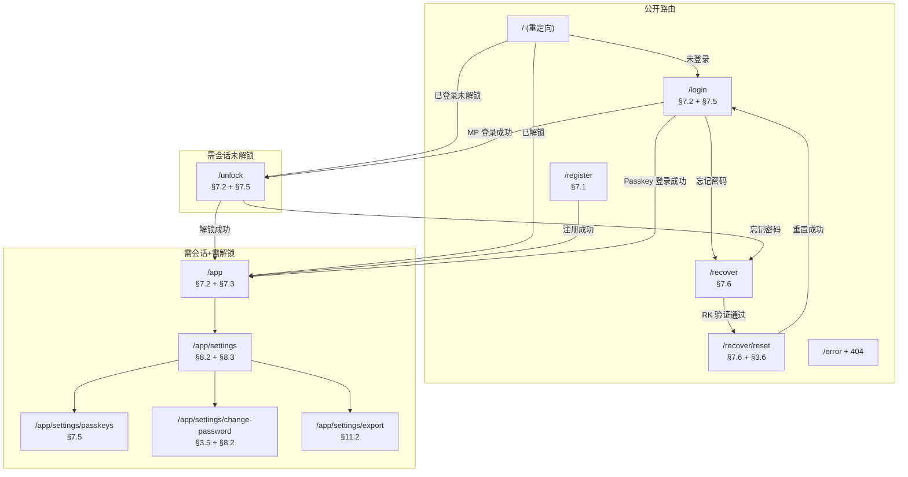

# 🧩 前端页面、路由与组件清单 (UI Inventory)

**文档版本**: 1.0  
**更新日期**: 2026 年 6 月 20 日  
**文档密级**: 公开 (Public)  
**核心标签**: `SvelteKit`, `Svelte 5 Runes`, `shadcn-svelte`, `路由守卫`, `组件规格`

> 本文档是 WebOTP 前端实现的完整页面/路由/组件清单，供 AI 辅助编码 (Vibe Coding) 使用。所有页面与组件均对齐 `docs/Architecture.md` 的三大状态模块（§6）与核心工作流（§7）。

---

## 0. 变更摘要 (Changelog)

| 变更 | 说明 |
| :--- | :--- |
| 初始版本 | 完整覆盖路由树、页面状态归属、组件清单、shadcn-svelte 选型、布局守卫、交互规格 |

---

## 1. 路由树

SvelteKit 文件路由。每条路由映射一个 `+page.svelte`，必要时配套 `+layout.svelte`。

| 路由路径 | 用途 | 对应架构工作流 | 鉴权要求 | 页面文件 |
| :--- | :--- | :--- | :--- | :--- |
| `/` | 根路由重定向 | — | 公开 | `src/routes/+page.svelte` — 仅含 `goto` 重定向逻辑 |
| `/register` | 新用户注册 | §7.1 注册流 | 公开 | `src/routes/register/+page.svelte` |
| `/login` | 登录（MP 或 Passkey） | §7.2 登录与离线优先启动、§7.5 PRF 免密 | 公开 | `src/routes/login/+page.svelte` |
| `/unlock` | 已登录但 DEK 未就绪时解锁 | §7.2 离线启动闭环、§7.5 PRF 解锁 | 需会话（未解锁） | `src/routes/unlock/+page.svelte` |
| `/app` | OTP 账户列表主界面 | §7.2（解密后渲染）、§7.3（同步状态） | 需会话 + 需解锁 | `src/routes/app/+page.svelte` |
| `/app/settings` | 设置主页（账户信息、设备管理） | §8.2 密码轮换、§8.3 会话管理 | 需会话 + 需解锁 | `src/routes/app/settings/+page.svelte` |
| `/app/settings/passkeys` | Passkey 绑定/撤销管理 | §7.5 PRF 多设备 | 需会话 + 需解锁 | `src/routes/app/settings/passkeys/+page.svelte` |
| `/app/settings/change-password` | 更改主密码 | §3.5 密码轮换、§8.2 原子轮换 | 需会话 + 需解锁 | `src/routes/app/settings/change-password/+page.svelte` |
| `/app/settings/export` | 数据导出（JSON/CSV） | §11.2 无门槛数据导出 | 需会话 + 需解锁 | `src/routes/app/settings/export/+page.svelte` |
| `/recover` | 灾难恢复：输入 RK 验证 | §7.6 灾难恢复流 | 公开（无会话） | `src/routes/recover/+page.svelte` |
| `/recover/reset` | 灾难恢复：设置新 MP + 轮换 RK | §7.6、§3.6 恢复后强制轮换 | 公开（无会话） | `src/routes/recover/reset/+page.svelte` |
| `/error` | 全局错误页 | — | 公开 | `src/routes/error/+page.svelte` |
| `/(...)` / `+error.svelte` | 404 兜底 | — | 公开 | `src/routes/+error.svelte` |

### 1.1 路由重定向规则

```typescript
// src/routes/+page.svelte — 根路由重定向
import { goto } from '$app/navigation';
import { authState } from '$lib/state/auth.svelte';
import { cryptoState } from '$lib/state/crypto.svelte';

$effect(() => {
  if (!authState.isAuthenticated) goto('/login');
  else if (!cryptoState.isUnlocked) goto('/unlock');
  else goto('/app');
});
```

---

## 2. 页面与状态归属

每个页面读写的 `$state` 模块一目了然。详见架构 §6.1–6.3。

| 页面 | `auth.svelte.ts` | `crypto.svelte.ts` | `vault.svelte.ts` | 需 `isUnlocked` 守卫 |
| :--- | :--- | :--- | :--- | :--- |
| `/register` | 写：注册 + 建立会话 | 写：生成 DEK、派生 KEK、包装 DEK | 写：初始化空 Blob | 否 |
| `/login` | 写：登录建立会话 | 写：派生 KEK_MP、解包 DEK | 读：拉取 Blob 解密渲染 | 否（解锁在登录过程中完成） |
| `/unlock` | 读：isAuthenticated | 写：派生 KEK、解包 DEK、设置 isUnlocked | 读：拉取/解密 Blob | 否（本页即解锁） |
| `/app` | 读：isAuthenticated | 读：isUnlocked | 读写：accounts、syncStatus | **是** |
| `/app/settings` | 读：会话列表、设备信息 | 读：isUnlocked | — | **是** |
| `/app/settings/passkeys` | 读写：Passkey 凭证列表 | 读写：绑定/撤销 PRF 包装 | — | **是** |
| `/app/settings/change-password` | 写：rotate-key 更新 LAK | 写：派生新 KEK_MP、重新包装 DEK | — | **是** |
| `/app/settings/export` | — | 读：isUnlocked | 读：accounts（解密明文） | **是** |
| `/recover` | — | 写：派生 KEK_RK、解包 DEK | 读：解密 Blob 恢复数据 | 否 |
| `/recover/reset` | — | 写：生成新 RK、派生新 KEK、重新包装 DEK | — | 否 |

### 2.1 `isUnlocked` 守卫实现

```typescript
// src/routes/app/+layout.svelte — /app 下所有路由的守卫
import { goto } from '$app/navigation';
import { authState } from '$lib/state/auth.svelte';
import { cryptoState } from '$lib/state/crypto.svelte';

$effect(() => {
  if (!authState.isAuthenticated) goto('/login');
  else if (!cryptoState.isUnlocked) goto('/unlock');
});
```

---

## 3. 组件清单

所有组件位于 `src/lib/components/`。Props 以 TypeScript interface 定义，状态归属标注所属模块。

### 3.1 OTP 展示与交互

| 组件 | 文件 | 职责 | Props | 状态归属 | shadcn 基组件 |
| :--- | :--- | :--- | :--- | :--- | :--- |
| `OtpCodeDisplay` | `otp/OtpCodeDisplay.svelte` | 显示 TOTP 验证码 + 倒计时环 / HOTP 验证码 + 手动递增按钮 | `account: Account` | `vault.svelte.ts`（读 account） | `Badge`、`Button` |
| `AccountItem` | `otp/AccountItem.svelte` | 单个 OTP 账户卡片：issuer 图标 + label + 验证码 + 复制按钮 | `account: Account`、`onCopy: () => void`、`onEdit: () => void` | `vault.svelte.ts`（读） | `Card`、`Button`、`Tooltip` |
| `AccountList` | `otp/AccountList.svelte` | 按 issuer 分组的账户列表 + 搜索过滤 | — | `vault.svelte.ts`（读 accounts） | `Input`（搜索框）、`ScrollArea` |
| `AccountEditDialog` | `otp/AccountEditDialog.svelte` | 编辑已有账户的对话框 | `account: Account`、`open: boolean` | `vault.svelte.ts`（写 accounts → dirty） | `Dialog`、`Input`、`Select`、`Button` |
| `AddAccountDialog` | `otp/AddAccountDialog.svelte` | 添加账户：otpauth URI 解析 / 手动输入 / QR 扫描 | `open: boolean` | `vault.svelte.ts`（写 accounts → dirty） | `Dialog`、`Tabs`、`Input`、`Button` |
| `ClockDriftWarning` | `otp/ClockDriftWarning.svelte` | 时钟漂移非阻塞警告条 | `driftSeconds: number` | —（纯展示，drift 由布局层计算） | `Alert` |

### 3.2 同步与状态

| 组件 | 文件 | 职责 | Props | 状态归属 | shadcn 基组件 |
| :--- | :--- | :--- | :--- | :--- | :--- |
| `SyncStatusBadge` | `sync/SyncStatusBadge.svelte` | 同步状态指示器（idle/dirty/syncing/conflict） | — | `vault.svelte.ts`（读 syncStatus） | `Badge` |
| `LockButton` | `sync/LockButton.svelte` | 一键锁定：清除内存中 DEK，跳转 /unlock | — | `crypto.svelte.ts`（写 isUnlocked=false） | `Button`、`Tooltip` |

### 3.3 安全与设置

| 组件 | 文件 | 职责 | Props | 状态归属 | shadcn 基组件 |
| :--- | :--- | :--- | :--- | :--- | :--- |
| `PasskeyManager` | `settings/PasskeyManager.svelte` | Passkey 绑定列表 + 绑定新 Passkey + 撤销指定 Passkey | — | `auth.svelte.ts`（读凭证列表）、`crypto.svelte.ts`（写 PRF 包装） | `Card`、`Button`、`Dialog`、`Table` |
| `RecoveryKeyDisplay` | `settings/RecoveryKeyDisplay.svelte` | RK 展示（20 字符 base32，4-4-4-4-4 分组）+ 抄写确认 | `recoveryKey: string`（仅注册/恢复后一次性传入）、`onConfirmed: () => void` | —（纯展示，RK 不持久化到状态） | `Card`、`Input`、`Button`、`Alert` |
| `ExportDialog` | `settings/ExportDialog.svelte` | 数据导出对话框：JSON/CSV 格式选择 + 下载 | `open: boolean` | `vault.svelte.ts`（读 accounts 解密明文） | `Dialog`、`Select`、`Button` |
| `ChangePasswordForm` | `settings/ChangePasswordForm.svelte` | 更改主密码表单：旧 MP + 新 MP + 确认 | — | `crypto.svelte.ts`（写：重新派生/包装）、`auth.svelte.ts`（写：rotate-key） | `Card`、`Input`、`Button`、`Alert` |

### 3.4 认证页面

| 组件 | 文件 | 职责 | Props | 状态归属 | shadcn 基组件 |
| :--- | :--- | :--- | :--- | :--- | :--- |
| `LoginForm` | `auth/LoginForm.svelte` | 登录表单：邮箱 + MP 输入 + Passkey 按钮 | — | `auth.svelte.ts`（写）、`crypto.svelte.ts`（写） | `Card`、`Input`、`Button` |
| `RegisterForm` | `auth/RegisterForm.svelte` | 注册表单：邮箱 + MP + 确认 MP | — | `auth.svelte.ts`（写）、`crypto.svelte.ts`（写） | `Card`、`Input`、`Button` |
| `UnlockForm` | `auth/UnlockForm.svelte` | 解锁表单：MP 输入 + 可选 Passkey 按钮 | — | `crypto.svelte.ts`（写 isUnlocked） | `Card`、`Input`、`Button` |
| `RecoverForm` | `auth/RecoverForm.svelte` | 恢复表单：邮箱 + RK 输入（4-4-4-4-4 分组输入） | — | `crypto.svelte.ts`（写） | `Card`、`Input`、`Button` |

### 3.5 布局组件

| 组件 | 文件 | 职责 | Props | 状态归属 | shadcn 基组件 |
| :--- | :--- | :--- | :--- | :--- | :--- |
| `AppSidebar` | `layout/AppSidebar.svelte` | /app 侧栏导航：OTP 列表、设置入口 | — | — | `Sheet`（移动端）、`Button` |
| `AppHeader` | `layout/AppHeader.svelte` | /app 顶栏：SyncStatusBadge + LockButton + 用户菜单 | — | `auth.svelte.ts`（读）、`vault.svelte.ts`（读）、`crypto.svelte.ts`（读） | `DropdownMenu`、`Button` |
| `SensitiveInput` | `layout/SensitiveInput.svelte` | 密码/密钥输入框：type=password，解锁后自动清空 | `label: string`、`placeholder?: string`、`onSubmit: (value: string) => void`、`autoClear?: boolean` | — | `Input`、`Label` |

---

## 4. shadcn-svelte 组件选型

仅列出本项目实际使用的组件子集，避免引入不必要的依赖。

| 组件 | 用途 | 使用页面/组件 |
| :--- | :--- | :--- |
| `Button` | 所有操作按钮 | 全局 |
| `Card` | 表单容器、账户卡片 | LoginForm、RegisterForm、AccountItem、RecoveryKeyDisplay |
| `Dialog` | 模态对话框 | AccountEditDialog、AddAccountDialog、ExportDialog、PasskeyManager |
| `Input` | 文本/密码输入 | 全局表单 |
| `Label` | 表单标签 | 全局表单 |
| `Select` | 下拉选择（算法、位数、导出格式） | AccountEditDialog、ExportDialog |
| `Tabs` | 选项卡切换（otpauth URI / 手动输入 / QR） | AddAccountDialog |
| `Badge` | 状态标签（同步状态、OTP 位数） | SyncStatusBadge、OtpCodeDisplay |
| `Alert` | 警告/提示信息 | ClockDriftWarning、ChangePasswordForm |
| `Tooltip` | 悬浮提示 | AccountItem、LockButton |
| `Toast` | 操作反馈（复制成功、同步完成） | 全局（通过 toast store） |
| `DropdownMenu` | 用户菜单（登出、设备管理） | AppHeader |
| `ScrollArea` | 可滚动区域 | AccountList |
| `Table` | 表格（Passkey 列表、会话列表） | PasskeyManager、设备管理 |
| `Sheet` | 侧栏抽屉（移动端） | AppSidebar |
| `Progress` | TOTP 倒计时进度条 | OtpCodeDisplay |

> **[建议]** 若需 QR 扫描功能，推荐 `jsQR`（纯 JS，无 Wasm 依赖）配合 `<video>` + `<canvas>` 实现，不引入额外 UI 库。

---

## 5. 布局结构

### 5.1 根布局 `src/routes/+layout.svelte`

```svelte
<script lang="ts">
  import { goto } from '$app/navigation';
  import { page } from '$app/stores';
  import { authState } from '$lib/state/auth.svelte';
  import { cryptoState } from '$lib/state/crypto.svelte';
  import { Toaster } from '$lib/components/ui/sonner';

  // 公开路由白名单——无需任何鉴权
  const publicRoutes = ['/login', '/register', '/recover', '/recover/reset', '/error'];

  $effect(() => {
    const path = $page.url.pathname;
    if (publicRoutes.some(r => path.startsWith(r))) return;

    // 未登录 → /login
    if (!authState.isAuthenticated) {
      goto('/login');
      return;
    }

    // 已登录但未解锁 → /unlock（/app 下路由由 app layout 二次守卫）
    if (!cryptoState.isUnlocked && path.startsWith('/app')) {
      goto('/unlock');
    }
  });
</script>

<slot />
<Toaster />
```

**守卫三态**：

| 状态 | `isAuthenticated` | `isUnlocked` | 行为 |
| :--- | :--- | :--- | :--- |
| 未登录 | `false` | `false` | 公开路由放行；受保护路由 → `/login` |
| 已登录未解锁 | `true` | `false` | `/app/*` → `/unlock`；`/unlock`、`/login`、`/register` 放行 |
| 已解锁 | `true` | `true` | 所有路由放行 |

### 5.2 `/app` 子布局 `src/routes/app/+layout.svelte`

```svelte
<script lang="ts">
  import AppSidebar from '$lib/components/layout/AppSidebar.svelte';
  import AppHeader from '$lib/components/layout/AppHeader.svelte';
  import ClockDriftWarning from '$lib/components/otp/ClockDriftWarning.svelte';
  import { detectClockDrift } from '$lib/utils/clock-drift';

  let driftSeconds = $state(0);

  $effect(() => {
    detectClockDrift().then(d => { driftSeconds = d; });
  });
</script>

<div class="flex h-screen">
  <!-- 侧栏：桌面端固定，移动端 Sheet 抽屉 -->
  <AppSidebar />

  <div class="flex flex-1 flex-col overflow-hidden">
    <!-- 顶栏 -->
    <AppHeader />

    <!-- 时钟漂移警告（非阻塞，仅偏差 >15s 时显示） -->
    {#if Math.abs(driftSeconds) > 15}
      <ClockDriftWarning {driftSeconds} />
    {/if}

    <!-- 页面内容 -->
    <main class="flex-1 overflow-y-auto p-4">
      <slot />
    </main>
  </div>
</div>
```

---

## 6. 解锁页交互规格

`/unlock` 页面对应架构 §7.2 离线启动闭环与 §7.5 PRF 免密解锁。

### 6.1 交互流程

```
用户到达 /unlock
  │
  ├─ 检测设备是否已绑定 Passkey（IndexedDB 缓存 passkeyWrap 行）
  │    ├─ 有 → 显示 "使用 Passkey 解锁" 按钮（主操作）
  │    │        点击 → navigator.credentials.get(PRF) → 解包 DEK → isUnlocked=true → /app
  │    │        失败/取消 → 回退到 MP 输入（显示提示）
  │    │
  │    └─ 无 → 仅显示 MP 输入框
  │
  ├─ MP 输入框 + 确认按钮
  │    输入 MP → 派生 KEK_MP → 解包 wrappedDekByMaster → 成功
  │    → isUnlocked=true → 清空输入框 → /app
  │    → 失败 → 显示 "主密码错误" 错误提示（不泄露细节）
  │
  └─ 底部链接：忘记密码？→ /recover
```

### 6.2 组件结构

```svelte
<!-- src/routes/unlock/+page.svelte -->
<script lang="ts">
  import UnlockForm from '$lib/components/auth/UnlockForm.svelte';
  import { cryptoState } from '$lib/state/crypto.svelte';
  import { goto } from '$app/navigation';

  $effect(() => {
    if (cryptoState.isUnlocked) goto('/app');
  });
</script>

<div class="flex min-h-screen items-center justify-center">
  <UnlockForm />
</div>
```

### 6.3 `UnlockForm` 关键行为

- **MP 提交**：调用 `cryptoState.unlockWithPassword(mp)` → 成功自动清空输入框（§6.2 敏感数据清除）
- **Passkey 按钮**：调用 `cryptoState.unlockWithPasskey()` → 成功自动跳转
- **加载状态**：Argon2id 派生期间（~1-3s）显示进度指示，禁用按钮
- **错误状态**：MP 错误 → 输入框抖动 + 错误文案；Passkey 失败 → 提示回退 MP

---

## 7. OTP 列表页交互规格

`/app` 主界面对应架构 §7.2（解密渲染）、§7.3（同步状态）、§11（UX 增强）。

### 7.1 列表交互

```
/app 主界面
  │
  ├─ 顶部：搜索框（issuer / label 实时过滤）
  │
  ├─ 按 issuer 分组展示
  │    ├─ 无 issuer 的账户归入 "其他" 分组
  │    └─ 每个分组可折叠
  │
  ├─ 每个 AccountItem
  │    ├─ 左侧：issuer 图标 + label
  │    ├─ 中间：OtpCodeDisplay
  │    │    ├─ TOTP：6/8 位验证码 + 倒计时环（Progress）
  │    │    └─ HOTP：6/8 位验证码 + "下一个" 手动递增按钮
  │    ├─ 右侧：复制按钮（点击 → 写入剪贴板 → Toast 提示 → 30s 后清除剪贴板）
  │    └─ 点击卡片 → 打开 AccountEditDialog
  │
  ├─ FAB / 顶栏按钮：打开 AddAccountDialog
  │
  └─ 时钟漂移警告位置：顶栏下方、列表上方（非阻塞 Alert）
```

### 7.2 HOTP 手动递增

```typescript
// HOTP 递增逻辑（在 AccountItem 内）
async function incrementHotp(account: Account): Promise<void> {
  account.counter = (BigInt(account.counter ?? '0') + 1n).toString();
  account.updatedAt = Date.now();
  // vault.svelte.ts 的 proxy 会自动标记 syncStatus = 'dirty'
}
```

### 7.3 复制与剪贴板清除

```typescript
// 复制 OTP 到剪贴板，30s 后清除
async function copyOtp(code: string): Promise<void> {
  await navigator.clipboard.writeText(code);
  showToast('验证码已复制');

  setTimeout(async () => {
    try {
      // 仅在剪贴板仍为我们的值时清除
      const current = await navigator.clipboard.readText();
      if (current === code) {
        await navigator.clipboard.writeText('');
      }
    } catch {
      // 剪贴板 API 可能被拒绝，忽略
    }
  }, 30_000);
}
```

### 7.4 搜索过滤逻辑

```typescript
// AccountList 内的过滤
function filterAccounts(accounts: Account[], query: string): Account[] {
  const q = query.toLowerCase().trim();
  if (!q) return accounts;
  return accounts.filter(a =>
    (a.issuer?.toLowerCase().includes(q) ?? false) ||
    a.label.toLowerCase().includes(q)
  );
}
```

---

## 8. 敏感数据 UI 约定

严格遵循架构 §6.2 内存安全原则。

### 8.1 输入框即时清空

| 场景 | 行为 | 实现 |
| :--- | :--- | :--- |
| 解锁成功 | MP 输入框立即清空 | `UnlockForm` 在 `cryptoState.unlockWithPassword()` 成功后 `value = ''` |
| 登录成功 | MP 输入框立即清空 | `LoginForm` 同上 |
| 注册完成 | MP + 确认 MP 输入框立即清空 | `RegisterForm` 在注册成功后清空 |
| 更改密码完成 | 旧 MP + 新 MP + 确认 MP 全部清空 | `ChangePasswordForm` 在 rotate-key 成功后清空 |
| 恢复完成 | RK 输入框立即清空 | `RecoverForm` 在恢复成功后清空 |

### 8.2 不回显规则

| 敏感数据 | 禁止行为 | 允许行为 |
| :--- | :--- | :--- |
| 主密码 (MP) | 不回显、不明文展示、不存入状态 | `type="password"` 输入框，带"显示/隐藏"切换按钮 |
| 恢复密钥 (RK) | 不回显、不持久化到任何状态/store | 仅注册/恢复成功后一次性展示在 `RecoveryKeyDisplay`，用户确认抄写后销毁 |
| DEK / KEK | 永不展示 | 内部 `CryptoKey`（`extractable: false`） |

### 8.3 RK 展示规格

`RecoveryKeyDisplay` 组件的精确规格：

```
┌─────────────────────────────────────┐
│  您的恢复密钥（请妥善保管）          │
│                                     │
│  ┌─────────────────────────────┐    │
│  │  ABCD  EFGH  IJKL  MNOP  QRST │  │
│  └─────────────────────────────┘    │
│                                     │
│  ⚠ 此密钥仅显示一次，请立即抄写     │
│                                     │
│  请重新输入上方密钥以确认：          │
│  [____] [____] [____] [____] [____] │
│                                     │
│  [确认并继续]（需输入正确后启用）    │
└─────────────────────────────────────┘
```

- **格式**：20 字符 base32 大写，4-4-4-4-4 分组，空格分隔
- **抄写确认**：用户必须在 5 个分组输入框中重新输入完整 RK，匹配后启用"确认并继续"按钮
- **确认后**：RK 明文从组件状态中清除，`RecoveryKeyDisplay` 卸载

### 8.4 剪贴板超时清除

| 操作 | 清除延迟 | 实现 |
| :--- | :--- | :--- |
| 复制 OTP 验证码 | 30 秒 | `setTimeout` + 条件清除（§7.3） |
| 复制恢复密钥 | 禁止复制 | RK 不提供复制按钮，仅视觉展示 + 手动抄写 |

### 8.5 `SensitiveInput` 组件规格

```typescript
interface SensitiveInputProps {
  label: string;
  placeholder?: string;
  /** 提交回调，传入明文值 */
  onSubmit: (value: string) => void;
  /** 提交后是否自动清空（默认 true） */
  autoClear?: boolean;
  /** 是否显示"显示/隐藏"切换按钮（默认 true） */
  toggleable?: boolean;
  /** 禁用状态（如 Argon2id 计算中） */
  disabled?: boolean;
  /** 错误信息 */
  error?: string;
}
```

行为约束：
- 默认 `type="password"`，带眼睛图标切换可见性
- `onSubmit` 调用后若 `autoClear !== false`，立即清空 `value`
- 组件卸载时清空 `value`
- 不使用 `bind:value` 双向绑定暴露明文到父组件状态——通过 `onSubmit` 回调单向传递

---

## 9. QR 扫描交互（AddAccountDialog 子流程）

AddAccountDialog 的 "扫描 QR" 标签页交互：

```
打开摄像头（navigator.mediaDevices.getUserMedia）
  │
  ├─ 每帧 → jsQR 解码
  │    ├─ 识别到 otpauth:// URI → 解析 → 填充表单 → 关闭摄像头
  │    └─ 持续扫描，显示取景框
  │
  ├─ 手动输入 fallback：用户可切换到"手动输入"标签页
  │
  └─ 权限拒绝 → 显示提示，引导手动输入
```

---

## 10. 工作流-路由-组件映射总览



---

## 11. 目录结构约定

```
src/
├── lib/
│   ├── components/
│   │   ├── auth/               # 认证相关组件
│   │   │   ├── LoginForm.svelte
│   │   │   ├── RegisterForm.svelte
│   │   │   ├── UnlockForm.svelte
│   │   │   └── RecoverForm.svelte
│   │   ├── otp/                # OTP 展示与交互
│   │   │   ├── OtpCodeDisplay.svelte
│   │   │   ├── AccountItem.svelte
│   │   │   ├── AccountList.svelte
│   │   │   ├── AccountEditDialog.svelte
│   │   │   ├── AddAccountDialog.svelte
│   │   │   └── ClockDriftWarning.svelte
│   │   ├── sync/               # 同步状态
│   │   │   ├── SyncStatusBadge.svelte
│   │   │   └── LockButton.svelte
│   │   ├── settings/           # 设置页组件
│   │   │   ├── PasskeyManager.svelte
│   │   │   ├── RecoveryKeyDisplay.svelte
│   │   │   ├── ExportDialog.svelte
│   │   │   └── ChangePasswordForm.svelte
│   │   ├── layout/             # 布局组件
│   │   │   ├── AppSidebar.svelte
│   │   │   ├── AppHeader.svelte
│   │   │   └── SensitiveInput.svelte
│   │   └── ui/                 # shadcn-svelte 生成组件（不手写）
│   ├── state/                  # Svelte 5 Runes 状态模块（架构 §6）
│   │   ├── auth.svelte.ts
│   │   ├── crypto.svelte.ts
│   │   └── vault.svelte.ts
│   ├── server/                 # 服务端工具函数
│   ├── crypto/                 # 密码学工具（见 crypto-spec 文档）
│   ├── models/                 # TypeScript 类型定义
│   └── otp/                    # OTP 算法实现
└── routes/                     # SvelteKit 文件路由（见 §1 路由树）
```

---

## 附录 A：组件 Props 完整类型定义

```typescript
// src/lib/models/ui.ts

/** OtpCodeDisplay */
export interface OtpCodeDisplayProps {
  account: import('./account').Account;
}

/** AccountItem */
export interface AccountItemProps {
  account: import('./account').Account;
  onCopy: () => void;
  onEdit: () => void;
}

/** AccountEditDialog */
export interface AccountEditDialogProps {
  account: import('./account').Account;
  open: boolean;
  onClose: () => void;
}

/** AddAccountDialog */
export interface AddAccountDialogProps {
  open: boolean;
  onClose: () => void;
}

/** ClockDriftWarning */
export interface ClockDriftWarningProps {
  driftSeconds: number;
}

/** RecoveryKeyDisplay */
export interface RecoveryKeyDisplayProps {
  /** 20 字符 base32 大写 RK，仅注册/恢复后一次性传入 */
  recoveryKey: string;
  /** 用户确认抄写正确后的回调 */
  onConfirmed: () => void;
}

/** ExportDialog */
export interface ExportDialogProps {
  open: boolean;
  onClose: () => void;
}

/** SensitiveInput */
export interface SensitiveInputProps {
  label: string;
  placeholder?: string;
  onSubmit: (value: string) => void;
  autoClear?: boolean;
  toggleable?: boolean;
  disabled?: boolean;
  error?: string;
}
```
